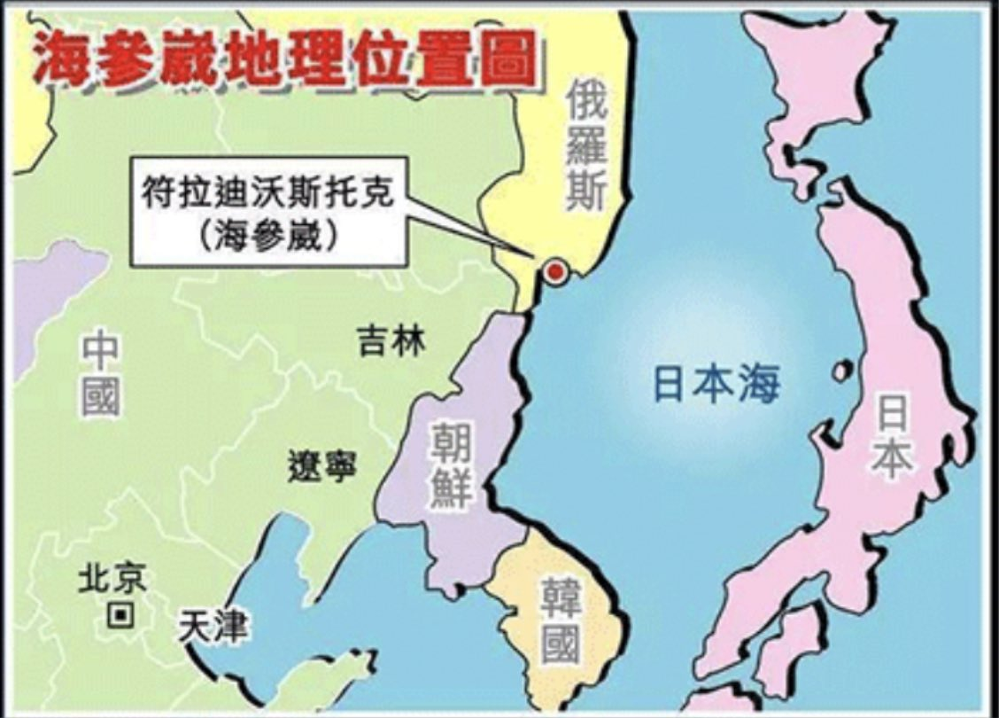

Ivy未央 北京时间 2022-03-20T22:21:19Z 1505550055239000065 转）海参崴也是像香港、澳门那样出租的，租期99年，香港租给英国，澳门租给葡萄牙，海参崴租给俄罗斯。香港、澳门租期届满顺利回归中国，而海参崴却永远成了俄罗斯的领土。但现在很多中国人却认为英国、葡萄牙是西方反华势力，俄罗斯则是中国永远的朋友。
这到底是什么样的逻辑和智商呢？ https://t.co/IvZiR3g40x   