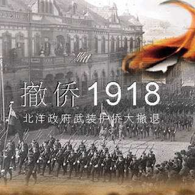
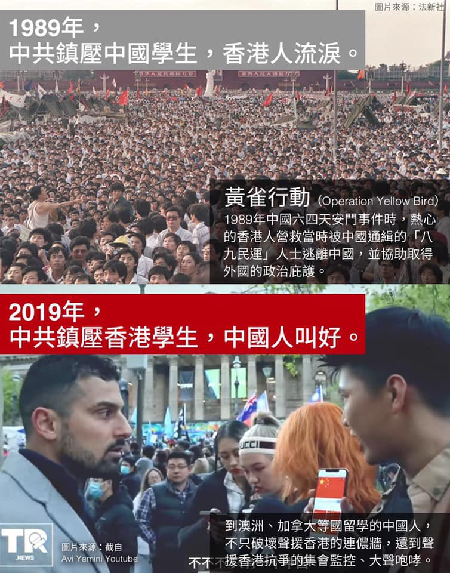

Ivy未央 北京时间 2022-03-19T21:39:27Z 1505177132326084609 1917年，俄国十月革命爆发，华人生命安全受到威胁，不得已，华人向当时的北洋政府发出急电请求救援。当时中国正处于军阀混战时期，但此时都主动停战，把接回华人当做第一要务。北洋政府派出四千名将士，一艘军舰，出兵远东，接回侨民。不但接回了活人，而且还把两具入殓的棺材运了回来。
中共脸红吗？ https://t.co/NjkJ4l9Cnm   Ivy未央 北京时间 2022-03-19T05:57:46Z 1504940148739477505 转）
1989年,香港人为中共镇压大陆人流泪
2019年,大陆人为中共镇压香港人叫好 https://t.co/h6VlYKQplY   