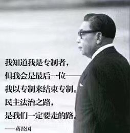

Ivy未央 北京时间 2022-03-18T20:13:23Z 1504793082721624067 转）1988年1月13日，蒋经国在台北逝世。
有的政治家，生前大权在握、唯我独尊，死后身败名裂、家人不保；有的政治家，台上时风光无限，其实不过是历史的匆匆过客；而有的政治家，生前推动了历史进程，死后其历史作用日益彰显。
蒋经国曾说过：没有永远的执政党。仅凭此言，他就是当之无愧的历史伟人。 https://t.co/tmBtRTLI9X   