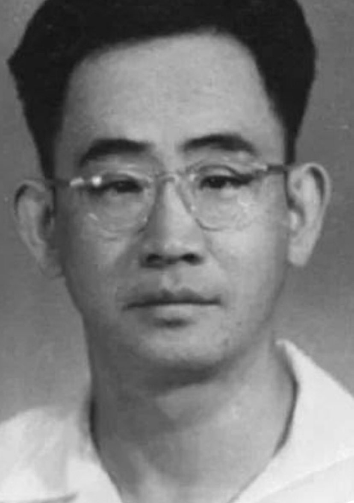

Ivy未央 北京时间 2022-03-09T22:00:33Z 1501558563126140933 转）中国第一个程序员。1939年毕业于上海交大。45年赴美国伊利诺伊大学，参与第一代电子计算机设计、编程工作，49年获博士学位。56年，他放弃在美国的优越生活，回归祖国，任北大教授。68年在“清理阶级队伍运动”中被指控为“特务”，68年10月18日，吊死在学校附近的一棵树上。他是中国计算机之父董铁宝！ https://t.co/ud1L5BVIa8   