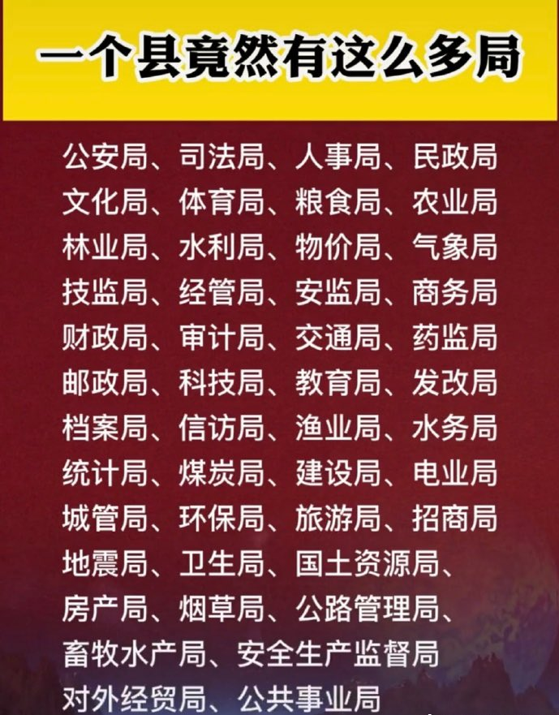

Ivy未央 北京时间 2022-03-08T07:15:12Z 1500973370636222465 转）以色列没有水利部，却在沙漠中建立了世界最先进的滴水灌溉农业；日本没有国家中医药局，但中成药的市场占有率却占世界的75%；瑞士没有禁刀枪，但犯罪率却是世界最低的国家之一。实践证明：一个国家，不在于你设立什么管理部门，只有建立一个好的制度，才是国家长治久安、人民和谐幸福的根本保证。 https://t.co/GmJSX0yjSU   