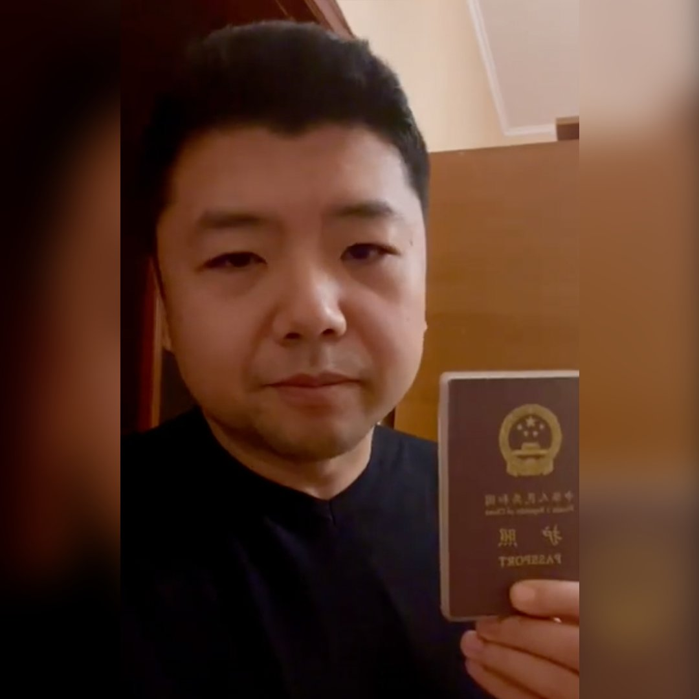

美国之音中文网 北京时间 2022-03-05T10:52:24Z 1499940864835080195 穿越火线到使馆指定的撤离地点？“你开玩笑吧？借一坦克你过得去吗？”困守乌克兰的北京人王吉贤说。2月初，美英等国就已关闭大使馆，敦促本国公民离开。中国却迟迟未发话。留在战区的王吉贤在社交媒体上发布战况、批评普京，遭中国网民“网暴”。“老子也不躲了，我命都快没了，我还怕你回去找我喝茶？” https://t.co/XhjFLdU5MR   