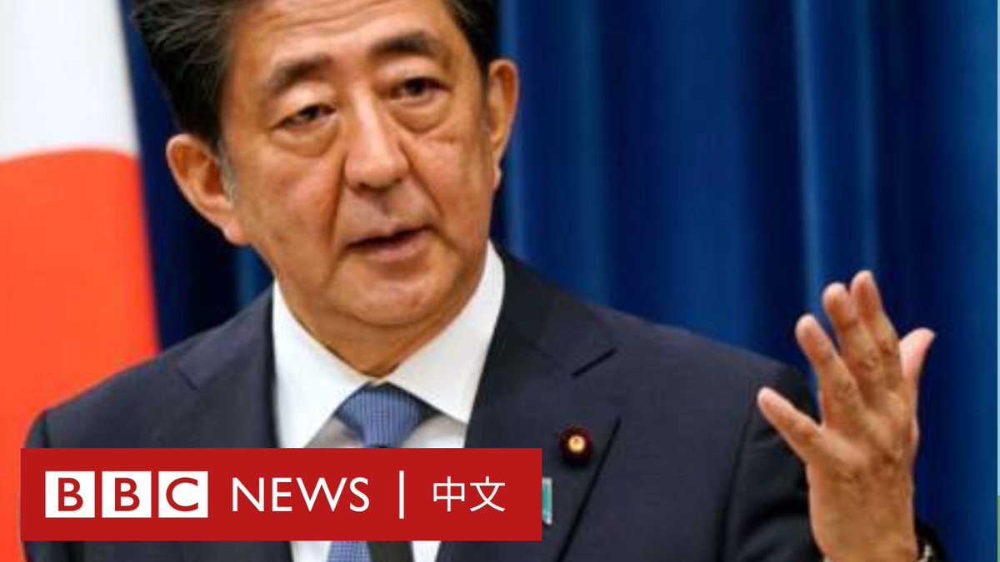

D英国广播公司BBC 北京时间 2022-02-28T15:35:05Z 1498200064279420928 针对乌克兰局势，日本前首相安倍晋三有争议地提出，建议日本应考虑允许美国在日本建立核武器基地。

安倍还说，他认为美国应该向中国明确表示，如果北京攻击台湾岛，美国将保卫台湾。

BBC中文多媒体直播：https://t.co/ziVYrKVKpd https://t.co/nJPYs3DaLL   