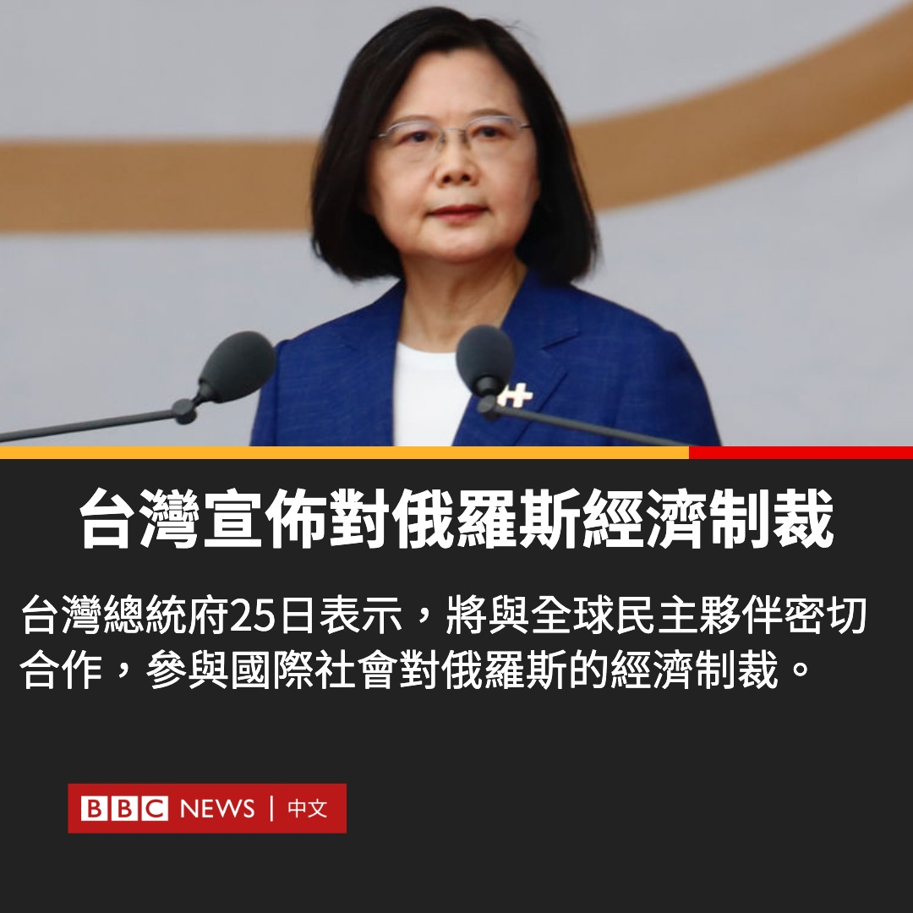

D英国广播公司BBC 北京时间 2022-02-25T13:01:06Z 1497074149382049816 台湾总统府25日表示，将与全球民主伙伴密切合作，参与国际社会对俄罗斯的经济制裁。
台经济部长王美花称，将“严格审查”对俄出口，具体时间表要再同各国确认，“应该很快”会有共同举措。她没有给出更多细节。
据台湾政府数据，台湾同乌克兰及俄罗斯的贸易额均占其贸易总额的不到1%。
（📸：Getty） https://t.co/pZZZ7qF4z4   