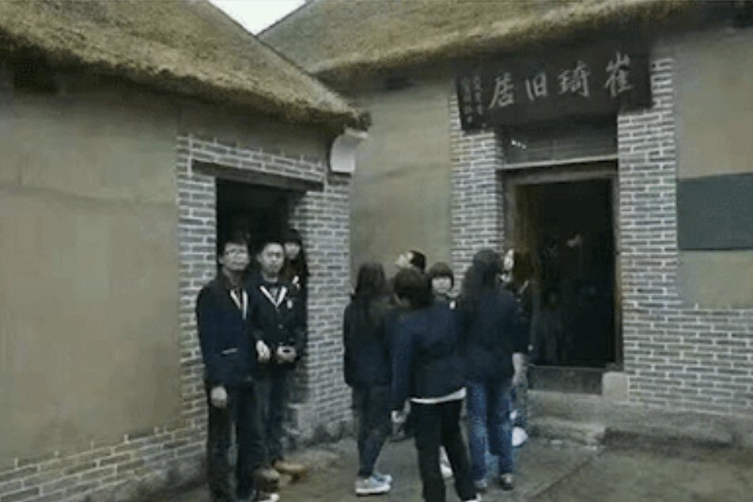

Ivy未央 北京时间 2022-01-15T05:24:55Z 1482101444497055750 1951年，出生于河南农村的崔琦被母送香港求学，崔父59年饿死，崔母背负里通外国罪68年贫病而亡，其姐欲借铁锹埋葬母亲，下跪求遍全村无一人肯借…而98年崔琦获诺贝尔奖后，当地政府大张旗鼓地搞起崔琦故居，并命名为爱国主义教育基地！而崔琦发誓终生不回故乡，他说：那里是地狱，没有丝毫可以怀念的。 https://t.co/sAgWBDm94R   