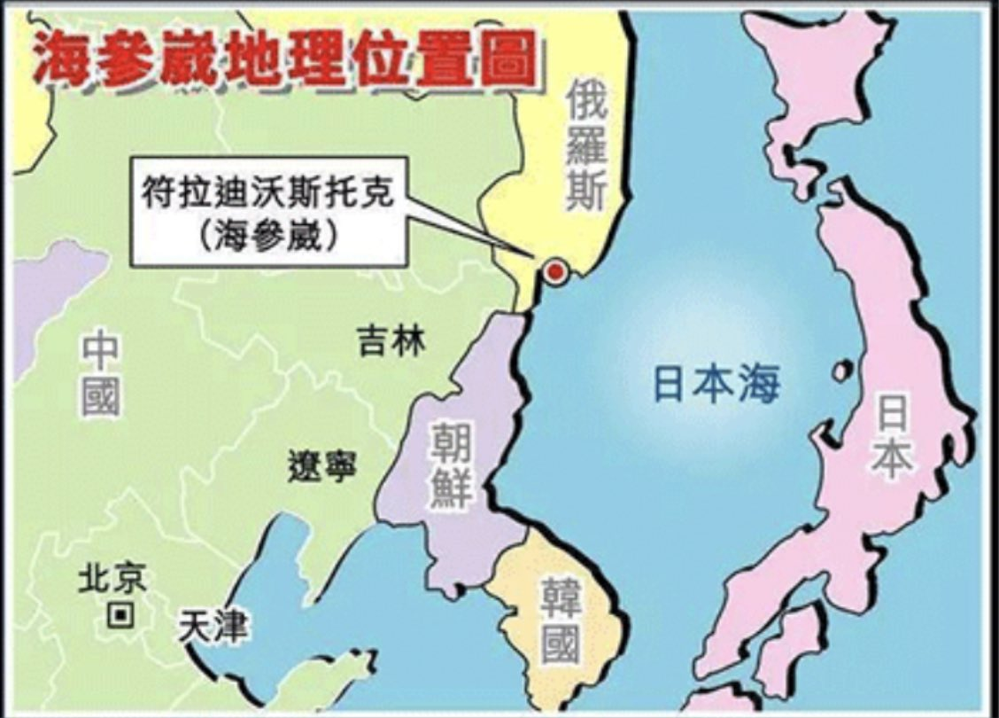

Ivy未央 北京时间 2022-01-14T06:45:56Z 1481759446204403720 转）【中国五个诺贝尓奖得主】1、达赖，获和平奖。2、高行健，获文学奖。3、刘晓波，获和平奖。4、莫言，文学奖。5、屠呦呦，医学奖。——两个流亡海外，一个关监狱致死，一个小学没毕业，一个评不上中科院院士…
究竟是中国搞笑了世界，还是世界搞笑了中国？   Ivy未央 北京时间 2022-01-14T20:10:23Z 1481961894441369606 海参崴也是像香港、澳门那样出租的，租期99年，香港租给英国，澳门租给葡萄牙，海参崴租给俄罗斯。香港、澳门租期届满顺利回归中国，而海参崴却永远成了俄罗斯的领土。但现在很多中国人却认为英国、葡萄牙是西方反华势力，俄罗斯则是中国永远的朋友。
这到底是什么样的逻辑和智商呢？ https://t.co/XJhmI5tsRX   