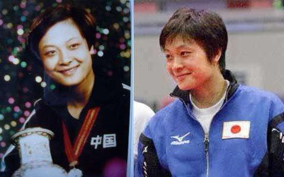

Ivy未央 北京时间 2022-01-07T07:20:28Z 1479231423240445961 1987年乒球世锦赛上，组织决定让何智丽输给队友管建华，以増加夺金概率。何未听从，以3：0战胜管建华，并最终夺冠。组织十分震怒，决定对其进行处罚，后经更大领导发话才得免。然第二年奥运会仍将其除名。何无奈远嫁日本，94年亚运会代表日本战胜邓亚萍。之后，她被骂汉奸。
有时被汉奸也是种荣耀吧？ https://t.co/b7qxf11Xjo   