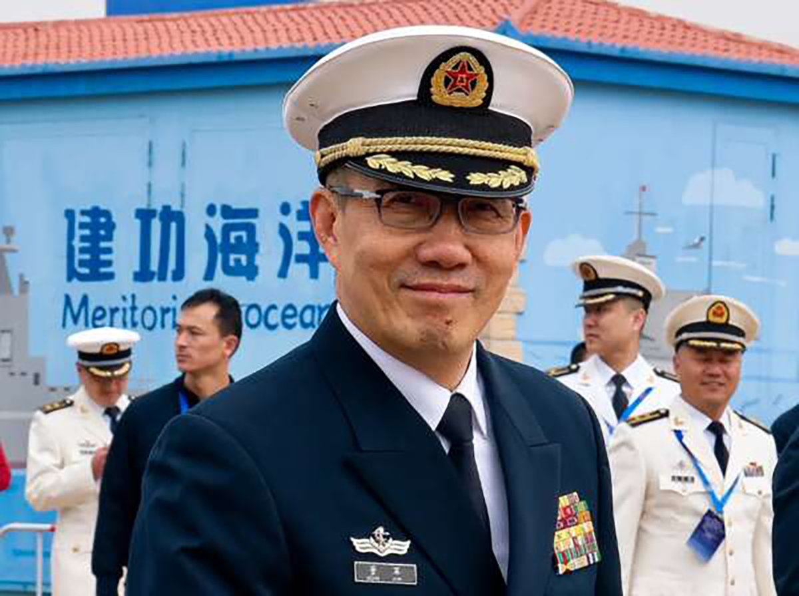

自由亚洲电台 北京时间 2023-12-31T00:36:17Z 1741136132174184520 【中共军史上首位懂外语的国防部长?】担任海军司令员才两年零四月就被宣布接替 #李尚福 国防部长职务的 #董军，不但是有大连舰艇学院正式学历的"#科班出身"，而且也已具备了丰富的军事外交经历。
详阅链接：https://t.co/7nznv16LYo https://t.co/b2dgDQyopv   自由亚洲电台 北京时间 2023-12-31T00:59:37Z 1741142005856493585 广西人权律师覃永沛案二审，维持原判。2019年10月 #覃永沛 被警方拘留。2023年3月 #广西 南宁中级法院以“煽动颠覆国家政权罪”判处有期徒刑5年，“剥夺政治权利”3年。
详阅：
https://t.co/s7TxQuO2LK   自由亚洲电台 北京时间 2023-12-31T01:21:48Z 1741147585518211138 为纪念刘晓波冥诞，12月28日，国际人权组织“中国人权”（#HumanRightsinChina）在纽约时代广场和中央公园，向“这位为 #中国民主 自由人权而献身的诺贝尔和平奖获得者致敬”，并提醒人们关注“中国的人权灾难”。
详阅：https://t.co/svp9J9oPgJ   自由亚洲电台 北京时间 2023-12-31T01:58:43Z 1741156879558975736 江苏省 #镇江 中级人民法院在29日宣判原中国银监会副主席、曾在 #央行 系统工作20多年的 #蔡鄂生 涉利用职权受贿、滥用职权等罪名，被判处死缓，须终身监禁。
详阅：
https://t.co/JeBwAIavt1   自由亚洲电台 北京时间 2023-12-31T00:05:36Z 1741128410280132755 2024元旦将至，中国多地宣布不组织跨年夜活动，其中包括人气最高的广州珠江，上海外滩、武汉汉口等热门跨年景点。中国应急管理部要求各地加强跨年夜活动安全管控，防范发生事故。
详阅：
https://t.co/ojkLLPEVDv   