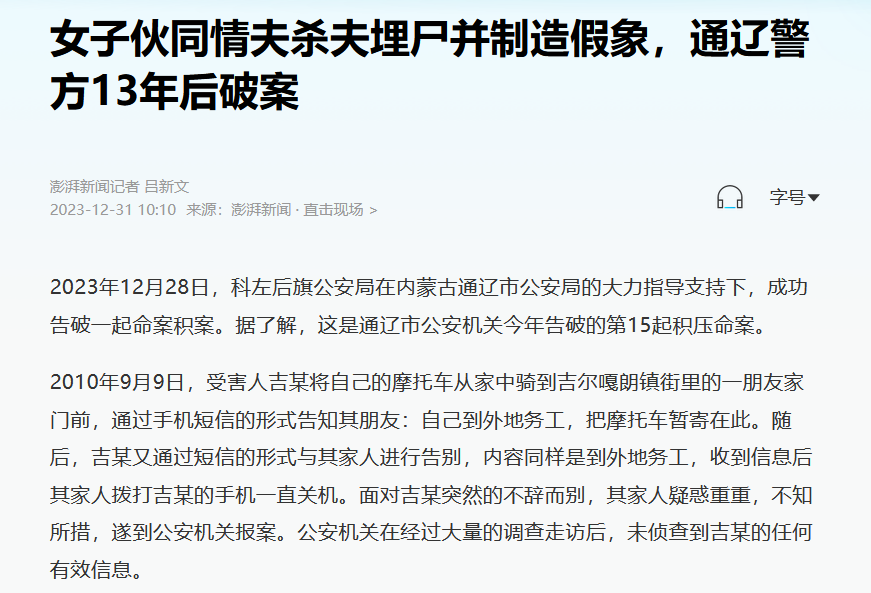
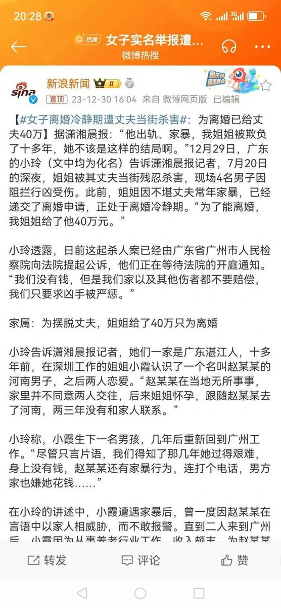

谁将十万横扫三江 北京时间 2023-12-31T15:11:06Z 1741356286275633239 RT @laborpowercn: 2023年，劳动者直面经济危机的一年（回顾、行业访谈、事件整理）

在2023年的最后一个月，我们回访了一些去年底参与民间访谈的工友，以及不同行业的一线工人，通过他们自身经历和观察，了解放开疫情管控后一年的工作生活大致情况。

全文链接在本帖…   谁将十万横扫三江 北京时间 2023-12-31T12:40:34Z 1741318403519087069 RT @lspk_cn: 23/1231/日/14-4℃
昨将扬州曜阳老人维权消息发诸友并请转发，大多反应积极，有发6个群的。然仅有的家族/同学两小群却石沉大海。古稀之人自顾不暇，自不能以冷漠一言以责之。况老朽也属“渐冻人群”，格外无话。
兔去龙来。若有展望，就盼来年“渐冻”得…   谁将十万横扫三江 北京时间 2023-12-31T13:01:55Z 1741323779673051406 RT @LinShengliang: 當年火燒 #靖國神社 的當事人，因舉報貪腐官員受到生命威脅在網路上求救🆘。內中包含他的思想覺醒：亡中國的不是日本人，是中國人；害我的不是日本政府，是中國警察⋯ https://t.co/Z0kuP5QnE8   谁将十万横扫三江 北京时间 2023-12-31T12:15:10Z 1741312014587449684 酗酒、家暴，离婚未果，伙同情夫杀人

男网友：家暴可以报警，不同意离婚可以起诉离婚，杀人干嘛？ https://t.co/AqSsJOJBKF   