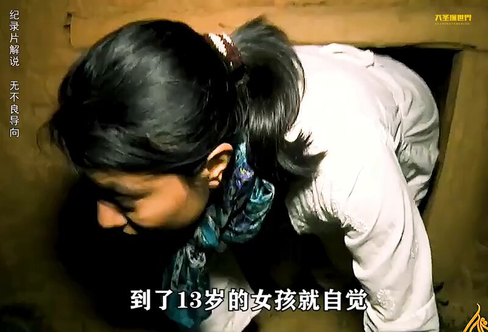
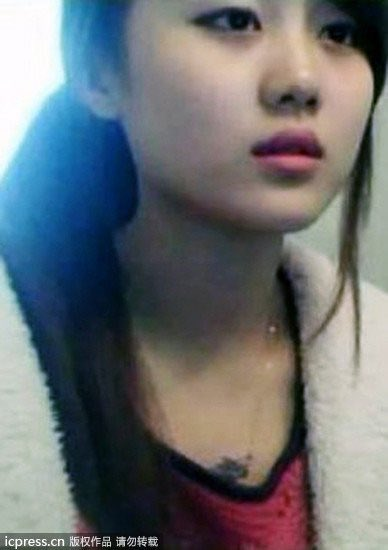
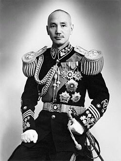
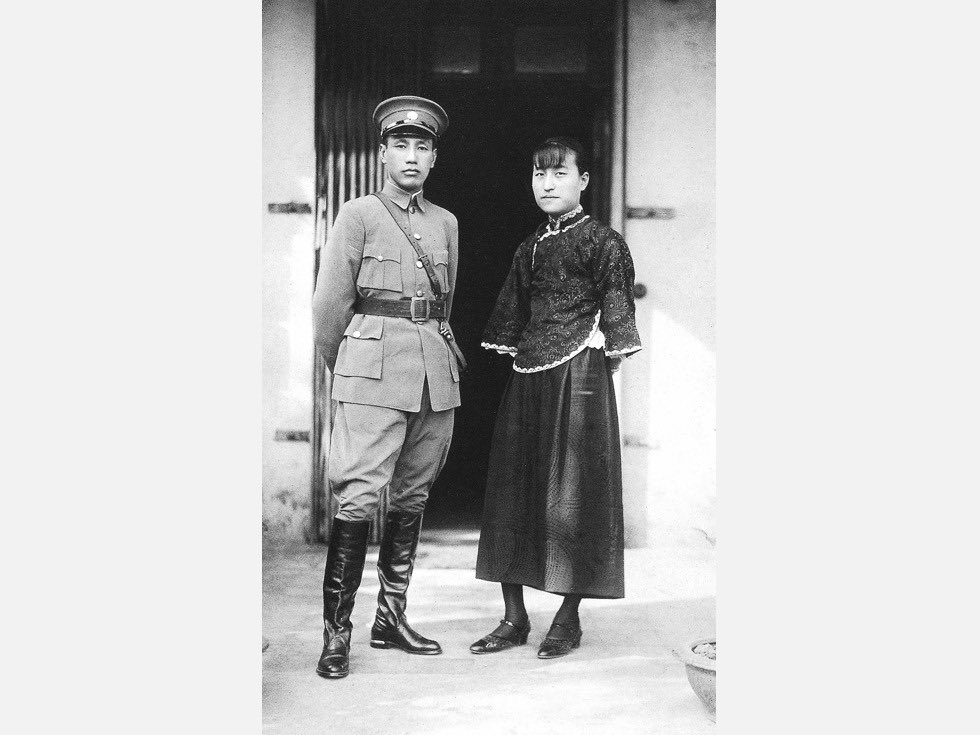
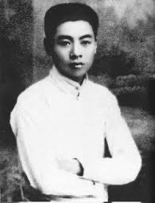
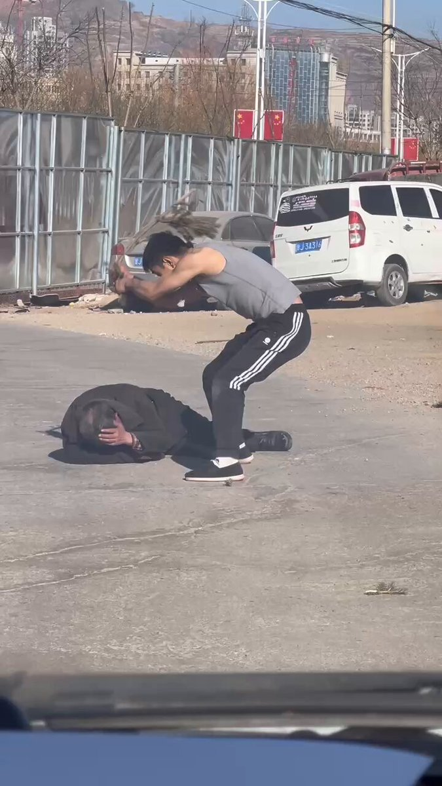
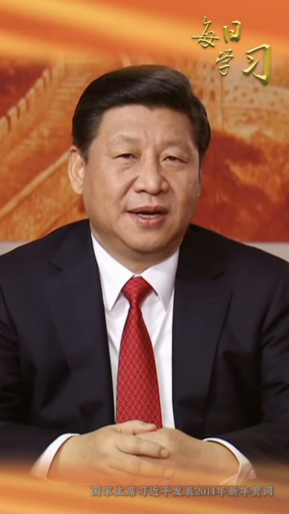
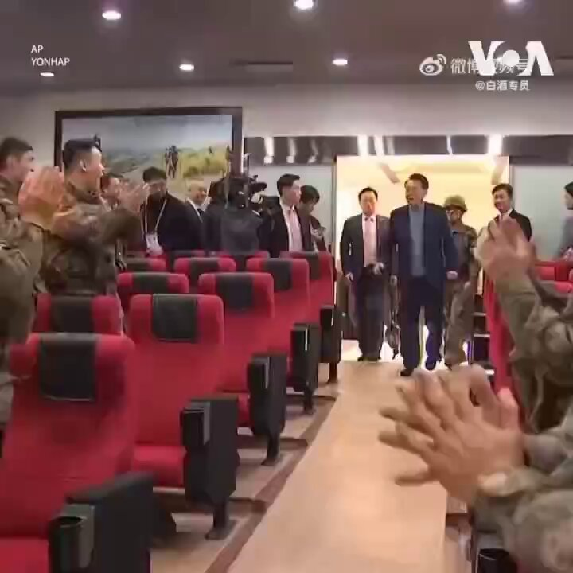

Petrichor 北京时间 2023-12-30T09:23:53Z 1740906520399995031 看了这个视频的男青年，不妨买张机票去尼泊尔找找这些地方，那里的女孩需要你们。祝你们好运气。 https://t.co/rJDmIp1tsF   Petrichor 北京时间 2023-12-30T10:48:43Z 1740927868228579376 陈泽宠，国民党组织部长陈立夫之子，美国普度大学航空工程系学士，普度大学MBA和工业设计系的双科硕士。曾接手担任财团法人立夫医药研究文教基金会董事长，是陈立夫子女中唯一未赴美定居者。其妻林颖曾为国学大师林尹之女。2005年8月赴北京旅游，因感冒不适到北京中日友好医院检查，却被建议切除肝肿瘤，手术中大量出血，术后病情恶化，北京中日友好医院却无积极处理，转至武警总医院紧急换肝后仍告不治，享寿六十四岁。其妻林颖曾为此，提出非常多的证据有关北京中日友好医院严重失责并试图隐瞒事实。   Petrichor 北京时间 2023-12-30T10:12:35Z 1740918774654451992 重庆赵红霞传 （转发）

今年12月11日上午，赵红霞办理完了出狱手续，乘一辆奥迪Q7越野车离开了山城监狱！ 
      她是一个女人，却睡了21位重庆高官；她只用一条床单，就揭开了重庆反腐的序幕；她拿到的仅仅是劳动所得，却让贪官们丢了亿万家产；她不是党员，却深入虎穴反腐；她不是一个人在战斗，身后有老板在运筹帷幄……
      12个月里，她扳倒了21名高官，中弹率为100%。她把半个重庆骑在胯下，必将载入中国反腐的光荣史册！她，就是山城名媛赵红霞。 
      她以身体为武器，以睡床为战场，始终默默奋战在我国反腐隐蔽战线上。她以顽强的意志和惊人的体力，阻击了腐败分子一次又一次的疯狂进攻，最终一举歼灭多名贪官，并冒着生命危险拍下了战场写实画面，为我党肃清腐败分子立下了汗马功劳！
      她——赵红霞同志，应该成为CCTV“感动中国”年度人物，更应该成为中纪委“反腐反贪女英雄!”
      赵红霞，在短短一年时间里，分别和正厅级干部雷政富、九龙坡区委书记彭智勇、璧山县委书记范明文、西南证券董事长罗广、长寿区区长韩树明、重庆城投副总经理粟志光等21名党政和国企干部，完成了勾引、上床、录像等艰巨任务。她宁可牺牲个人利益也要揪出贪官，她一心为民，造福一方，堪称当代神女！
      若干年后，赵红霞会深情地对她儿子说：儿子，你要理解妈妈，确实妈也不知道你爸是谁？因为那段时间妈接待过的领导实在是太多了，但有一点可以肯定：他们都是共产党员。如果今后再有人问你这个问题时，你就大胆而又自豪地说：我是党的儿子！   Petrichor 北京时间 2023-12-30T07:53:54Z 1740883875008540761 如果中国民主了会怎么样

1.公务员将大量裁员，各种高于普通人的养老、五险一金等福利将取消，全民福利逐步上调，公务员取消特殊待遇，成为普通工作；官员特供消失。

2.“人民”、“老百姓”一词消失，由“公民”取代。

3.开放多党竞争，谁上台将由公民手里的选票决定，因此各竞争党将制定各种福利制度讨好公民，同时官员财产公开。

4.电信石油电力等垄断行业被开放，民间成立多家通信台及石油公司，由于有了竞争，汽油、通话、宽带、电费等费用将大幅度下降。

5.对私营企业的税收将大幅度下调，私企压力减轻。

6.工会不再是党组织的摆设，将由民间掌控，真正达到了监督私企老板的目的。加之私企压力减轻，私企员工的福利、休假及待遇将会大幅度上升。

7.关税下调，进口产品包括汽车将再不是奢侈品。取消年检，和车辆强制报废年限

8.党史将被公开，人们看到了真相，将鄙视和咒骂过去的年代，民主政府开始对“文革”、“大跃进”等浩劫及死难者进行国家公祭，并开始历史性的批判。

9.历史真相被还原，国民党真实抗战事迹被公布，全国各地树立抗日英雄纪念碑、纪念馆，8.15被列为抗战胜利纪念日。教科书不再篡改历史，影视剧中的八路军神剧消失，大量军民抗战史实剧开播。

10.医疗与教育将去除产业化，由政府财政支出负担，全民免费医疗逐步实现。

https://t.co/MiOB1mbjsc将开放自由，官员会像明星一样被媒体追查报道，官员每吃一顿饭每出一趟差都会被监督采访，讨论和八卦政府官员成为家常便饭。

12.应试教育取消，学生压力大幅减轻，小学至高中将成立游泳社、围棋社、柔道社、篮球社等各种兴趣社团。                          

13.教育人性化，国家免费为学生提供营养餐，学生校服不再臃肿，将变得时尚潮流，性教育正式在课堂上出现。                     

 14.由于税收和原油价格大幅降低，将起到连锁反应，物价下降。

15.保护私有财产，民主政府不再高价卖地，房价实现有史以来大幅度下调。土地私有，按自由经济市场价交易，允许自由建房。

16.言论真正实现自由，各种民间报社、网站将大量成立，大家敢说真话了，官员没了特权，丑恶现象逐渐消失，社会逐步实现公平化。

17.广电总局将被取缔，各种探讨人性、反思社会、还原历史题材的电视、电影将大量出现，同时电影分级化，中国影视界文艺界迎来新生。

18.由于全民免费医疗实现，碰瓷现象消失，老人摔倒没人敢扶的现象将消失不见，道德回升。

19.社会公平化，官员特权消失，全民福利上调，贫富差距将随之逐渐减小。取消城管非法组织，不需要作为打手了

20.司法独立，法官不准是任何党派的党员，司法变得公平。任何官员强征强拆违法犯罪行为，由司法机关依法索赔，撤职，构成犯罪的依法判刑。

21.电视新闻讲假大空话套话的现象消失，新闻将会真实报道民间疾苦和执政党的不足，年轻人变得爱看新闻。

22.无神论及“封建迷信”一词被摒弃，传统信仰回归，人性回归。

23.全民生活压力大幅减轻。免费养老将实现，公民和公务员领取基本同样退休养老工资

24.民企不再被国企压制，民主政府将大力支持民企，民族品牌崛起。

25.由于新闻自由，加之执政透明，民主政府将成立问责制，使食品安全真正被监督重视，地沟油等毒食品现象逐渐消失。

26.由于中国体制改革，真正加入了民主阵营，将与独裁国家彻底决裂，援助撤销。周边敌对国家与中国关系缓和，多国家对中国护照开放免签。

27. 军队国家化只忠于宪法，不属于任何党派。   Petrichor 北京时间 2023-12-30T05:41:59Z 1740850677616902325 周恩來曾以共產黨員身分「跨黨」加入國民黨時，入黨介紹人是蔣介石，周恩來一直尊稱陳潔如為「蔣師母」。 https://t.co/KZxi25d25o   Petrichor 北京时间 2023-12-30T06:16:57Z 1740859474615943292 习近平上台后，出台一系列措施，意在提高社会文明程度、法制水平，提倡社会主义价值观。然而，为什么实际效果不好，反而变坏？大街上有人暴打老人，却无人主张正义，制止非法暴力，施救老人，人们麻木不仁，全然不像一个正常社会。华春莹还好意思吹中国是个治安安全的国家吗？ https://t.co/5rZs0khUSq   Petrichor 北京时间 2023-12-30T00:54:10Z 1740778245748920526 近十一年来，百姓的日子怎么越过越苦！

他，
催生了一个荒唐的美梦，
画就了一个飘香的大饼，
修改了形同虚设的宪法，
坐牢了永不变色的江山，
重用了俯首帖耳的奴才，
撤换了心存疑虑的异己；
指引了五百次方向，
开出了三百张药方，
发布了一万条金句，
印制了二百卷著作，
滥发了貌似敦厚的画像，
诞生了空前绝后的思想，
打破了一百条原有的规矩，
培植了一杆子护院的家军；
竖起了亦尊亦神的雕像，
烂尾了一带一路的宏图，
整出了一个世界思想的首都，
建成了一个副京雄案的空城，
膨胀了一个大国的领袖，
缩小了一个世界的舞台，
搞垮了香港的一国两制，  
伤害了台湾的两岸三通 ， 
得罪了左邻右舍，
弄掰了旧朋老友，
为丐帮抛撒了无数的金币，
和流氓结交了可耻的友谊，
打了数不清的老虎，
关了几十万的贪官，
吓跑了百家外资，
整垮了万家私企，
吹爆了脱贫的中国，
割光了苦逼的韭菜；
捅了百姓三年嗓子，
封了百城万家家园，
吹破了千张牛皮，
扯烂了一地鸡毛，
……
下台吧
全世界人民的共同心愿。   Petrichor 北京时间 2023-12-30T01:15:11Z 1740783535479263298 中华民国的新总统能否也像韩国总统尹锡悦一样，命令军队消灭一切挑衅之敌，先斩后奏。例如，只要飞机越过中线，就发导弹打下来。那就有好戏看了。 https://t.co/kUZx8cMgOi   