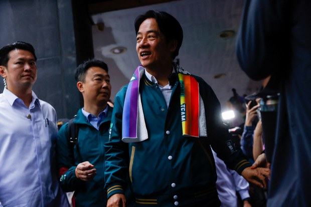
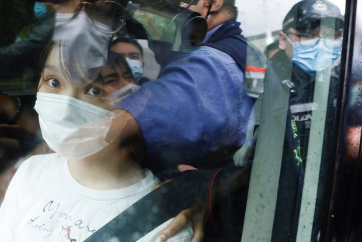
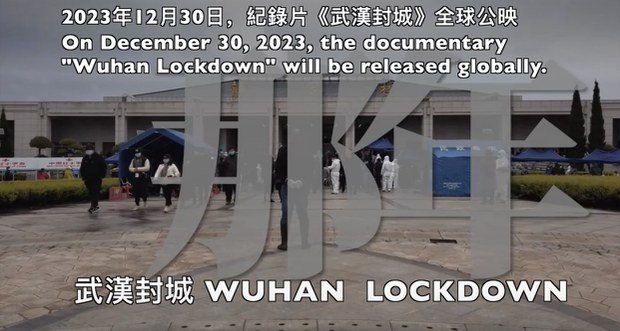

自由亚洲电台 北京时间 2023-12-30T01:07:59Z 1740781722898448830 #台湾选情观察 台湾的现任副总统 #赖清德 代表民进党角逐2024年大选，希望延续执政路线和政绩。不过，他过去的言论被视为具有较多的"台独"色彩。若当选台湾的总统，赖清德的外交和两岸路线是否会与目前不同？赖清德是位出身清寒家庭的矿工之子，他的成长和从政历程都成为本次选举中的焦点。 https://t.co/PWM1YlhdPq   自由亚洲电台 北京时间 2023-12-30T01:19:30Z 1740784619191144694 涉嫌违反《港区国安法》获准保释的前香港众志成员 #周庭 没有按照规定到警署报到，香港警方谴责周庭畏罪潜逃，声称将对她终身追捕。前"港独"组织召集人、到英国寻求政治庇护的钟翰林则披露，香港警方国安处曾利诱他成为线人。
https://t.co/16JorTkfST https://t.co/MwJLX0Nq3J   自由亚洲电台 北京时间 2023-12-30T02:22:08Z 1740800384157766073 【《#武汉封城》月底全球首映】
https://t.co/vIyDaWSweq
制作团队一成员告诉本台：“对于武汉疫情信息的核实，当时在网上有两套反审查系统建在海外，会把各媒体的相关报道自动进行搜集，形成表格内容非常详尽，我们从中获得许多信息。我们又进行研究核实，再把公民抗争的视频、图文搜集起来，调查武汉肺炎死亡人数等。在这个过程中，卢煜宇发挥了很大的作用。我们的纪录片初期时间很长，但受限于时间，必须浓缩内容，因此，许多人物，内容仅仅点到为止。”   