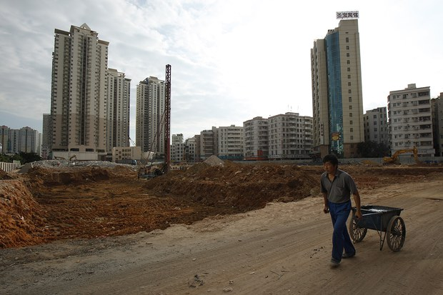
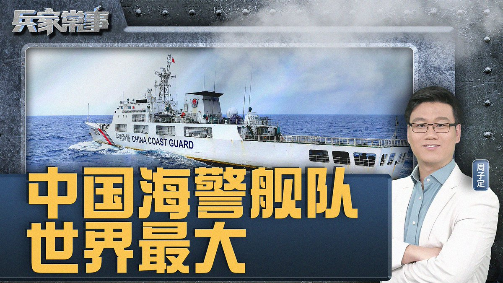
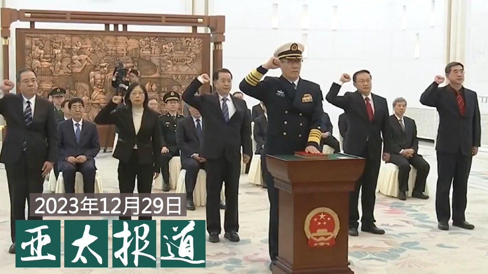
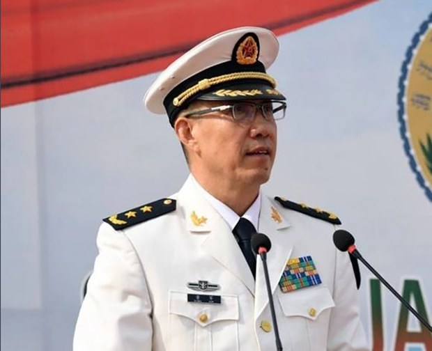
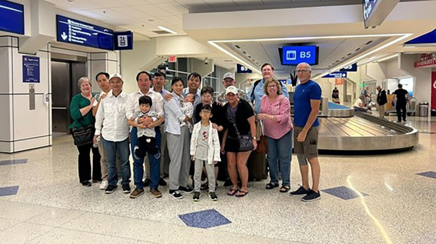
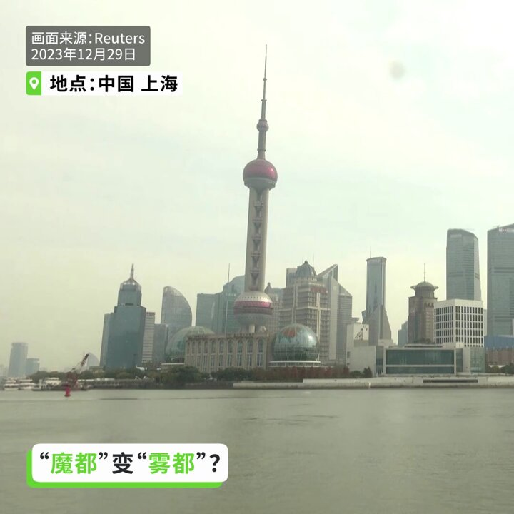
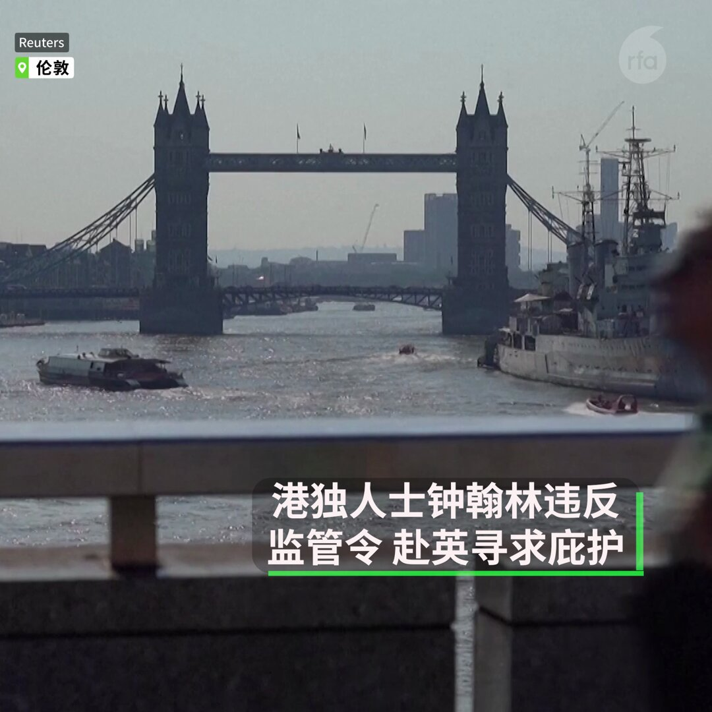
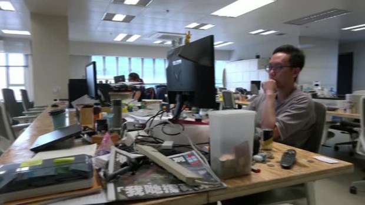
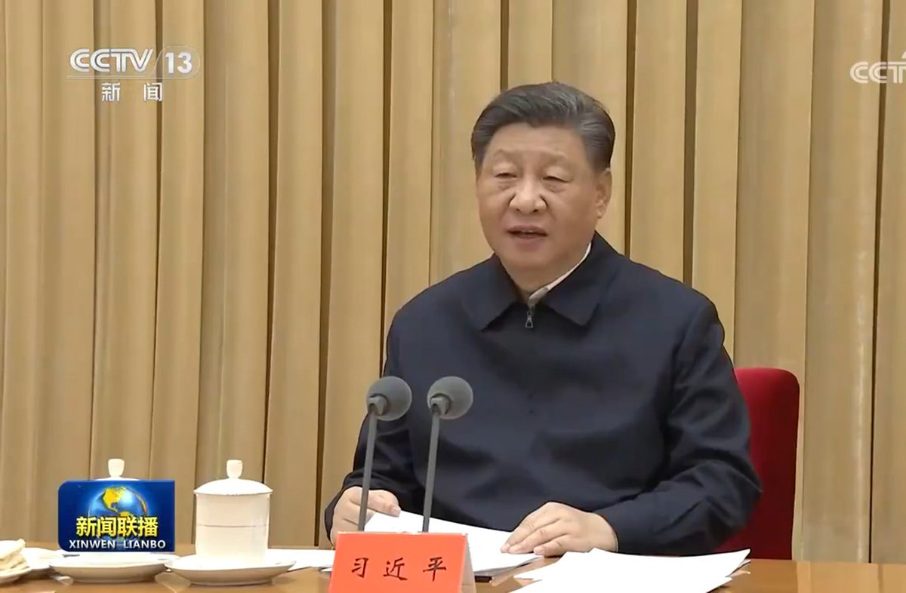

自由亚洲电台 北京时间 2023-12-30T14:00:01Z 1740976012157227018 评论 | 陈光诚 @iguangcheng：经济崩溃，民不聊生，中共却仍在双堠镇大兴土木
https://t.co/SMUUkOuZXg https://t.co/ucELGDaDXx   自由亚洲电台 北京时间 2023-12-30T12:12:04Z 1740948845457183176 #总统 #赖清德 #侯友宜 #柯文哲 #辩论会 #2024大选 #新闻直播
台湾总统候选人电视辩论会将于12/30 台北时间 2pm 美东时间 1am登场。三组候选人如何针对台湾的经济走向、国家认同、国际地位、两岸关系提出良方？将有什么激烈交锋？#自由亚洲电台 全程转播，欢迎收看！ https://t.co/AvC84FUpTv   自由亚洲电台 北京时间 2023-12-30T06:36:09Z 1740864306709696877 【为何南海冲突必将加剧？中国海警舰队规模有多大？｜兵家常事】美东时间12月29日晚7点播出
https://t.co/iFlKomsd7j
自11月29日 #习近平视察武警海警总队 东海海区指挥部之后，#南海 紧张局势不断升级，#菲律宾 和中国在南海 #仁爱礁 附近发生多次冲突。12月20日，王毅警告菲律宾外交部长马纳罗不要误判形势，“中菲关系已站在十字路口” 。进入2024年，南海冲突会加剧么？#中国海警舰队 作为南海争霸急先锋，规模到底有多大？它们会不会打响南海交锋第一枪？
@tansuoshifen1 周子定   自由亚洲电台 北京时间 2023-12-30T07:00:08Z 1740870344003727753 欢迎收听和订阅播客【＃亚太报道】 https://t.co/MjLNSvVMqc

中国任命原海军司令员 #董军 接任 #防长；《#武汉封城》即将全球公映；习近平重申外交“#斗争精神”；#中国年终回顾 与展望 https://t.co/RwFKM25gSD   自由亚洲电台 北京时间 2023-12-30T04:48:32Z 1740837227729662328 空悬了两个月的 #中国国防部长 一职，终于出现接替人选。 12月29日，中国第十四届全国人大常委会第七次会议任命海军上将 #董军 为新任防长。
这是中共建政以来，首度由海军将领担任国防部长。此举是否攸关中国对台战争的布局？
https://t.co/kRNOVJIdFS https://t.co/tZ4ZhQx1MJ   自由亚洲电台 北京时间 2023-12-30T05:29:46Z 1740847601363358013 #深圳改革宗圣道教会 (又名 #五月花号教会) 的六十多名基督徒，今年4月从泰国到美国获得庇护，他们在泰国一度要被遣返中国的惊险时刻，#陈广泽 参与了营救工作。之后陈广泽及时出逃加拿大，最近获得难民身份。他说，还有许多中国难民仍困在东南亚...

https://t.co/zLof7EShPo https://t.co/KCNqnJ5raa   自由亚洲电台 北京时间 2023-12-30T05:37:56Z 1740849656425562508 【上海：魔都变雾都】
12 月 29 日, #上海大雾。有关部门发布上海大雾黄色预警，并暂停了部分轮渡航线。 部分高速公路路段以及通往集装箱港口的桥梁暂时关闭。 https://t.co/E9m6djZodN   自由亚洲电台 北京时间 2023-12-30T06:09:08Z 1740857508548448576 【港独人士钟翰林逃英，周庭正式被追捕】
因“分裂国家罪”而被判监的香港“#学生动源”创办人钟翰林，释放后违反警方监禁令，在日本 #冲绳 “旅游”时拒绝返港，进而转机飞往伦敦，并在 #英国 寻求政治庇护。距离周庭弃保流亡不足一个月。同一时间，#香港 警方正式表示对 #周庭 展开“全力追捕”。 https://t.co/mOAhBrr2Dv   自由亚洲电台 北京时间 2023-12-30T02:55:09Z 1740808693594333591 《#立场新闻》关闭两周年　“#媒体自由联盟”对香港新闻自由表达严正关切
https://t.co/3cKIFsiNAh https://t.co/gJTbNon7xM   自由亚洲电台 北京时间 2023-12-30T04:05:54Z 1740826498712711254 【特别报道：中国政经状况回顾与2024年展望】https://t.co/gfhyJ54aen
回首过去、展望来年，影响中国社会的最主要因素将会是什么呢？本台记者凯迪 @KittyWang5 邀请美国非政府组织"对话中国"智库所长 王丹 @wangdan1989 和美国斯坦福大学中国经济与制度研究中心资深研究员 #许成钢 教授进行讨论。 https://t.co/e7uKzF016G   自由亚洲电台 北京时间 2023-12-30T00:53:46Z 1740778146977464770 五年以来，中共首次召开 #中央外事工作会议，会后公告强调中国自十八大之后的"外交成就"，强调斗争精神和人类命运共同体等。这对中国未来的外交政策有何暗示？

https://t.co/s8ug1zV3DN https://t.co/a6nv897Z7t   自由亚洲电台 北京时间 2023-12-30T01:07:59Z 1740781722898448830 #台湾选情观察 台湾的现任副总统 #赖清德 代表民进党角逐2024年大选，希望延续执政路线和政绩。不过，他过去的言论被视为具有较多的"台独"色彩。若当选台湾的总统，赖清德的外交和两岸路线是否会与目前不同？赖清德是位出身清寒家庭的矿工之子，他的成长和从政历程都成为本次选举中的焦点。 https://t.co/PWM1YlhdPq   自由亚洲电台 北京时间 2023-12-30T01:19:30Z 1740784619191144694 涉嫌违反《港区国安法》获准保释的前香港众志成员 #周庭 没有按照规定到警署报到，香港警方谴责周庭畏罪潜逃，声称将对她终身追捕。前"港独"组织召集人、到英国寻求政治庇护的钟翰林则披露，香港警方国安处曾利诱他成为线人。
https://t.co/16JorTkfST https://t.co/MwJLX0Nq3J   自由亚洲电台 北京时间 2023-12-30T02:22:08Z 1740800384157766073 【《#武汉封城》月底全球首映】
https://t.co/vIyDaWSweq
制作团队一成员告诉本台：“对于武汉疫情信息的核实，当时在网上有两套反审查系统建在海外，会把各媒体的相关报道自动进行搜集，形成表格内容非常详尽，我们从中获得许多信息。我们又进行研究核实，再把公民抗争的视频、图文搜集起来，调查武汉肺炎死亡人数等。在这个过程中，卢煜宇发挥了很大的作用。我们的纪录片初期时间很长，但受限于时间，必须浓缩内容，因此，许多人物，内容仅仅点到为止。”   