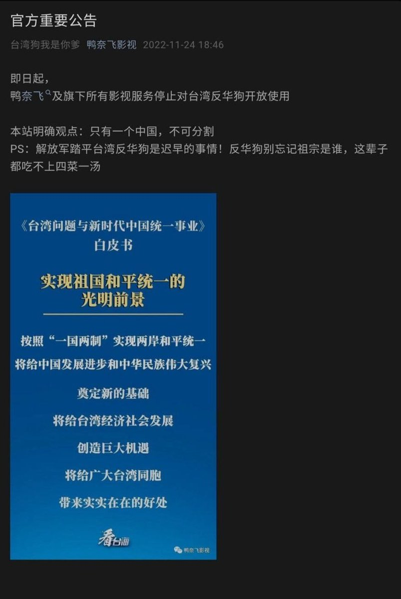
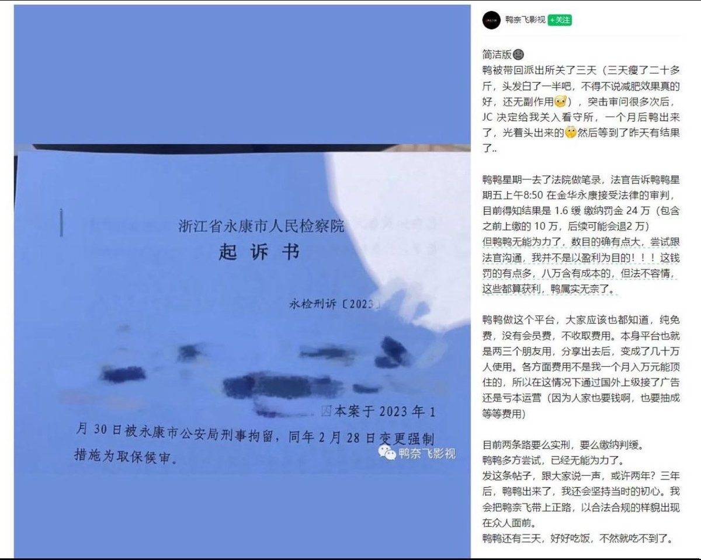

谁将十万横扫三江 北京时间 2023-12-30T22:16:59Z 1741101078199038458 中兴通讯公司同事骚扰猥亵后当事人试用期未转正

网评：看起来这是一场蓄谋已久的行动，从你为自己争取正当权益的那一刻起，就已经被他们打上危险人物的标签了

朋友们，我失业了☹️

我的前司是中兴通讯，缩写是ZTE，祖上阔过后来被美国重锤出击的那家（）之所以明确地写出来，是因为离职的过程太难看了，以至于到了一种匪夷所思的地步，所以我必须如实地做个记录。

我7月份入职、是部门唯一的应届生，试用期6个月。12月26日上午，我做了转正答辩，26日下午3点，我被喊到办公室通知无法转正、解除劳动合同。因为没有得到任何提前的告知，所以我很惊讶。部门领导让我立刻签字。在场没有HR、没人告诉我后续要进行的步骤，我也不太确信应该如何应对，于是我拿着通知单先离开，打算梳理消化一下。

我把通知单给隔壁部门的朋友看，她也很惊讶，提出陪我下楼走走。我们到大厦外，被2个保安尾随、阻拦，他们问我“有没有拿公司的东西”。莫名其妙之余，我意识到这场离职可能氛围比我想象得更严峻，于是决定先不出去了、就在楼里聊天。

我回工位拿上办公电脑（我想他们这个样子可能接下来会直接趁我不在、收走电脑，而电脑里还有我的自学笔记），和朋友到茶水间聊天，此时已经有4个人全程跟随我们：2个保安、2个部门行政人员。我们坐下还没开始聊，我朋友的领导就给她打电话，叫她回工位，我也只好回到工位。

此时我的办公软件及邮箱已无法使用，另有朋友提醒我，要留存一些工作时长、工作量的证明。于是我开始翻看我的日常to do list、笔记，并试图拍照留存。

此时保安突然上来【抢我的电脑】，我的手机在争执中被摔到地上。我愤怒极了，紧紧地抱着电脑一侧，大喊你要干什么。保安撒手后我跑开一点，他们随即跟上，一直在我附近1、2米的范围内。旁边有个中层领导样的男人，授意保安“【去抢她的电脑】”，有声音威胁我说“你再这样我们要报警了”。我气得好笑，说：该报警的人是我吧？于是当场打了报警电话。

警察来后进行了简单的调解。我继续整理思路、收拾东西。本来和另外一位同事朋友约了晚间小聚，我告知不能参加、我已离职，对方也大为震惊、询问我的状况，我于是和他约到茶水间聊聊。聊到一半，部门领导带着警察破门而入，把我的朋友赶走，而叫警察的理由好像是“占用公司空间”或“盗取公司机密”之类的——我3点接到通知，此时才下午6点，而离职通知单上明文写的是29日办结手续。

警察再次调解的结果是，让我继续整理自学笔记，如果公司审核同意我可以带走。此时我身边已经无时无刻不跟着6个人了：2个保安，2个部门行政，2个公司行政。中途我去了一次卫生间，4个人跟在我身后，等我出来，发现2个男保安就在门口等待。

我找了个安静的会议室整理资料，因为部门领导在之前的调解中称“所有工作期间产生的成果都属于公司”，我对于最后能拷走什么资料不太乐观。我试图拍摄知识思维导图，被保安两次冲进来打断。我不再拍摄，整理到8点，又有警察到来。我精神几乎崩溃，问他们到底要干什么，围绕着我的6个人不愿意抬头看我。我问是谁报的警，有人忙表示不是自己。

警察再次调解，部门领导出面谈判，可能因为情绪激动，这个时候我看电脑屏幕已经有点头晕脑胀、觉得视野边缘涣散。调解的结果是让我安静地整理到11点。我继续整理，过程中和我发生过肢体冲突或尾随过我的2位男保安，时不时地闯入会议室，并坐在离我很近的地方，我感到非常不适并明确反对，但也无济于事。

10点半左右，我整理好了。部门领导审核内容，我去收拾东西、签字、了解后续。好笑的是，围绕我的6个人没一个清楚离职手续，问到大家大家纷纷说“不是我的职责范围”，要我发邮件询问。我说，我的软件邮箱工卡都失效，按照这个架势明天肯定进不来公司、很不方便，何况我已经离职，没有义务熟悉你们的组织架构，请给我安排一站式的服务。部门领导现场给大领导打了电话，才安排了专人对接我的离职手续。

折腾到1点左右才结束，我问部门领导，具体是什么原因不让我转正，对方缄口不答。我说离职本来是小事，我也在不断寻找适合自己的环境，我一定会做事但不一定在中兴做事，你在乎这里的职位我不见得那么在乎，为什么不肯提前和我说、为什么要闹得这么难看，他也不做任何回应。

打包东西等等，我到家大概3点了。我对于整个事件中莫名其妙的敌意感到非常震惊和受伤，处理手段的野蛮和荒谬让人很难相信这是2023年、很难相信这是一家市场经济语境下的上市公司。朋友说，这好像都市怪谈，日日相处的人一夕之间突然变脸，“一下子你不再是一个活人而立刻成为一个问题”，几乎是以防暴演习的级别来处理一场离职。连累到朋友这件事使我非常非常难过，而部门领导带着警察闯进茶水间、打断我和朋友聊天的一幕也让我每次想起都阵阵泛恶心。

我和部门领导交谈时的想法是真实的：离职相比来说其实是件小事，我没打算辛苦地适应环境或者让环境容忍我，但这件事本来可以有成熟体面的处理。首先应该提前告诉我，让我为转岗或者找下一份工作做准备；其次过程完全不必要如此——我曾经使部门骚扰我、猥亵我的两位已婚70后男同事离职，过程中我展现出性格强硬的一面，我的领导好像由此有点怕我，担心我做出什么极端的事情来——事实上，我从头到尾维护的正是自己的人格、乃至所有人的人格，他们这样激烈的、侵犯人身的处理才是我会大怒和追究的事。

我不知道这场离职处理得如此荒谬的具体原因是什么，事到如今也不太感兴趣背后的来龙去脉——当然，我有隐约的猜测、嗣后可以慢慢复盘。但我认为应该有人为这件事情负责（我希望部门领导和保安向我道歉），或者大家应该知道，这样一家公司可能会以这样的态度对待自己的员工。目前离职手续初步完成而赔偿金还没有到位，我做好了劳动仲裁的初步准备。请@中兴通讯 关注，我的诉求已内部反馈，期待节后得到妥善解决。

2023年进入职场真的遇到了太多太多，如同一出人间历险记。我大概会先躺一段时间，再思考接下来的方向。欢迎大家以各种形式提供思路和可能性。祝大家、也祝我自己前程似锦吧，为新岁干杯 source (https://t.co/F1ApkehtNW)   谁将十万横扫三江 北京时间 2023-12-30T22:51:41Z 1741109810291257585 😆 https://t.co/aJq0ularXb   