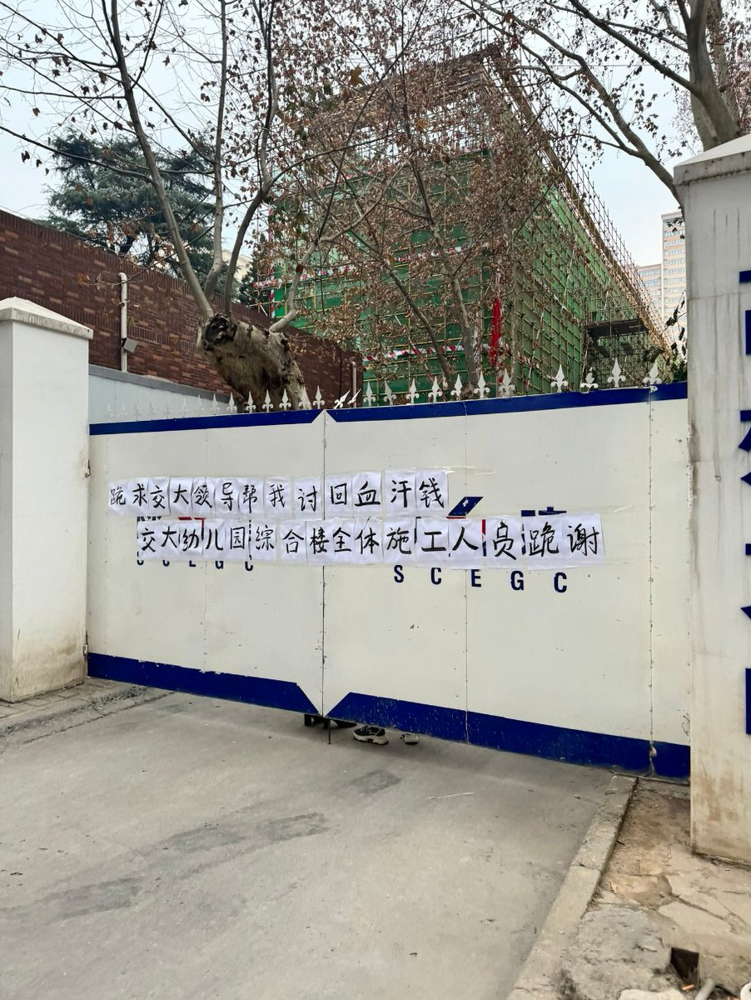
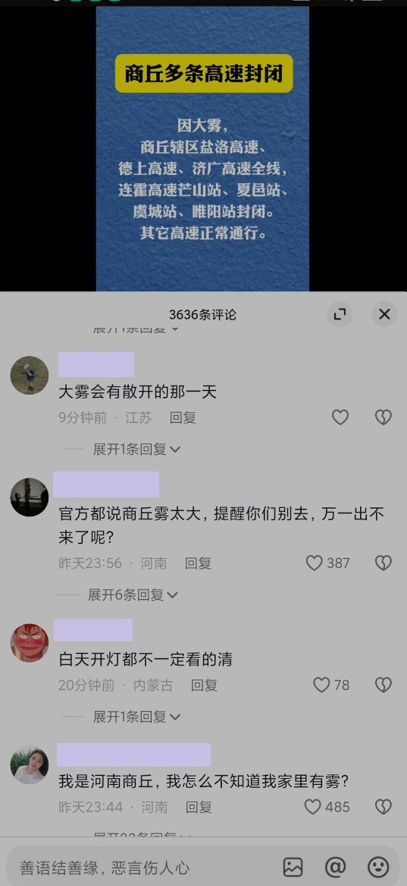
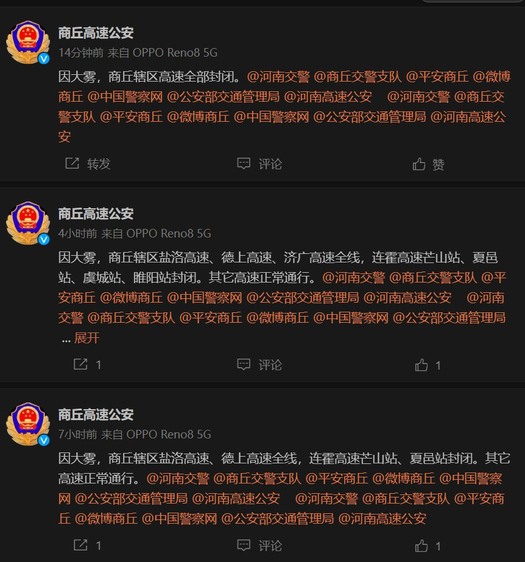

A李老师不是你老师 北京时间 2023-12-29T19:26:20Z 1740695743525171578 12月29日，西安交通大学工地门口，员工讨薪 https://t.co/ruhrwNPIww   A李老师不是你老师 北京时间 2023-12-29T19:36:17Z 1740698245678965105 12月29日，宁陵的每个路口都布置了大量特警
关键路口用数量私家车横摆封路 https://t.co/0U4mMaFpZw   A李老师不是你老师 北京时间 2023-12-29T20:09:24Z 1740706582415933747 12月29日，有网友发现，美食作家王刚疑似被“软封杀”
测试王刚的全平台账号发现
他的抖音显示无法关注；
西瓜视频无法关注并且主页显示该用户已被禁言；
B站目前可以关注；
微博点击关注显示已关注，但是关注列表里并没有王刚。
另外，自从“蛋炒饭风波”后，王刚再也没有发布过任何视频。 https://t.co/6vE83Wx0d8   A李老师不是你老师 北京时间 2023-12-29T20:17:48Z 1740708696546811961 12月27日，北京。一位公交司机在社交平台发视频称，刚接到紧急通知，集团的工资总额从2800元改成了1420元，发放时间上级未公布。
司机质疑，北京公交集团原党委书记董事长王春杰因违法违纪被调查后，司机们拿到的工资反而变少了，是不是新上任的官员又从司机身上扒皮了。 https://t.co/1yvA5CGjzb   A李老师不是你老师 北京时间 2023-12-29T07:57:17Z 1740522337341157618 目前，河南商丘网络电视台的直播间评论区
民众向正在做报告的领导“要真相”
感叹“天太黑了” https://t.co/NiQeqyeV8p   A李老师不是你老师 北京时间 2023-12-29T01:21:26Z 1740422720574107665 目前网传消息称，28日晚，有宁陵县当地派出所在群里紧急通知民众，明天不准前往育华园中学。 https://t.co/Ni5gvWbKMV   A李老师不是你老师 北京时间 2023-12-29T06:02:09Z 1740493365655859284 一段宁陵县育华中学学生讲述事情经过的视频在29日凌晨被抖音网友们接力转发
但请注意，该视频的内容为这名学生的个人主观描述，事件的具体原因目前还没有定论 https://t.co/SyqpVTxWUm   A李老师不是你老师 北京时间 2023-12-29T00:37:13Z 1740411591836008866 截至目前，民众已经散去，学校周围布置了大量警力，封路警戒 https://t.co/biUAyByOWb   A李老师不是你老师 北京时间 2023-12-29T02:03:14Z 1740433239951745302 当天下午，宁陵县县长出面与民众交涉
民众要求“杀人偿命” https://t.co/qWbio7ZGMq   A李老师不是你老师 北京时间 2023-12-29T01:42:15Z 1740427959427887225 目前，商丘境内多条高速公路因大雾封闭 https://t.co/tFGWP6SS7c   A李老师不是你老师 北京时间 2023-12-29T02:07:31Z 1740434316578951499 28日晚，宁陵县封路戒严画面 https://t.co/BbpKMiEBzw   