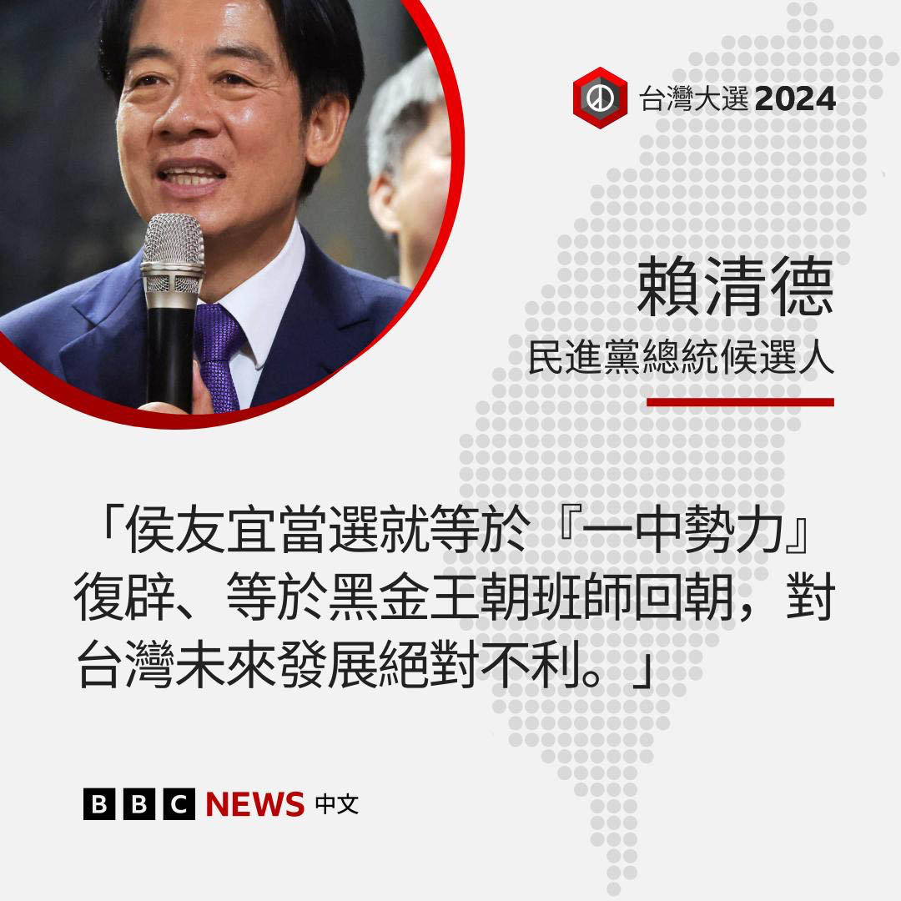
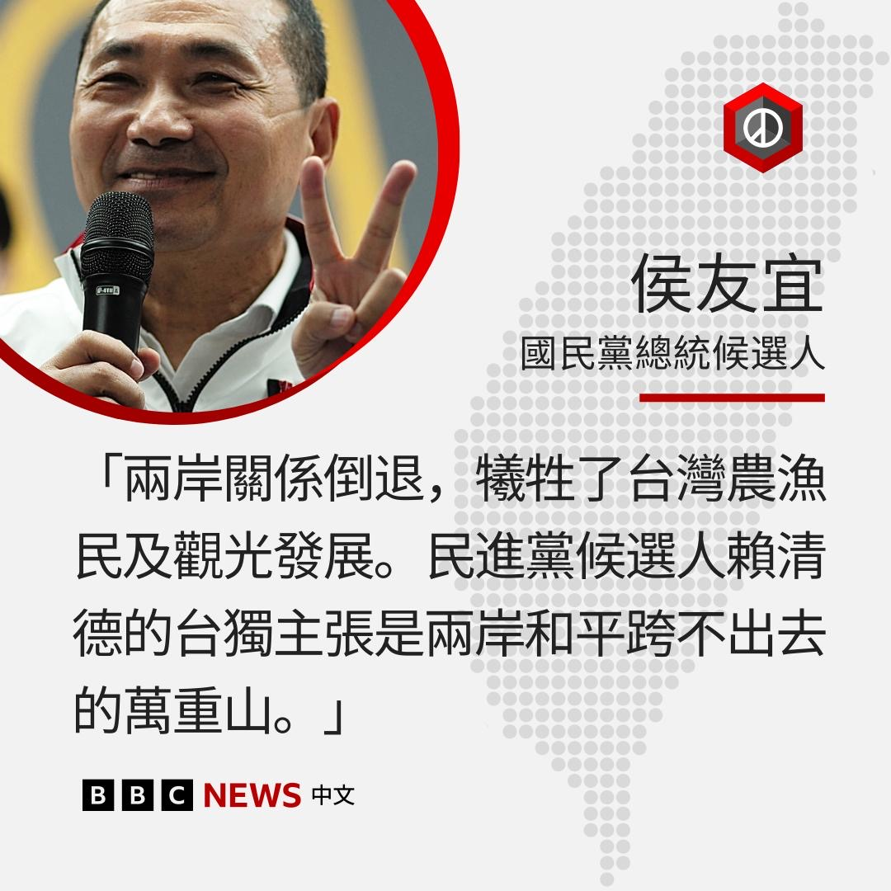
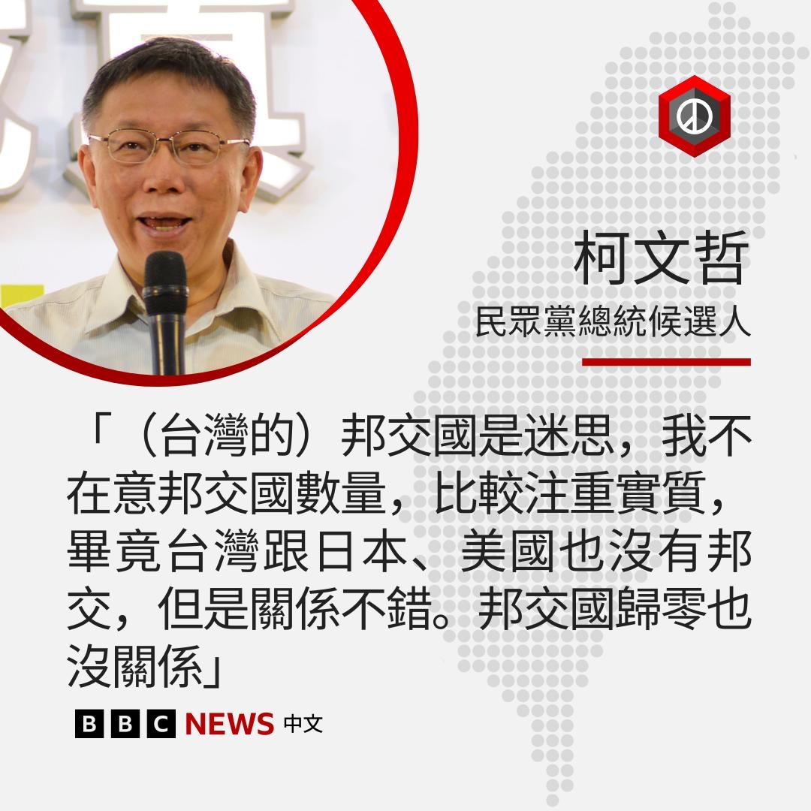

D英国广播公司BBC 北京时间 2023-12-29T09:00:06Z 1740538145626542315 虽然北京在台湾大选投票日临近之际一直在加大对台湾的压力，但观察人士认为，这次选举只是一个短期目标，北京真正的大战略，亦即终极目标，是不费一兵一卒的情况下让台北签下和平协议。https://t.co/JrCNzArlup   D英国广播公司BBC 北京时间 2023-12-29T09:01:05Z 1740538393153454364 香港前“学生动源”召集人、独派人士钟翰林指，他已经于周三 （12月27日）抵达英国寻求庇护。钟翰林告诉BBC，获释半年以来，他面对着比牢狱更大的恐惧，就如置身于“一个更大、更危险的监狱”。
https://t.co/iRSllU4kji   D英国广播公司BBC 北京时间 2023-12-29T02:44:54Z 1740443723300036827 台湾总统大选拉票进入白热化阶段。在刚结束的总统参选人政见发表会，三党候选人都各自陈述两岸政策，并在台湾的内政外交议题上攻防。

国民党候选人侯友宜抨击赖清德主张“台独”，将把台湾带入战争危险，又称与北京的不睦牺牲了台湾农渔民生计。

赖清德则回击侯友宜坚持“一中”政策，以及其与北京的联系正在伤害台湾的民主制度。

柯文哲强调，在意台湾邦交国还剩多少个没有太大意义，重点是如何与他国实际交流。   