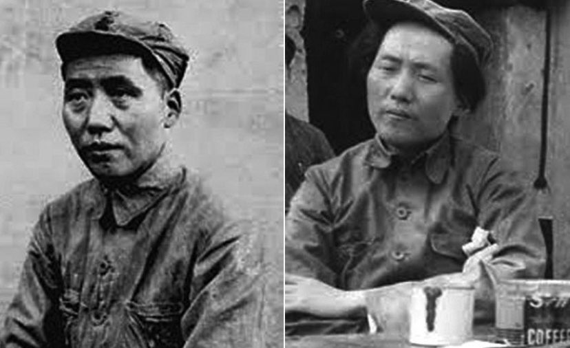
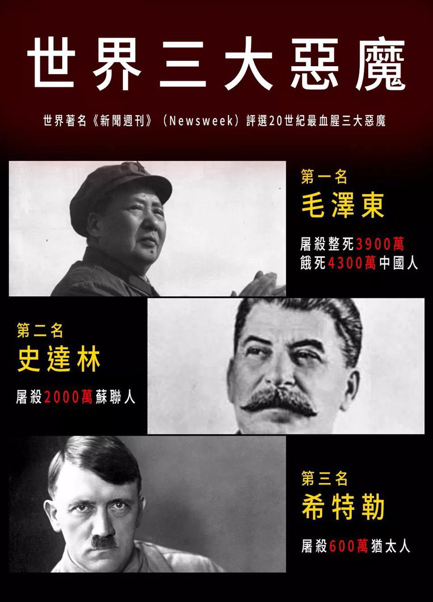

Ivy未央 北京时间 2023-12-29T20:25:57Z 1740710746777170166 转）五位副主席点评毛泽东
刘少奇：“人相食,你我要上史书的！”
林彪：“自我崇拜,自我迷信,功为己，过为人。”
叶剑英：“文革整了一亿人，整死二千万人浪费八千亿元。”
李先念：“文革使国民经济到了崩溃的边缘！”
陈云：“一意孤行，打击同他意见不同的人，破坏民主集中制；···治国他无能，文革他有罪！” https://t.co/QKQuQFKjOV   Ivy未央 北京时间 2023-12-29T09:02:33Z 1740538761346519244 毛泽东放言：不怕战争死一半人
1957年莫斯科共产党大会，毛泽东：如果爆发战争，全世界27亿人，可能死掉一半，还有一半人。帝国主义打平了，世界社会主义化了…
1958年中共八大会议毛：打起仗来无非就死人。原子仗没经验，不知要死多少，最好剩一半，换来资本主义全部灭亡，取得永久和平，这不是坏事。 https://t.co/5HmEGhpPmS   