Petrichor 北京时间 2023-12-29T11:21:23Z 1740573703812051007 最佳舵手奖，他得之无愧。 https://t.co/EbljMMThfo 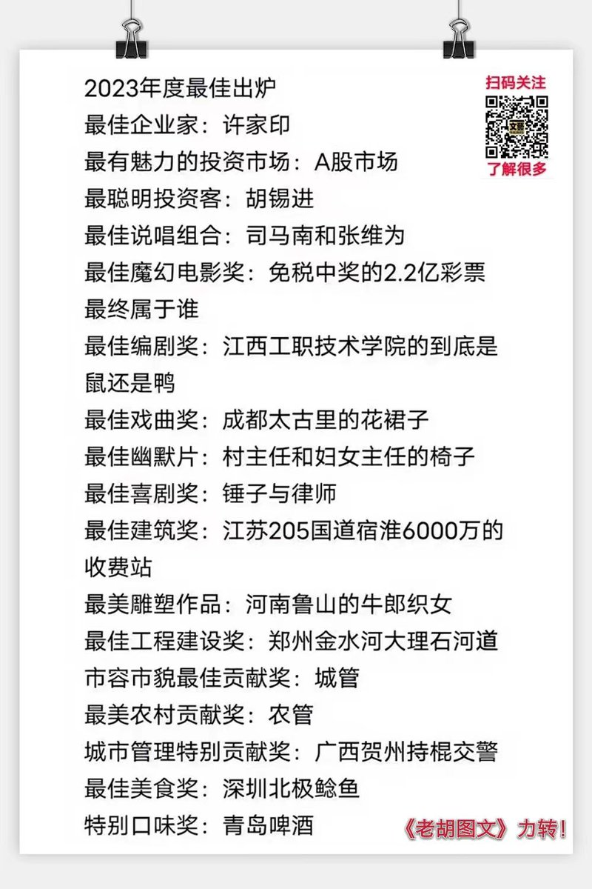  Petrichor 北京时间 2023-12-29T09:14:24Z 1740541747350974688 目前中国创新药中，行业共识的分类可以如下几种：
1）首创新药（First-in-class），罕见,青蒿素算一个,或者说近几十年里没有；
2）同类最优（Best-in-class），极为少见，乐观点百济神州的泽布替尼，南京传奇的西达基奥仑赛可以算此类；
3）优化模仿（Me-better），也少；公平观点百济神州的泽布替尼，南京传奇的CAR-T产品“西达基奥仑赛”可以算此类；
4）快速模仿（Fast follow），国内大部分的创新属于此类，已经成为内卷重灾区
5）仿不如（Me-below），中国有众多的小企业，行业专家大多认为这些药企的仿制水平远远达不到国际公司的标准，出来的产品质量令人堪忧。
总结一句话，中国目前的问题是在做相对低水平的创新药研发。
​③这种内卷和低水平的快仿将大量浪费中国的研发资源。
没有首创新药的基础，过多的抢赛道的跟风，影响中国创新的声誉，同时面临不可预计的风险。   Petrichor 北京时间 2023-12-29T09:34:15Z 1740546741101855217 及时纠正，追查责任，绳之以法。

“涉罪人员近亲属多项权利进行限制，违背罪责自负原则，不符合宪法第二章关于‘公民的基本权利和义务’规定的原则和精神。”全国人大常委会法工委对“连坐”亮出了鲜明态度——违反宪法原则。
12月26日，全国人大常委会法工委主任沈春耀向十四届全国人大常委会第七次会议报告2023年备案审查工作情况，报告中还公布了多起备案审查典型案例。报告称，有的市辖区议事协调机构发布通告，对涉某类犯罪重点人员采取惩戒措施，其中对涉罪重点人员的配偶、子女、父母和其他近亲属在受教育、就业、社保等方面的权利进行限制。
法工委明确：任何违法犯罪行为的法律责任，都应当由违法犯罪行为人本人承担，而不能株连或者及于他人，这是现代法治的一项基本原则。有关通告对涉罪人员近亲属多项权利进行限制，违背罪责自负原则，不符合宪法第二章关于“公民的基本权利和义务”规定的原则和精神。   Petrichor 北京时间 2023-12-29T10:04:46Z 1740554420805382516 尼克松与赫鲁晓夫辩论，面红耳赤，最后尼克松撂下一句狠话：双方将国门打开，让人民自由选择，用脚投票，看看哪个国家的人民愿意留在本国，哪个国家的人民选择逃跑。结果，柏林墙的倒塌印证了尼克松的赌言，狠抽了赫鲁晓夫的脸。

习皇提“四个自信”，即“中国特色社会主义道路自信、理论自信、制度自信、文化自信”。但是，如果开放国门，看习皇的子民是否往欧美跑？冒着危险走线美国，等同于打了“四个自信”的脸。 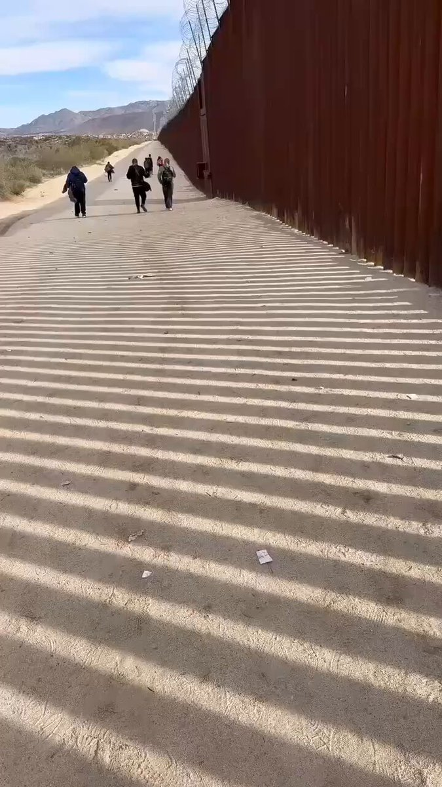  Petrichor 北京时间 2023-12-29T04:18:44Z 1740467339651694784 网友论中国（1） https://t.co/GkKm4hNF1L 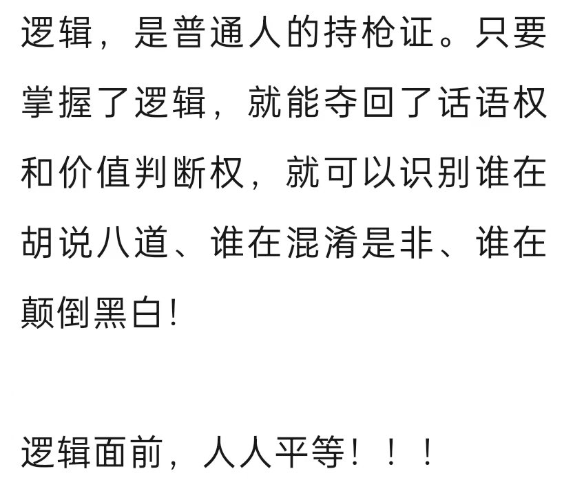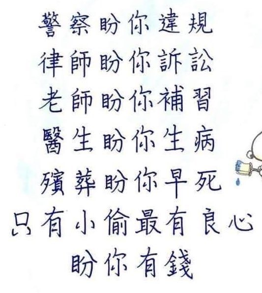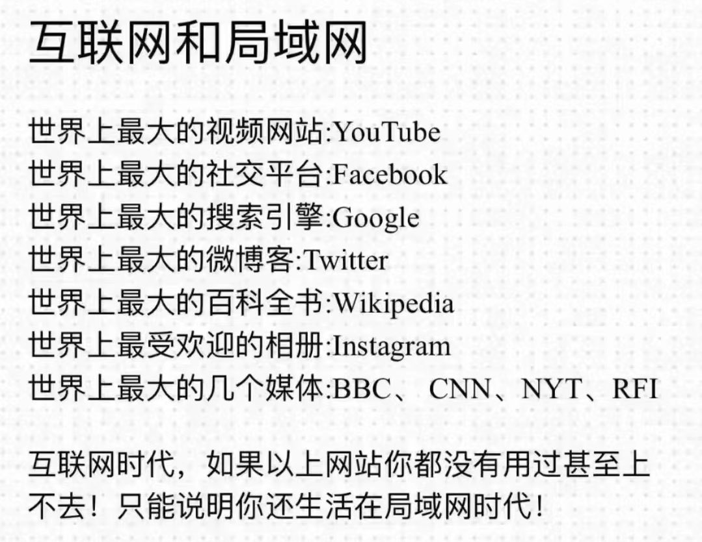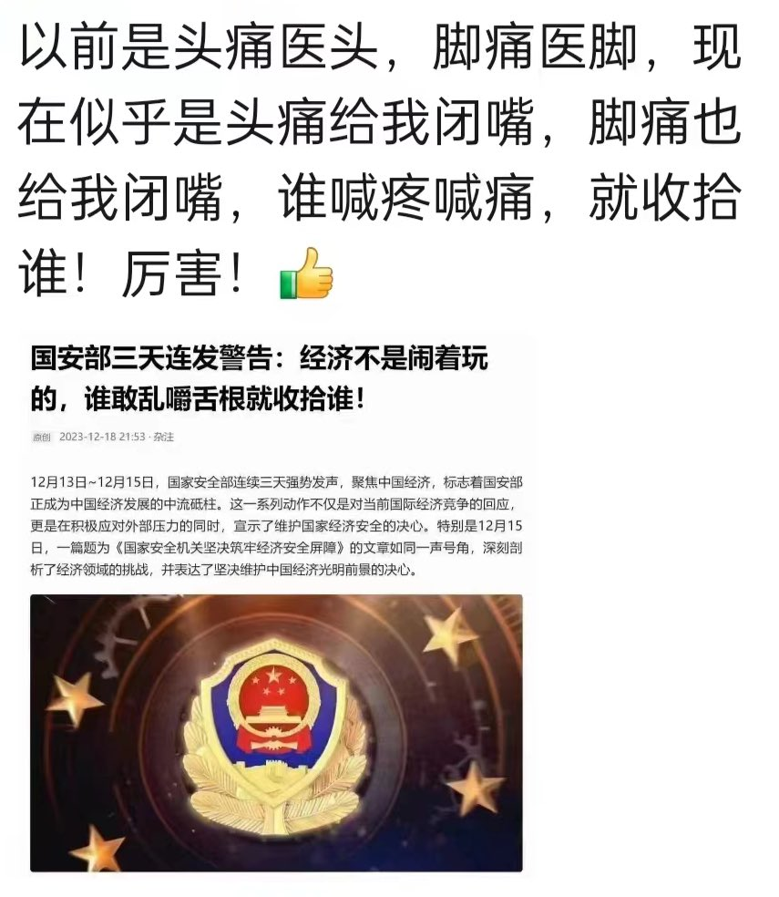  Petrichor 北京时间 2023-12-29T04:38:25Z 1740472292810063925 夕奥塞斯库的全面脱贫就是一个笑话，自欺和欺人。他的政绩就是用一张美丽贴纸掩盖贫穷，不实事求是的，祸国殃民的。
把粪球打磨再光，哪怕再绘上画或雕上花，依然是臭不可闻的屎。 https://t.co/SNBnFp04rV 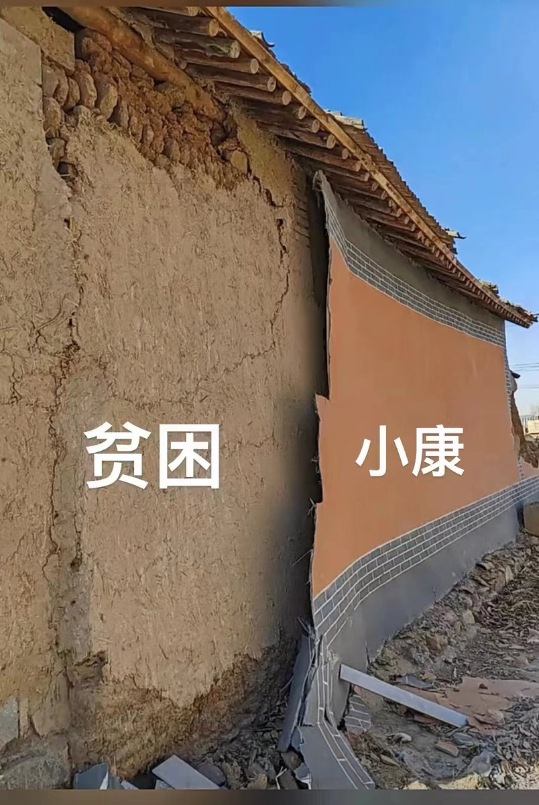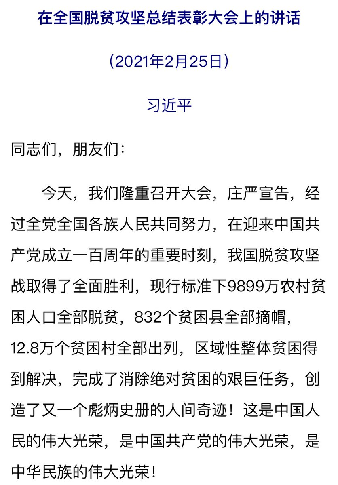  Petrichor 北京时间 2023-12-29T02:51:42Z 1740445434055889101 工业化造成空气污染，形成酸雨，腐蚀石头古建筑和古雕塑，特别是那些碳酸钙组成的大理岩和石灰岩材料，在其表面留下一个个凹坑和空洞，保养和维修皆需要大量资金。 https://t.co/wxRvpYmDWw 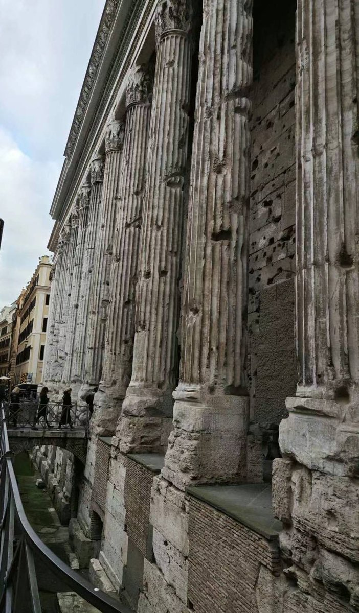  Petrichor 北京时间 2023-12-29T04:14:07Z 1740466176185057600 拉斯维加斯花23亿美元打造巨型视觉球，成为一个新的地标性建筑。这座建筑英文名为MSG Sphere，位于Las Vegas市中心，是目前世界上最大的球形建筑。球外部呈现出各种震撼奇幻的视觉效果，内部则是面积15793平米，分辨率高达16K的高科技LED屏。开放后的球幕剧场内部可以容纳一万八千人，为观众打造出无需眼镜就能身临其境的VR体验。面对如此真实的“卡通球球”，我们难以分得清虚拟与现实。 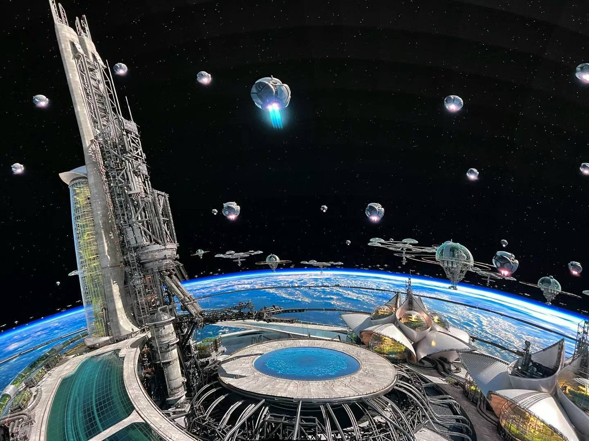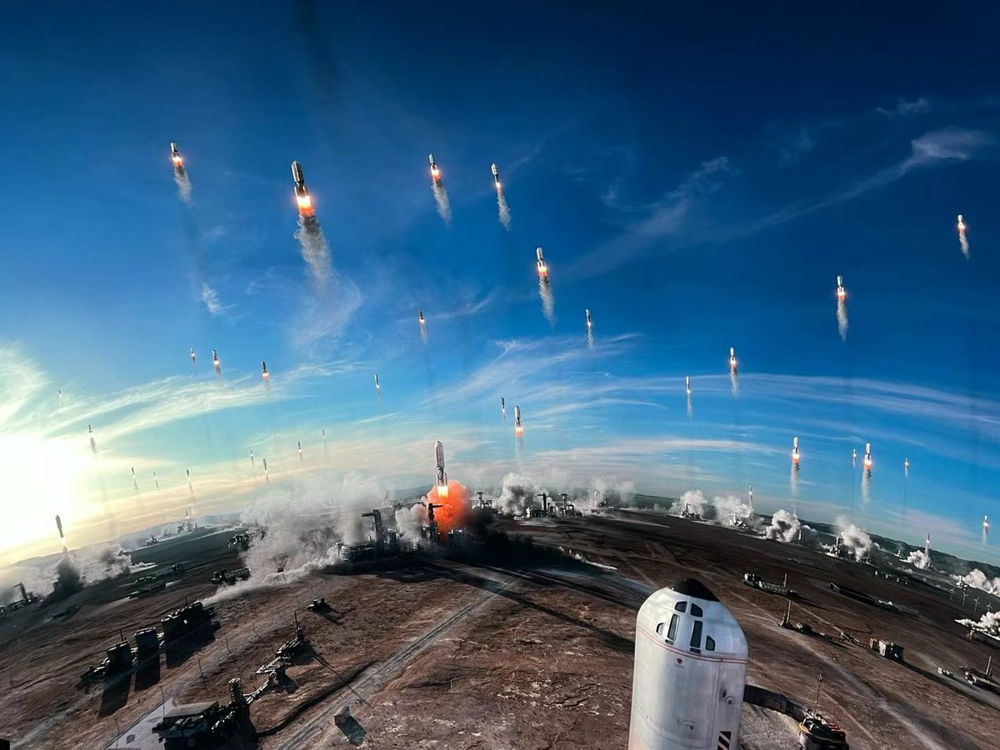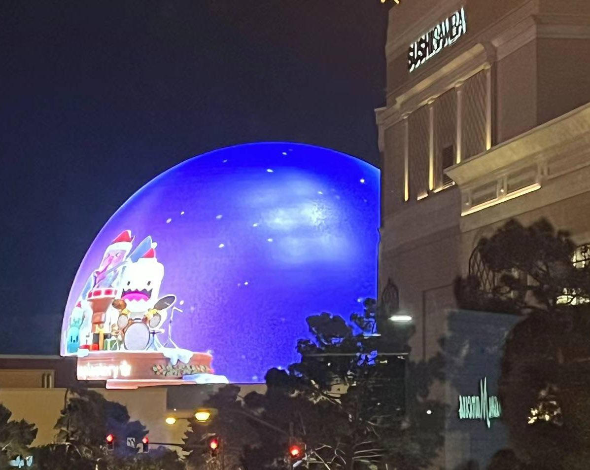  