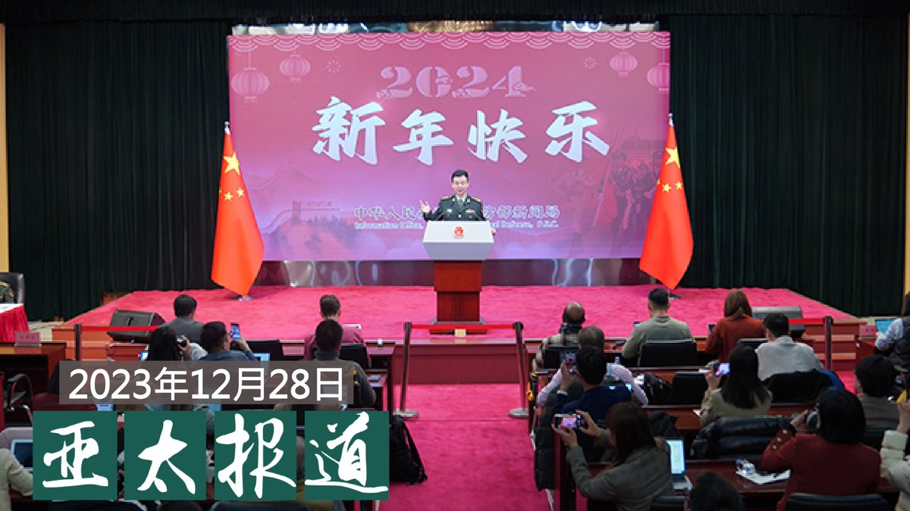
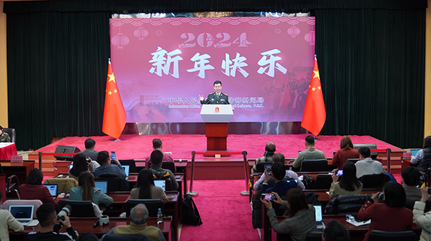
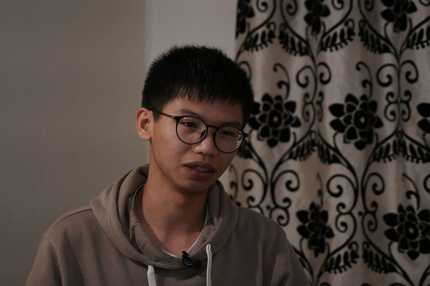
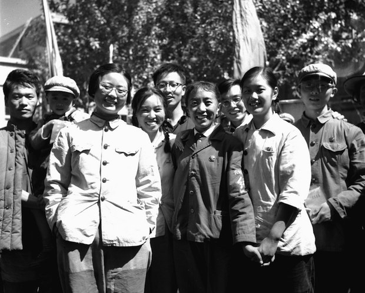
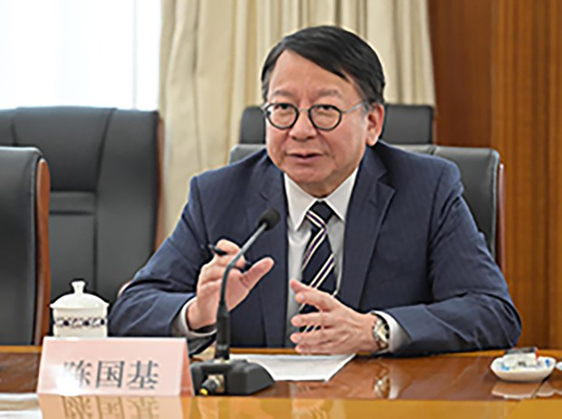
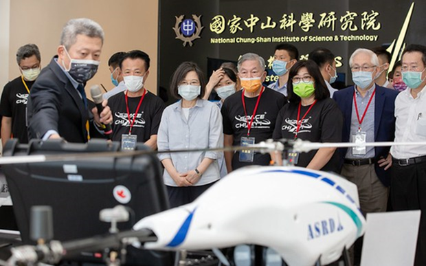
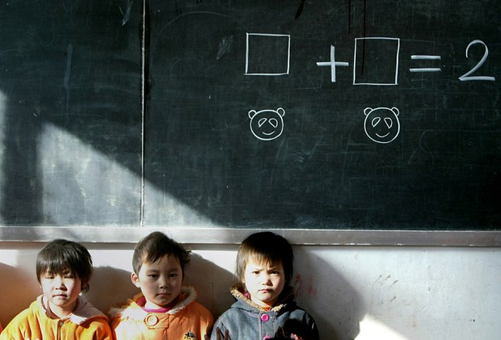
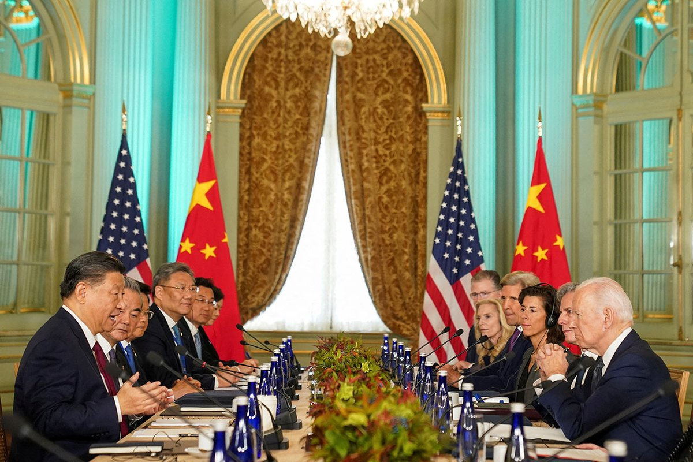

自由亚洲电台 北京时间 2023-12-29T13:03:41Z 1740599444511289746 据台湾中央社12月28日报道，国际社群平台X（原推特）近日流传一段视频，视频中一位中国人在 #中华民国驻教廷大使馆 外，将鼻涕抹在使馆馆牌上。使馆官员在回应中央社询问时表示，在看到影片后，使馆人员已立刻清洗、消毒馆牌，并依据监视器影像向意大利警方报案，同时也对这位不理性中国人的脱序行径发表严正谴责。使馆发言人在脸书上发文表示，“这是对民主的感冒，以及对自由的过敏”。
目前，台湾与梵蒂冈存在邦交关系。教廷更是台湾13个邦交国中，唯一一个欧洲国家。   自由亚洲电台 北京时间 2023-12-29T09:41:00Z 1740548441221292114 欢迎收听和订阅播客【＃亚太报道】 https://t.co/MjLNSvVMqc
中国军方谴责美国、威胁台湾；中国国安部发布“#保密清单”；前瞻2024年 #美中关系；#余文生 首次会见辩护律师；中国据报施压“#五月天”影响 #台湾大选。 https://t.co/SctRV8799g   自由亚洲电台 北京时间 2023-12-29T11:00:10Z 1740568361527021808 本周四，中国国防部举办的年末最后一场新闻记者会上，发言人吴谦严厉抨击美国在涉及国防、台海及南海问题上的政策立场，并且针对台湾即将举行的大选发出威胁。美中军方实现高层通话后，中方此举引发外界舆论的关注。
https://t.co/c1psB1Rgbm https://t.co/12DaQ1VJHT   自由亚洲电台 北京时间 2023-12-29T09:42:19Z 1740548771388572128 前香港学生领袖 #钟翰林 抵英寻政庇 揭国安"招安"收买内情
https://t.co/PvWXKLH5uH https://t.co/s0GHcT1MUa   自由亚洲电台 北京时间 2023-12-29T08:49:23Z 1740535448508969151 RT @RFA_Chinese: 【专访台湾民众党副总统候选人吴欣盈】
【吴：台湾在中美之间不是规则制定者 需提高竞争力】
台湾 #民众党 副总统候选人 #吴欣盈 27日接受自由亚洲电台 #亚洲很想聊 主持人 #戴忠仁 专访时指出，台湾在国际政治上，不是 #规则制定者 （Pri…   自由亚洲电台 北京时间 2023-12-29T04:59:25Z 1740477575263408303 北京维权律师 #余文生 和妻子 #许艳 因涉嫌寻衅滋事等罪名被羁押已超过八个月。据了解，余文生案已进入公诉审查阶段。近日余文生首次和辩护人会晤，表示自己已经豁出去，唯独对儿子放心不下。
https://t.co/xy49cfIbfP https://t.co/XZOE42P2sw   自由亚洲电台 北京时间 2023-12-29T00:46:32Z 1740413937454387387 中国 #国安部 本周发布一份有关 #加强保密工作清单 罗列了应加强涉密文件保护工作的二十六项具体内容，其中包括不在涉密电脑上使用无线的网卡、鼠标和键盘等设备以及不得在朋友圈表明自己特殊身份等。
https://t.co/cK3SAyeE0c https://t.co/eXwdVjZEQP   自由亚洲电台 北京时间 2023-12-29T01:29:58Z 1740424866367783244 专栏 | #纵横大历史：文革系列 第七十四讲　#西纠 与 #周恩来（二）
https://t.co/7bgQmyyMa3 https://t.co/0NuRZxCD0D   自由亚洲电台 北京时间 2023-12-29T03:11:36Z 1740450442075901961 评论 | #唯色：《#杀劫》 2023年最新修订版与前两版有何不同？(十一)
https://t.co/tSDbvmatiO https://t.co/VTRPuipS25   自由亚洲电台 北京时间 2023-12-29T03:47:34Z 1740459494772216225 继广东省上月出台文件，加快港澳居民在大湾区统一身份认证后，中国发改委再发新计划，以融入 #大湾区 为前提，吸引金融领域的港资，把业务北移到深圳前海的试点区。此举是利港还是弃港？
https://t.co/YJGKlD5mK7 https://t.co/u0PKCobui9   自由亚洲电台 北京时间 2023-12-29T04:10:34Z 1740465284753072530 专栏 | #军事无禁区: 积极性”#豪猪战略”－台湾应有的防卫设想
https://t.co/eAVaLiNPur https://t.co/yqlp5qXzwf   自由亚洲电台 北京时间 2023-12-29T00:24:09Z 1740408302343958764 专栏 | #绿色情报员：#铅毒 离你很近（上）#亚洲儿童 被偷走的智力
https://t.co/Tm7YXKnNdM https://t.co/2Mde5QthJu   自由亚洲电台 北京时间 2023-12-29T02:10:47Z 1740435140730576948 #美中关系 在2023年持续低荡。今年十一月结束的"#拜习会"看似让拜登与习近平恢复了沟通，或就共同管理两国关系达成某种默契。 那么在新的一年，美中关系又会面对哪些机遇和挑战呢？

https://t.co/tCDtgsEHQl https://t.co/1xli4g4lwM   