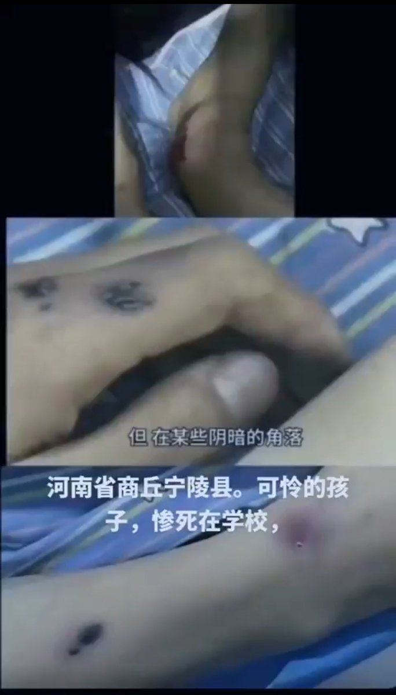
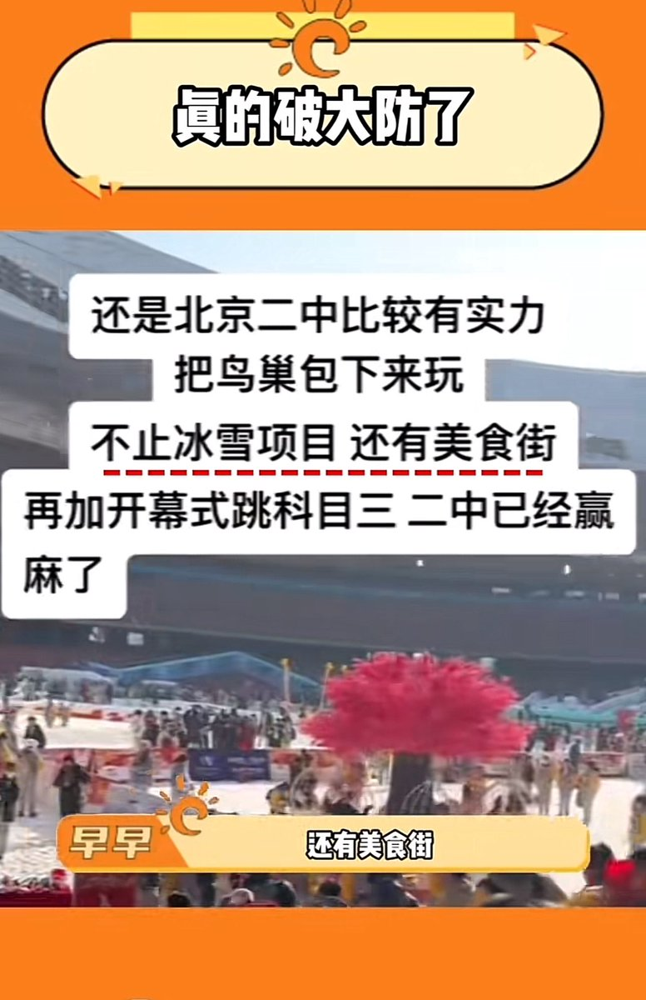
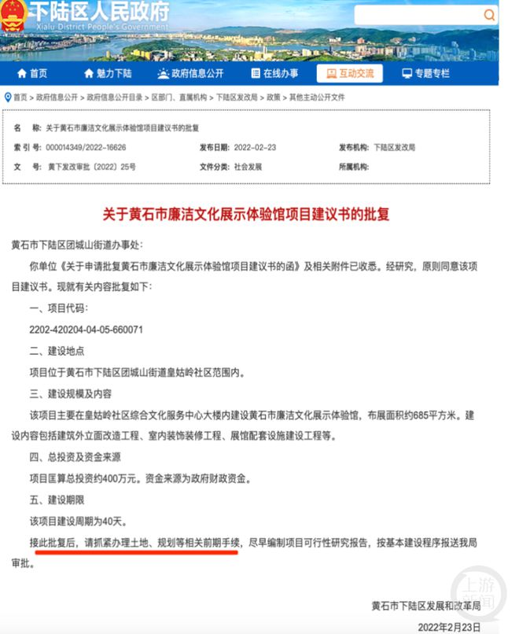

谁将十万横扫三江 北京时间 2023-12-29T17:50:11Z 1740671546467962956 RT @torontobigface: 一边是宁陵县学生惨死学校
一边是北京二中鸟巢开元旦晚会
这个荒诞的世界 https://t.co/WLnqRzUXtr   谁将十万横扫三江 北京时间 2023-12-29T13:23:47Z 1740604505841172837 湖北黄石一街道花368万公款建廉洁文化馆，施工工期15天。举报者本人房屋曾因政府项目扩建被强拆且未获赔偿 https://t.co/4uI6cYC5FR   谁将十万横扫三江 北京时间 2023-12-29T09:29:56Z 1740545655968534867 RT @yuu00401: 所以女人在哪里?
“全村的老少爷们”
只有一半人有资格参与的活动
有什么资格嘲讽城市的“小布尔乔亚”?
有一点你说对了
这确实是“中国文明”存在的基础
千年来小农的中国的基础
这样野蛮
这样不平等的
只有一半人的“中国文明”
就一定灭亡，应当灭亡
历…   谁将十万横扫三江 北京时间 2023-12-29T10:28:03Z 1740560281720570288 RT @lilaoshizuikeai: 其实我们看过去一年的大型抗议事件你就会发现
富士康2.0暴动最初的一个原因除了工资问题，还有一个是工人们怕宿舍安排阴阳混住被传染新冠
乌鲁木齐之夜的起点是当地一个社区干部扇了一个小孩一巴掌
白纸运动的导火索是网信办删帖子
乌鲁木齐路呐喊…   谁将十万横扫三江 北京时间 2023-12-29T10:22:28Z 1740558874053386482 RT @lenscn: @cskun1989 实际情况跟你说的正相反。当你被中国网监公安关照后，你的粉会大量增加，这些粉是中共各地的机器人帐号。然后X 平台也时不时清理这些机器人帐号。 在我这小号，每天都有几十个新粉，然后大部分又被X自动清掉。   