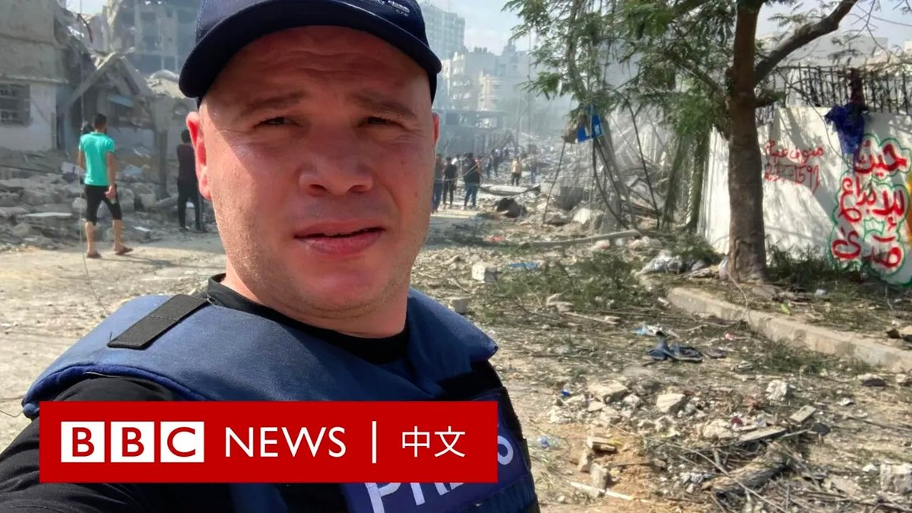
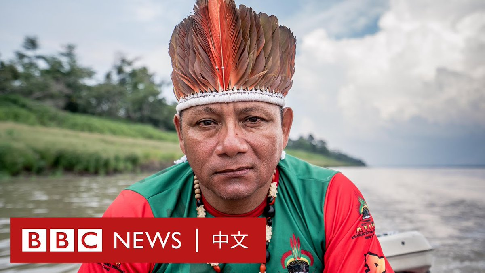
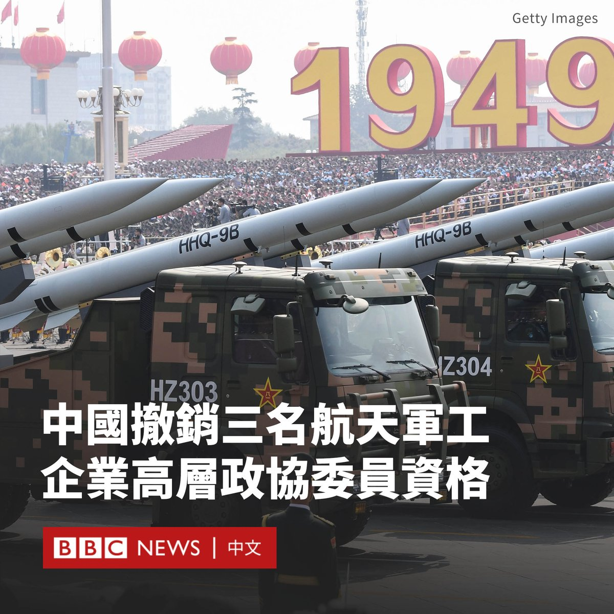

D英国广播公司BBC 北京时间 2023-12-28T15:00:00Z 1740266332778643538 两个多月前，以色列下令居住在加沙北部的100多万巴勒斯坦人向南迁移，准备对哈马斯发动地面攻势。BBC阿拉伯语部的摄影师杰哈德·马什拉维（Jehad El Mashhrawi）与成千上万的人们一起走上了南下的道路。他向我们详细讲述了旅程中的所见所闻。 https://t.co/ycSWZKjrlA   D英国广播公司BBC 北京时间 2023-12-28T13:00:00Z 1740236131843670183 过去几个月，亚马逊雨林经历了有记录以来最严重的干旱，一条主要河流创下了121年前有记录以来的最低水位。

这使得许多村庄难以到达，野火肆虐也让很多野生动物死亡。科学家担心，目前的情况正在将这片世界上最大的森林推向崩溃的边缘。 https://t.co/99S8k0WGrJ   D英国广播公司BBC 北京时间 2023-12-28T11:00:00Z 1740205931491684434 人工智能（AI）可能是2023年最热门的词汇之一。自2022年11月ChatGPT发布以来，科技巨头们争相推出AI产品。

AI不但为人类劳动力短缺提供解决方案，更是与人类互动和娱乐的伙伴。但它的发展也引发了担忧，尤其是如何确保其发展符合人类的利益和价值观。

在2024年，AI将为人类带来更多惊喜，还是挑战？ https://t.co/NZxhr0oeO4   D英国广播公司BBC 北京时间 2023-12-28T09:58:16Z 1740190397824127219 据中国官方媒体报道，中国全国政协周三（12月27日）在北京召开主席会议，宣布撤销三名重要航天和军工企业高层的委员资格。

被撤销政协委员资格的包括中国航天科技集团董事长吴燕生、中国兵器工业集团董事长刘石泉，以及中国航天科工集团副总经理王长青。

中国官方没有解释撤销这三名军工要员政协委员身份的原因，但通常意味着这些人可能正在接受调查。

在做出这一决定之际，中国领导人习近平正在对该国的军事领导层进行整肃。

今年10月，北京在没有任何解释的情况下免去了李尚福的国防部长职务，距其上任仅七个月。

7月，当局还突然宣布更换解放军火箭军的两名最高级指挥官。火箭军是负责掌管核武器的中国精英部队。   