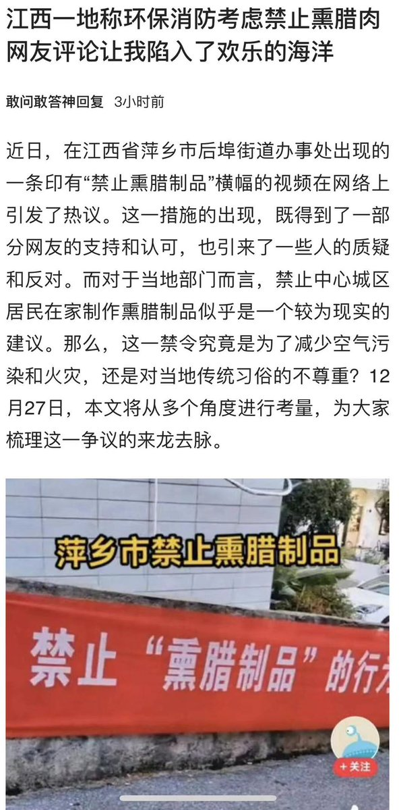
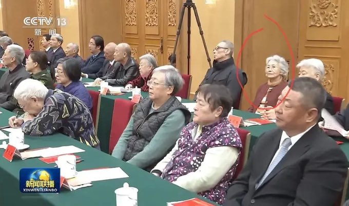
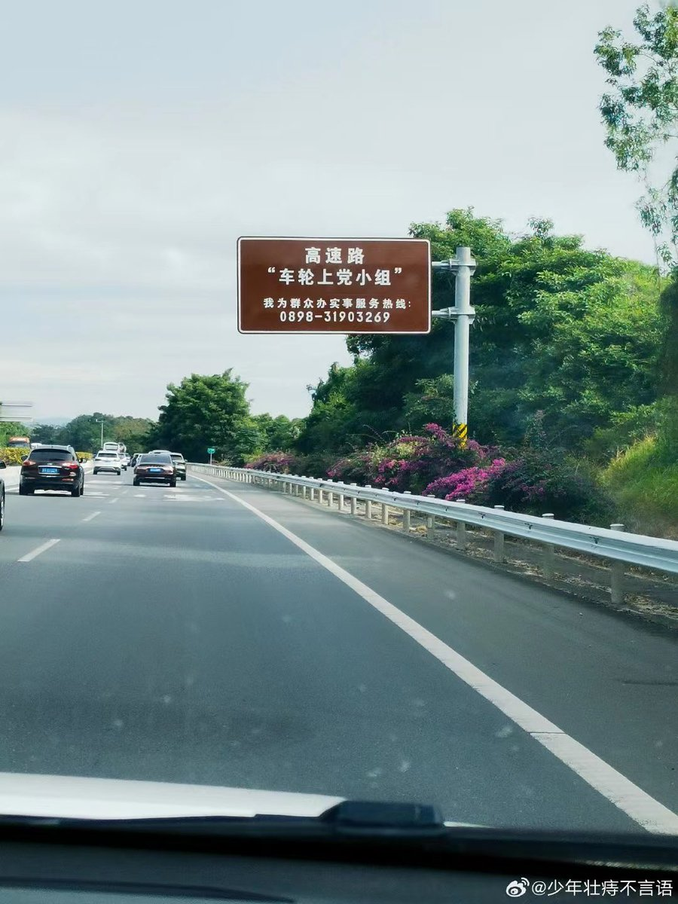
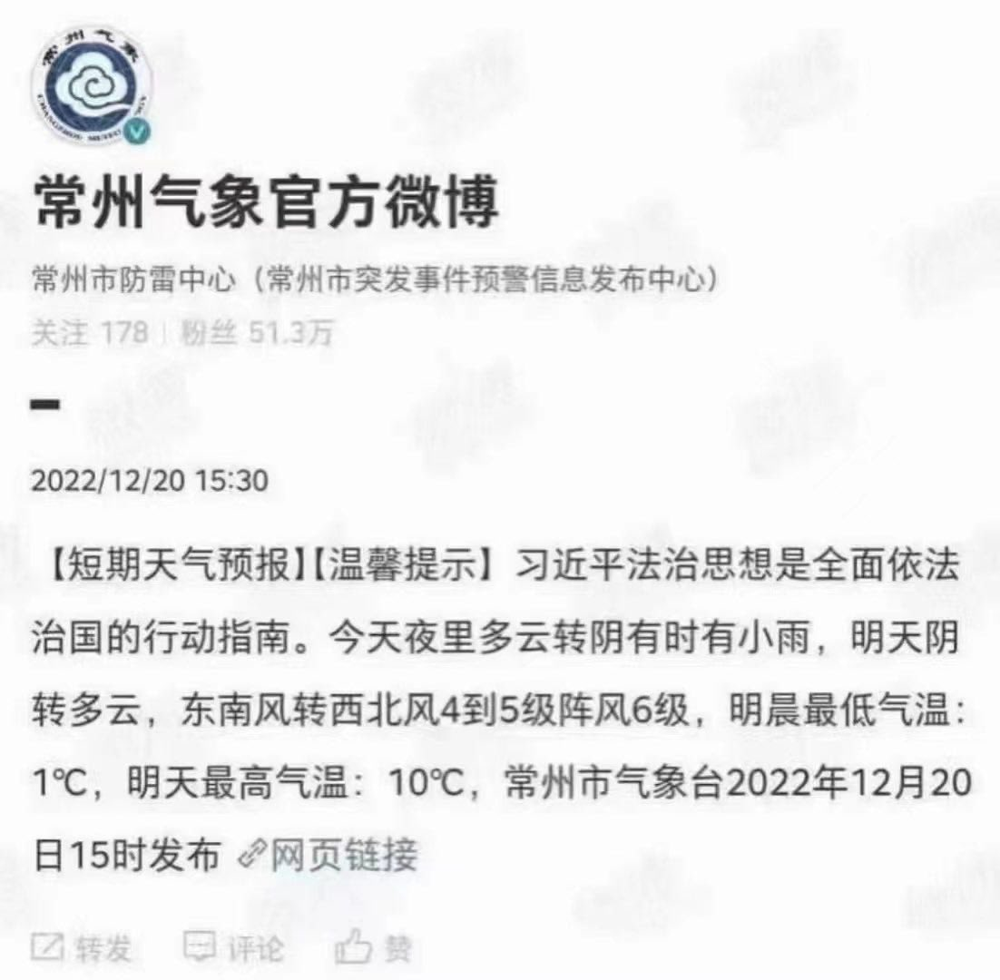
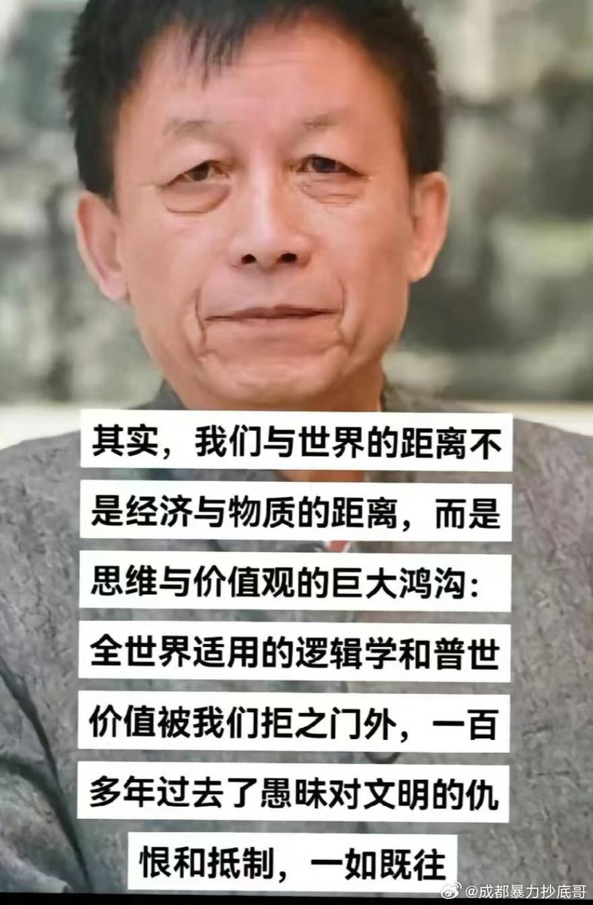

Petrichor 北京时间 2023-12-28T23:02:37Z 1740387786602299587 不让过除夕（除习），禁止老腊肉，不许蛋炒饭，本朝有趣的事情。

🤣🤣 https://t.co/KCp4GEHgPY   Petrichor 北京时间 2023-12-28T14:47:41Z 1740263230650601508 请你们为这个话剧起个名字。

因为有了他 https://t.co/j5l8E02hjx   Petrichor 北京时间 2023-12-28T06:32:03Z 1740138502249935258 在纪念毛泽东诞辰130周年的大会上，竟然没有给张玉凤安排坐第一排。

皇后不在了，这位贵妃健在，女以夫贵。

想当年，没有这位贵妃的首肯，政治局委员和副总理也见不到圣上。最高指示都是通过这位贵妃从口齿不清的湖南话翻译出来，然后中央传达全国各地的。若要杀邓小平、习仲勋，这位贵妃假传圣旨就能轻松办到。当年若没了习仲勋，也就没有现在的习近平。   Petrichor 北京时间 2023-12-28T08:26:52Z 1740167394147049481 Sit on a volcano. 
听到这句话就感到屁股一阵滚烫，赶紧撒丫子狂奔，逃生去。
所以，人们会用“sit on volcano”形容某人陷入了危险境地，随时有被推翻和被消灭的危险。 https://t.co/iJsWI9smwc   Petrichor 北京时间 2023-12-28T08:29:28Z 1740168048303337868 车轮上，不怕被摩擦、不怕被碾压、不怕被抛弃。 https://t.co/z1p7FrEhQV   Petrichor 北京时间 2023-12-28T06:02:27Z 1740131053350908090 物极必反。越动用公权力搞个人崇拜，越遭人厌恶。本来就一个人，非说成是一个神，其结果就是人神共怒。任何不实事求是的东西，都没有生命力，活不久的。 https://t.co/TVZX6u9FSz   Petrichor 北京时间 2023-12-28T03:33:32Z 1740093574816166242 1998水灾和2023年水灾，凸显习近平战狼外交思想的“伟大胜利”，说明两个维护的必然结果。这一切都是中共的历史选择和不可逆转的世界孤立。 https://t.co/QO0lS3RqSM   Petrichor 北京时间 2023-12-28T00:57:46Z 1740054375161380984 不解决价值观和意识形态的问题，中国无法走进世界，与世界一起进步，必被世界孤立与抛弃。

任何不承认或反对普世价值的人，就是为了一己之私而毁民族前途的坏人，他们是中国人民的敌人。 https://t.co/4URRpOzm0V   Petrichor 北京时间 2023-12-28T01:11:48Z 1740057905620300018 相比江浙沪一带人，北方人尤其是河南和东北人的语言有时生硬又富有攻击性，刚开始接触时，真有些受不了，时间长会习惯了，但是档次却降低一大截。 https://t.co/ZaIx2t56MQ   