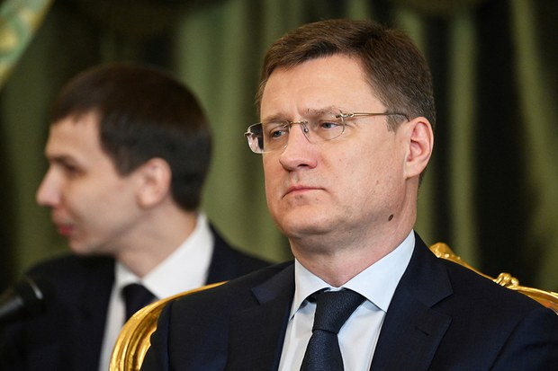
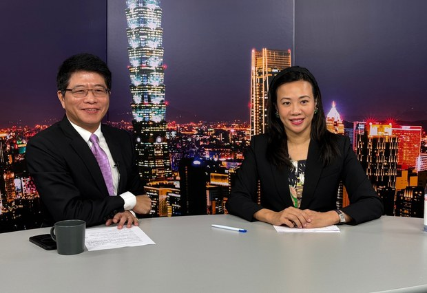
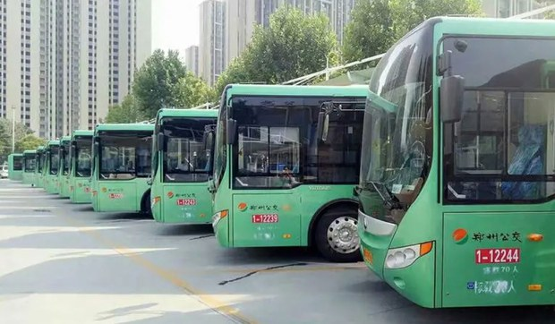
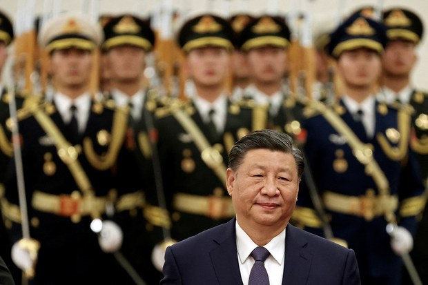

自由亚洲电台 北京时间 2023-12-28T03:36:34Z 1740094339194462685 【制裁无效？】
俄罗斯副总理诺瓦克（Alexander Novak）：俄罗斯已经成功规避了西方对其石油的制裁，将石油出口从欧洲转移到中国和印度，对这两国的原油出口量合计约占俄罗斯原油出口总量的90%左右。
欧洲在俄罗斯原油出口中所占的份额已从约40-45%降至仅约4-5%。
https://t.co/zbcjmQFQnt https://t.co/yHIjwbXRiF   自由亚洲电台 北京时间 2023-12-28T00:45:30Z 1740051286740070674 台湾民众党副总统候选人、现任立法委员 ＃吴欣盈 12月27日接受自由亚洲电台"＃亚洲很想聊"节目专访，对出身豪门背景、两岸关系、台湾国际地位等议题，表达自己的看法。
https://t.co/3qzgBw59Sj https://t.co/UsQxvVzTBF   自由亚洲电台 北京时间 2023-12-28T00:52:41Z 1740053098280935868 近日，#郑州公交集团 向员工发出征求意见稿，鼓励工龄十年以上的员工"#自主创业"两年。但员工创业期间停发工资、奖金和津贴补助等所有福利，理由是"为进一步缓解集团经营和资金压力"。
网民议论：把裁员说得那么清新脱俗
https://t.co/XBcZZthxJG https://t.co/jBArLMjixN   自由亚洲电台 北京时间 2023-12-28T01:46:54Z 1740066742616150047 中国全国政协12月27日通过了撤销 #吴燕生、#刘石泉、#王长青 三人的政协委员资格，有消息指出，他们和之前 #火箭军贪腐案 有关。而中共中央将于明年元旦起施行修订完成的《#中国共产党纪律处分条例》，表示将从严治党。
https://t.co/qwIhDtKLTQ https://t.co/9dhO5rZ041   