自由亚洲电台 北京时间 2023-12-28T22:44:35Z 1740383248943874543 【吴欣盈：台湾应结合经济与外交力量发挥影响力】
【批评台湾外交部为断交部 外交应有新做法】
完整视频 https://t.co/0YRdNnWRI2
台湾的 #民众党 副总统候选人 #吴欣盈， 在接受自由亚洲电台 #亚洲很想聊 的节目专访时，认为台湾的外交走错方向，面对国际既成的“#一个中国 ”原则，台湾不应浪费纳税人的钱做不切实际的事。她认为应该效法其他国家把外交和经济部门结合，发挥实质影响力，在 #绿色金融、#主权基金、 志愿团体、文化交流等领域，创造台湾更大的竞争力。 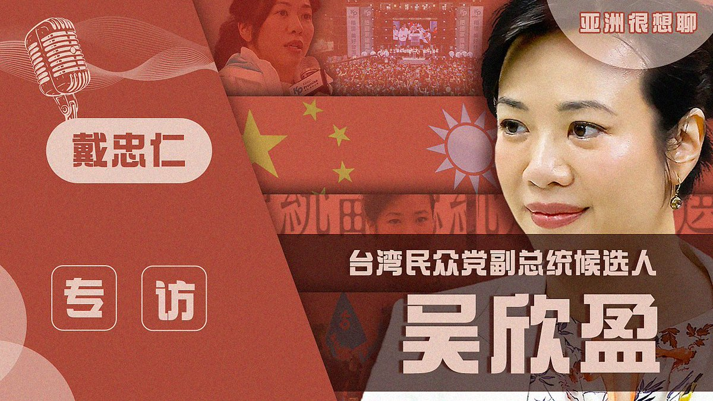  自由亚洲电台 北京时间 2023-12-28T18:47:16Z 1740323524890575188 【路透:中国要求“#五月天”发表亲中言论被拒】
【之后控其“假唱”】
台湾总统大选前夕，路透报道，有多名知情人士透露，中国官方向“五月天”施压，要求他们公开表示台湾是中国的一部分。为了施压乐团，中国当局于12月宣布对“五月天”假唱疑云展开调查；另有消息人士表示，中国当局要求“五月天”提供“政治服务”，如果不合作，他们“就必须付出代价。” 据悉“五月天”没有同意这一要求。报道: https://t.co/56uKBpOJAa   自由亚洲电台 北京时间 2023-12-28T19:17:33Z 1740331145437552961 【港第二大民主派政党完成解散程序】
【前总部已变成“民主遗址”】
创立于2006年的香港第二大民主派政党 #公民党，上周六(12月23日)完成解散的最后程序，成为香港民主的历史。已人去楼空、位于炮台山的党总部，也像是 #香港民主 的遗址。
公民党前党主席 #梁家杰 接受外媒访问，分享对公民党解散的感受，强调时代已改变，公民党不会回来，解散也是公民党目前最好的结局。 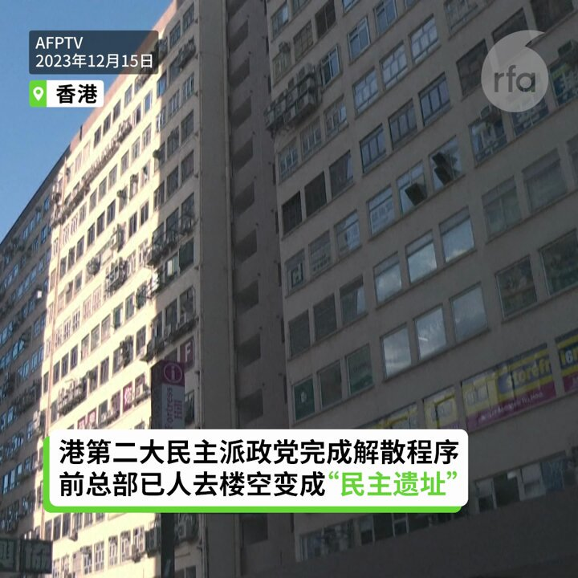  自由亚洲电台 北京时间 2023-12-28T17:45:26Z 1740307961355043155 【路透：中国要求台湾乐团 #五月天 发表亲中言论被拒】
【之后五月天被控“#假唱”】
台湾 #总统大选 前夕，路透报导，中国官方向“五月天”施压，要求他们发表“亲中”言论。根据路透检视的文件显示，中国国家广播电视总局要求“五月天”公开表示支持台湾是中国的一部分。
另外，2名正在调查此事的台湾安全官员表示，为了施压乐团，中国当局于12月宣布对五月天假唱疑云展开调查；另一名要求匿名的消息人士表示，中国当局要求“五月天”提供“政治服务”，该人士表示：“如果他们不合作，他们就必须付出代价。”据悉“五月天”没有同意这一要求。
台湾乐团“五月天”在中国拥有广大歌迷，遭质疑“假唱”后，所属的相信音乐多次澄清。
报导指出，有官员透露，中国当局认为，他们这样做可以“影响台湾年轻人的选票”，对此，中国官方及五月天尚未回应。
在台湾，国民党、民进党和台湾基进都对中国的动作予以谴责。
#一个中国
#介选 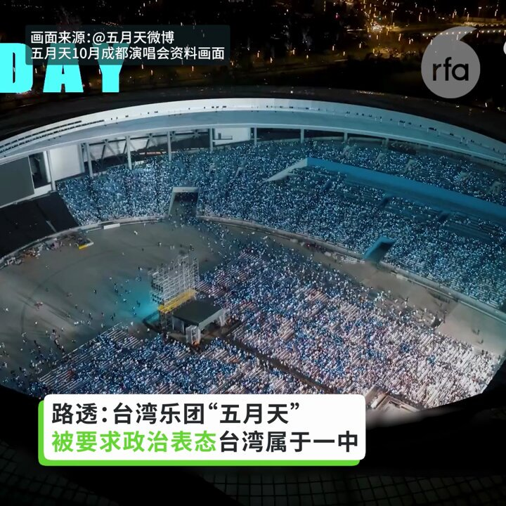  自由亚洲电台 北京时间 2023-12-28T15:54:10Z 1740279960739483908 【中国“民间棋王”被控“肛珠”作弊】
【冠军奖座被收回】
中国海南12月17日举行2023年中国全国 #象棋 民俗棋王争霸赛总决赛，河南棋手 #颜成龙 击败吉林省棋手张伟夺魁，得到10万元人民币奖金。颜成龙赛后被怀疑用“#肛珠”作弊获得冠军，奖座奖金被收回。但当事人否认。
https://t.co/7rFRpgkTTc https://t.co/J8v2vZqa84   自由亚洲电台 北京时间 2023-12-28T10:28:40Z 1740198045570965670 【多国多城联动  声援牛腾宇】
12月24日，近200名中国留学生和异议人士聚集在洛杉矶中国领事馆门前，参与全球圣诞节寄明信片关注 #牛腾宇 活动。英国伦敦、日本东京以及德国、新西兰、荷兰、加拿大等多国也有类似活动。 https://t.co/Uvzd5XIsqX 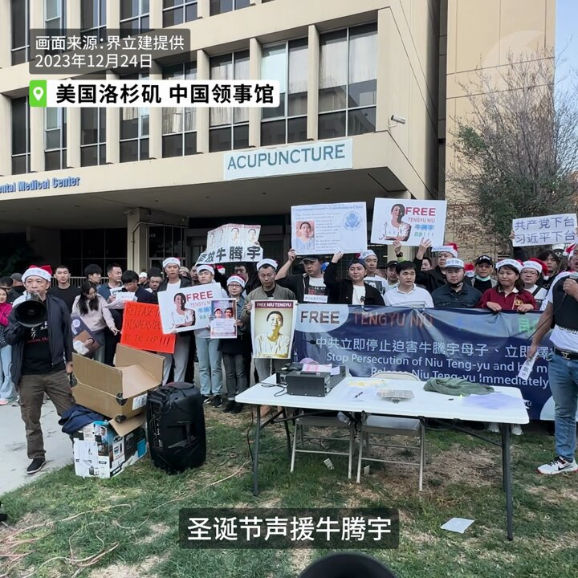  自由亚洲电台 北京时间 2023-12-28T10:30:43Z 1740198563370643628 因“#恶俗维基案”遭中国政府迫害、被关押狱中的 #牛腾宇 的母亲 #可可 日前到广东省政法委申诉途中，遭到不明身份人士暴力阻拦。维权网27日发表了可可致广州市公安局局长 #张锐 的一封公开信，其中奉劝张锐不要协助参与制造该冤案的广东政法匪帮，继续迫害她。 https://t.co/rCAfYBjrsp 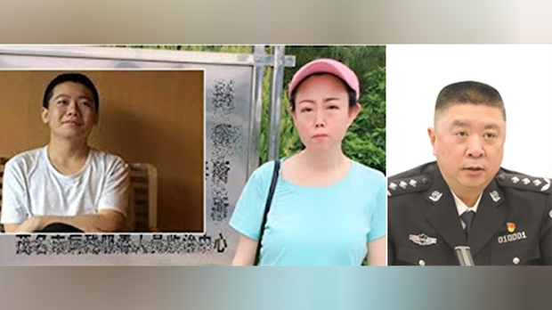  自由亚洲电台 北京时间 2023-12-28T06:18:05Z 1740134987092095378 【中方强硬回应美国国防授权法案】
12月22日美国总统拜登签署 #2024年度国防授权法案。授权创纪录的8860亿美元军费开支，以援助乌克兰以及在印太地区对抗中国等政策。
今日中方强硬回应，认为该法案干涉中国内政，并敦促美国“停止操纵台湾问题”。 https://t.co/Fo4JMf1buf 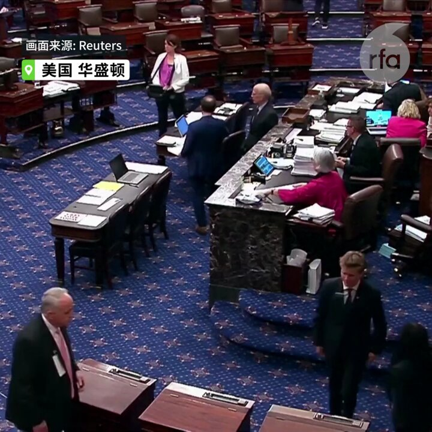  自由亚洲电台 北京时间 2023-12-28T09:22:47Z 1740181465609175127 #事实查核｜#胡塞武装 在 #红海 击沉以色列船只？
@asiafactcheckcn

https://t.co/c56KyH2o0c https://t.co/Q4phf9FjkT   自由亚洲电台 北京时间 2023-12-28T09:55:53Z 1740189797963186207 前海军司令 #董军 将接 #李尚福 任中国新防长？
https://t.co/1AIkNawR1o https://t.co/OUOzPwIpJh 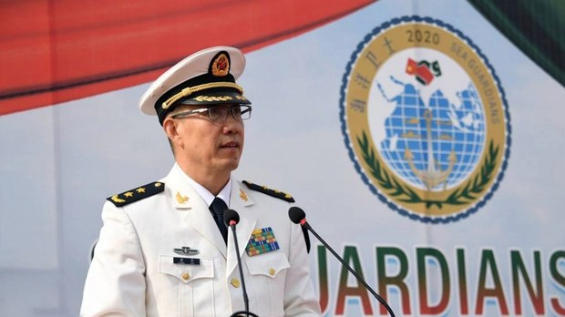  自由亚洲电台 北京时间 2023-12-28T07:00:01Z 1740145539117961376 中国国安部发布《#日常保密清单》　涉密电脑连无线鼠标都不可以用
https://t.co/GVKwwjDL6u https://t.co/gCYwFc0btn   自由亚洲电台 北京时间 2023-12-28T07:29:00Z 1740152831749804303 【#2023中国十大年度人物】  
网事如风，多年以后，提起2023年， 您会想起谁？  
RFA网友各抒己见，提名最多的是以下几位。他们是您心目中的“十大”吗？ https://t.co/aLFBDs0WTk   自由亚洲电台 北京时间 2023-12-28T08:00:05Z 1740160653762171385 欢迎收听和订阅播客【＃亚太报道】 https://t.co/MjLNSvVMqc

三名军工高层遭撤政协委员资格；学者引用“#月收2千元以下人口 有9.64亿”后文章被下架；#郑州公交集团 鼓励员工"#自主创业"引热议；#印尼中企镍冶炼厂火灾 致8名中国公民死亡；中国预计 #人口负增长 状况恶化。 https://t.co/QB6gj3tOrQ 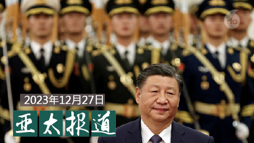  自由亚洲电台 北京时间 2023-12-28T04:29:21Z 1740107621796081867 印尼苏拉威西岛一家中资镍冶炼厂上周末发生火灾。这起事故目前已经造成至少十九名工人死亡，其中有八名中国公民，另有数十人受伤。据半岛电视台报道，数百名印尼工人周三针对这次火灾发起抗议。
https://t.co/lmW8p5hOPZ https://t.co/GZedUMW2wy 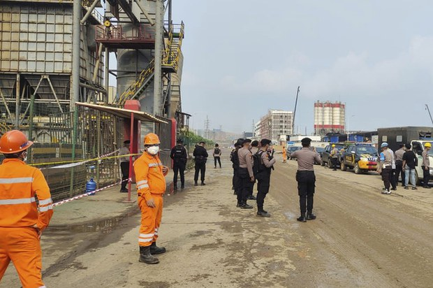  自由亚洲电台 北京时间 2023-12-28T05:15:05Z 1740119131033370903 【港府也变 #战狼 了？】
本台粤语组统计发现，港府今年平均每星期至少一次向西方表达“强烈不满”或“谴责”，显示港府积极向国际“#说好香港故事”的同时，也频繁“战狼出征”。
https://t.co/Tk7ARB1TMJ https://t.co/1hgJTFWVJZ 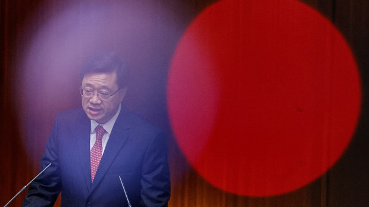  自由亚洲电台 北京时间 2023-12-28T05:51:22Z 1740128262003810569 今年12月26日是“#厦门聚会案”四周年纪念日。总部在纽约的国际性非政府组织“中国人权”（Human Rights in China，简称：HRIC）特别推出人权倡导者 #罗胜春 的系列特稿，以此表彰她为包括其丈夫 #丁家喜 律师在内的中国良心犯伸张正义以及倡导中国人民的人权和自由的不懈努力。
https://t.co/TKXDrZre1C https://t.co/KLtG87RAJp 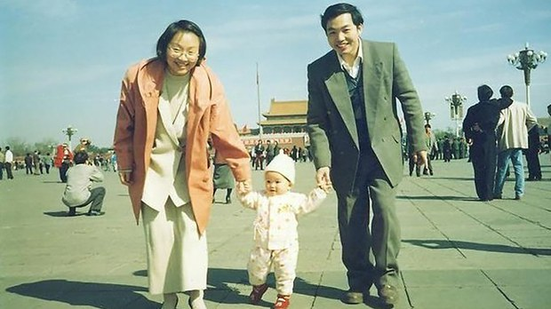  自由亚洲电台 北京时间 2023-12-28T03:18:48Z 1740089869677056358 近日，一篇谈论购房需求不足的评论文章，因为作者引用了中国"#月收入2000元以下人口约9.64亿"的研究数据，成为网民热议的话题。有网民质疑数据的真假，也有人感叹中国 #贫富悬殊。但文章在发布一天后就被下架。
https://t.co/6Y7VV9Fxyg https://t.co/4D697up2YN 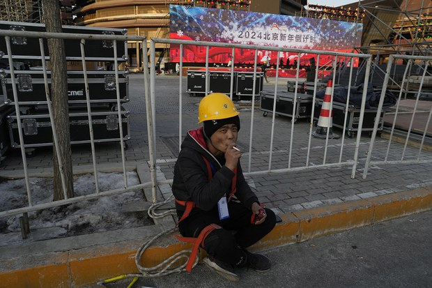  自由亚洲电台 北京时间 2023-12-28T03:36:34Z 1740094339194462685 【制裁无效？】
俄罗斯副总理诺瓦克（Alexander Novak）：俄罗斯已经成功规避了西方对其石油的制裁，将石油出口从欧洲转移到中国和印度，对这两国的原油出口量合计约占俄罗斯原油出口总量的90%左右。
欧洲在俄罗斯原油出口中所占的份额已从约40-45%降至仅约4-5%。
https://t.co/zbcjmQFQnt https://t.co/yHIjwbXRiF   自由亚洲电台 北京时间 2023-12-28T00:45:30Z 1740051286740070674 台湾民众党副总统候选人、现任立法委员 ＃吴欣盈 12月27日接受自由亚洲电台"＃亚洲很想聊"节目专访，对出身豪门背景、两岸关系、台湾国际地位等议题，表达自己的看法。
https://t.co/3qzgBw59Sj https://t.co/UsQxvVzTBF   自由亚洲电台 北京时间 2023-12-28T00:52:41Z 1740053098280935868 近日，#郑州公交集团 向员工发出征求意见稿，鼓励工龄十年以上的员工"#自主创业"两年。但员工创业期间停发工资、奖金和津贴补助等所有福利，理由是"为进一步缓解集团经营和资金压力"。
网民议论：把裁员说得那么清新脱俗
https://t.co/XBcZZthxJG https://t.co/jBArLMjixN   自由亚洲电台 北京时间 2023-12-28T01:46:54Z 1740066742616150047 中国全国政协12月27日通过了撤销 #吴燕生、#刘石泉、#王长青 三人的政协委员资格，有消息指出，他们和之前 #火箭军贪腐案 有关。而中共中央将于明年元旦起施行修订完成的《#中国共产党纪律处分条例》，表示将从严治党。
https://t.co/qwIhDtKLTQ https://t.co/9dhO5rZ041   