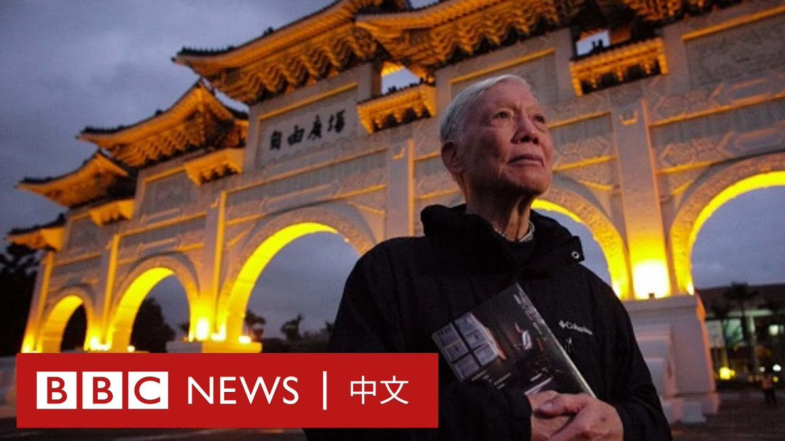

D英国广播公司BBC 北京时间 2023-12-27T15:36:04Z 1739913019751100665 被没收的数百封西班牙女性与摩洛哥男子之间含情脉脉的信件揭示了一段禁忌之恋的历史。在1930年代至1950年代，西班牙殖民当局系统性地没收了这些跨国情书，以阻止这些恋情。https://t.co/IywpJZ21yN   D英国广播公司BBC 北京时间 2023-12-27T13:27:33Z 1739880677041217921 韩国警方称，因出演奥斯卡获奖电影《寄生虫》（Parasite）而闻名的韩国演员李善均被发现身亡，终年48岁。

据报道，李善均周三（12月27日）在首尔市钟路区一处公园的车内被发现不省人事。

据韩联社报道，目前尚不清楚李善均是否是自杀，但警方接到报告称，他在写了一张疑似是遗书的字条后离开了家。

自10月以来，李善均一直因涉嫌吸毒而接受警方调查。

韩联社报道称，他涉嫌多次吸食大麻和注射氯胺酮。李善均表示，自己被一名夜店公关所骗，在不知情的情况下吸食了毒品。

李善均在早些时候曾通过律师要求对自己和这名女子进行测谎测试。据报道，他此前接受的验毒结果呈阴性。

李善均涉毒事件的调查此前在韩国引起广泛关注，使其声誉受损。今年10月，他退出了电视剧《无路可逃》（No Way Out）的拍摄。他后来接受了警方长时间的调查。

李善均与女演员田慧振结婚并育有两个儿子，他已出道二十多年，在数十部电影和电视节目中担任主角，在2010年代成为韩国家喻户晓的人物。

2019年，他在《寄生虫》中饰演朴东益一角而让他在国际舞台上声名鹊起。该片是奥斯卡历史上第一部获得最佳影片奖的非英语电影。

在韩国，吸食大麻等毒品犯罪被视为严重罪行，最高可判处五年监禁。   D英国广播公司BBC 北京时间 2023-12-27T11:42:19Z 1739854193207464328 从流落街头的孤儿到香港资深民主人士，79岁的朱耀明牧师在最新出版的自传中，回忆了自己与专制统治抗争的经历。

书中留下30页的空白，以回应中国大陆的“白纸运动”，以及抗议香港政府的政治审查。

2020年底，朱耀明离开香港，目前居住在台湾。 https://t.co/TYFX9IqDgp   D英国广播公司BBC 北京时间 2023-12-27T09:29:33Z 1739820780379386043 印尼苏拉威西岛一家中资镍工厂12月24日清晨发生爆炸，死亡人数现已增至18人，另有数十人受伤。

这起事故是印尼镍冶炼厂发生的一系列致命事故中的最新一起。该工厂位于青山工业园区，事发时工人正在维修熔炉。 https://t.co/sxoKaDT6Kn   