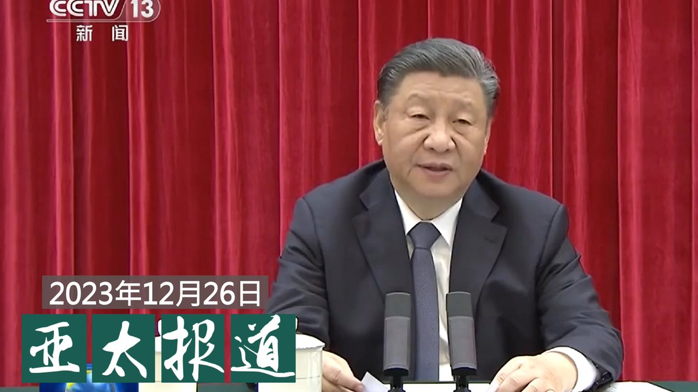
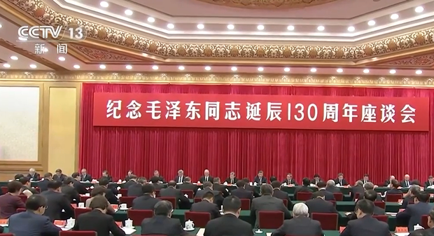
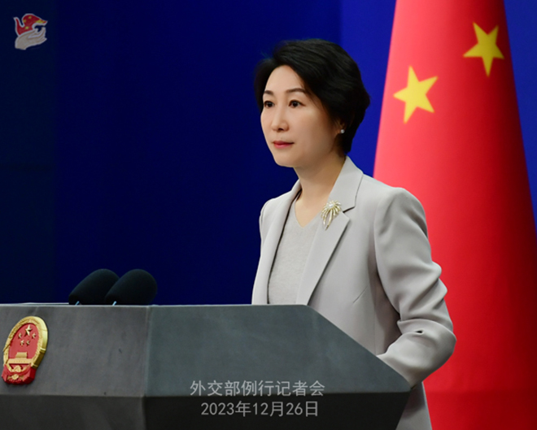
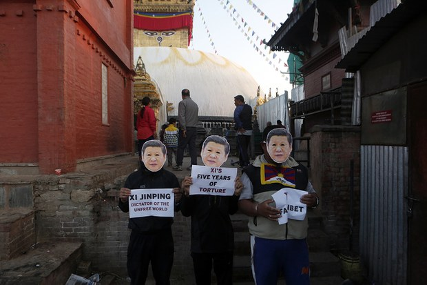
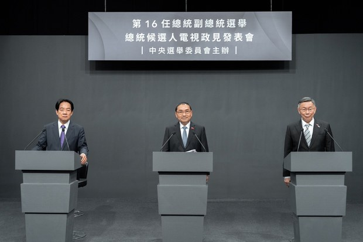

自由亚洲电台 北京时间 2023-12-27T05:00:03Z 1739752958928269635 #事实快查｜#台湾总统候选人第二场政见会 哪些说法有问题？
https://t.co/w47AfwFrQt
@asiafactcheckcn https://t.co/uvDIpGScZa   自由亚洲电台 北京时间 2023-12-27T08:00:07Z 1739798274478104733 欢迎收听和订阅播客【＃亚太报道】 https://t.co/MjLNSvVMqc
习近平高调纪念 #毛泽东冥诞；“#实事求是”怎成敏感事件？；福州访民 #叶钟 猝死的消息引发关注；中方宣布对美一机构和个人实施制裁；#台湾大选 候选人聚焦内政议题。 https://t.co/7BilRtaBT4   自由亚洲电台 北京时间 2023-12-27T04:44:34Z 1739749062080098814 本周二是中共已故领导人 #毛泽东130周年冥诞。中国国家主席 #习近平 在相关纪念座谈会上，一如既往地评价了毛泽东在中国历史上的"功"与"过"。不过有专家发现，习近平今年对毛泽东的评价增加了新的内容。
https://t.co/rmlhwhv5gw https://t.co/1UCg3Hg1UM   自由亚洲电台 北京时间 2023-12-27T05:55:29Z 1739766910504546523 评论 | #魏京生：新年谈农民和农村问题
https://t.co/7qUctRW80s https://t.co/WcEaARpUBM   自由亚洲电台 北京时间 2023-12-27T02:49:05Z 1739720001467363392 中国外交部周二宣布，针对一家美国公司和两名人权研究人员采取反制措施。这令美中之间，涉及有关 #新疆强迫劳动 问题的指控争端再次升级。
与此同时，对于美国总统拜登签署《#2024财年国防授权法案》，中方也表示"强烈不满和坚决反对"。
https://t.co/7oC9EPghGn https://t.co/eIKvTN0LXX   自由亚洲电台 北京时间 2023-12-27T04:02:13Z 1739738407675560429 福州访民 #叶钟 在拘留期间暴毙的消息至今尚未获得官方确认。近日家属对外披露，曾在殡仪馆目睹叶钟的遗体，但遗体是否已遭火化尚未明朗。福州两名公民因为关注事件疑遭公安扣查，其中一人相信已被刑事拘留。
https://t.co/hzdlpfu0ZG https://t.co/MgVT7gnaNy   自由亚洲电台 北京时间 2023-12-27T00:45:53Z 1739688995913863672 中国财政部早前透露，今年会提前下达明年度的部分 #新增地方政府债务额度 ，保障地方融资需求，除了黑龙江省已发布可为明年融资需求申报工作外，多地已做好新一年度发 #地方债 的部署。那么，如何从有关行动解读中国各地方政府的财政状况？
https://t.co/PDmtEjb7rA https://t.co/2fm05fSnS7   自由亚洲电台 北京时间 2023-12-27T01:15:55Z 1739696557057098149 图为三名流亡藏人头戴着有习近平形象的面具在加德满都进行抗议。中国目前正在向 #尼泊尔 政府施压，要求其对所有媒体实施审查，禁止报道任何支持 #西藏 或 #台湾 的内容。
https://t.co/nZFm9KgfLo https://t.co/4IO967hYtO   自由亚洲电台 北京时间 2023-12-27T01:48:04Z 1739704644774035459 本周二，台湾举行 #2024年总统大选 的 #第二场候选人电视政见会。代表民众党的 #柯文哲、代表国民党的 #侯友宜 和代表民进党的 #赖清德 各自就台湾的定位以及内政等议题发表了看法。
https://t.co/RVoSfMgMUi https://t.co/ikBxUXvNOh   自由亚洲电台 北京时间 2023-12-27T00:03:17Z 1739678278817112183 中国公安部12月22日通报"#严厉打击整治网络谣言违法犯罪活动 "并且取得成效。海外 #哈萨克 维权组织披露，在今年的公安"#百日打谣" 行动中有三千多名哈萨克族年轻人被集中教育，其中五十人遭逮捕。哈萨克人还说，新疆伊犁额敏县的 #清真寺 几乎被拆尽。

https://t.co/kgu0xoKc48 https://t.co/9z2WXJkbTC   