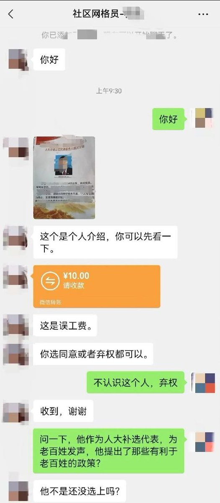
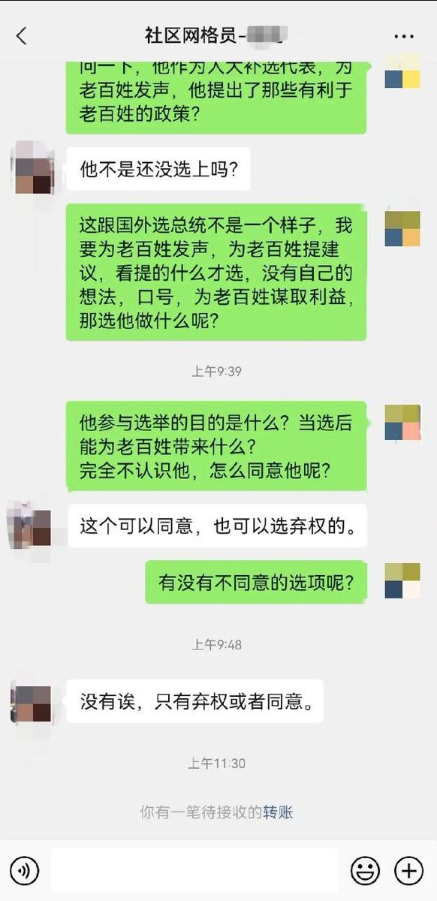

谁将十万横扫三江 北京时间 2023-12-27T18:25:57Z 1739955770790445473 RT @laborpowercn: 各位读者：非常抱歉，工劳小报的订阅系统自12月13日以来一直没有正常运行。我们刚刚发现并修复了问题，如果在此期间内你曾尝试订阅但没有收到任何确认信，则订阅未成功，请在此网址重新订阅：https://t.co/UJvAy3OutT 感谢大家支持！   谁将十万横扫三江 北京时间 2023-12-27T18:50:03Z 1739961838878773554 RT @Chai20230817: “当那个决断的时刻来临，我们要听从自己的良心”——来自Kim的信。

柴静你好！

此刻我在爱尔兰给你写信。
  
本科时我过的不很愉快，最初我带着朦胧的爱国主义情怀，讨厌一位老师。大一大二我对她极厌烦，一到她的课我就躲到最后一排带上耳机，两…   谁将十万横扫三江 北京时间 2023-12-27T19:26:26Z 1739970992519426353 RT @Pandazhq: 关于罐头出口

记得我小时候走亲访友的时候，有一样礼品就是罐头。那时候罐头也不贵，一两块钱一罐吧，但因为农村商品化程度太低，人们手上普遍缺现金，所以不贵平时还是吃不起，只有过年的时候，把所有亲戚走完了，还有剩的才会打开来吃。… https://t.c…   谁将十万横扫三江 北京时间 2023-12-27T13:27:18Z 1739880613061304612 RT @cskun1989: 抬毛捧毛是中共面对执政危机时最惯用的伎俩，习近平10年折腾，让党内外都大受其害，借纪念毛泽东130周年再次抬毛捧毛，一方面可以压制不同势力不同声音，另一方面抬高自己把自己置于毛的高度甚至超过毛的政治地位，纪念毛泽东130周年，中共中央党史和文献研究…   谁将十万横扫三江 北京时间 2023-12-27T10:50:40Z 1739841196909121780 十块钱的贿选 https://t.co/bLAmHqCDaz   