A李老师不是你老师 北京时间 2023-12-26T21:08:12Z 1739634214897664429 12月25日，邳州明德实验中学校门口打出“在中国，在今天，再无‘圣诞节’！只有‘长津湖’”的标语。
在全面脱钩，国进民退的今天，这句话即将成为接下来的时代象征。 https://t.co/xwJoKDh4tu 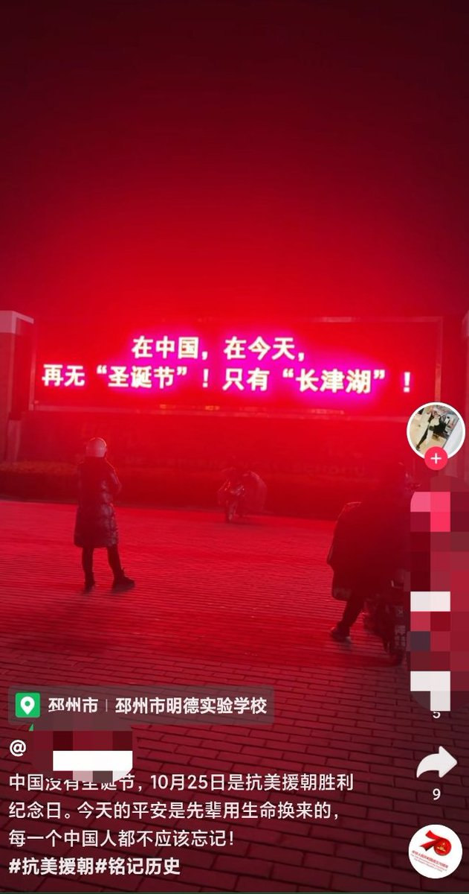  A李老师不是你老师 北京时间 2023-12-26T21:10:45Z 1739634855548199222 12月26日，广东外语外贸大学
一蒙面男子站在宿舍楼的二楼连接处，挥舞“毛泽东思想万岁”的旗帜。 https://t.co/3ZaG38359V 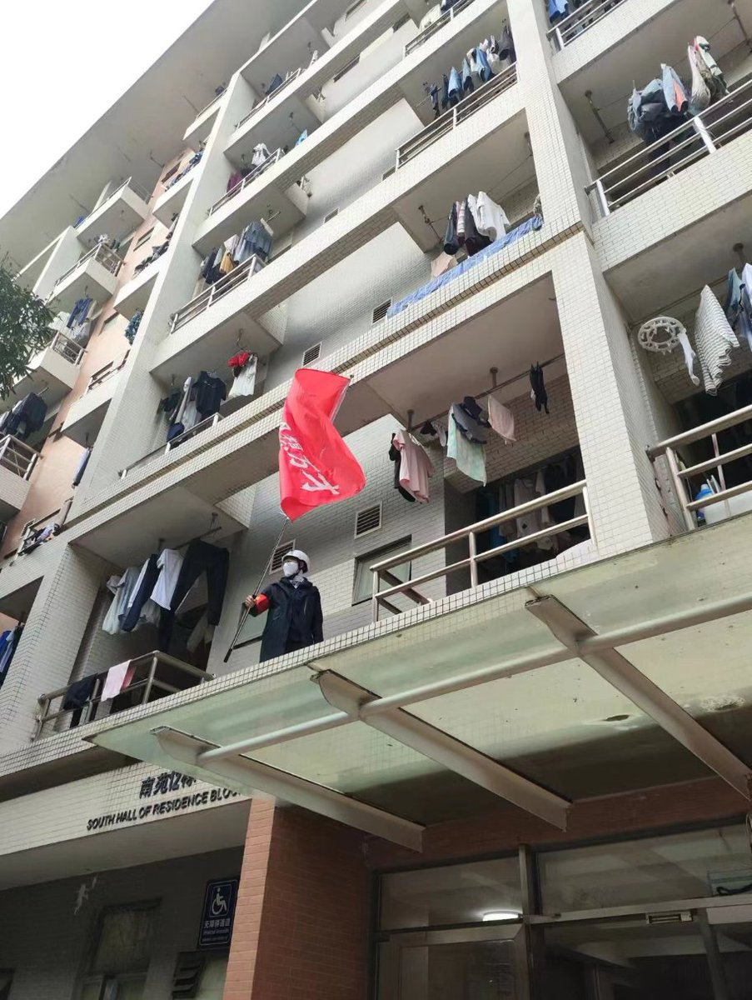  A李老师不是你老师 北京时间 2023-12-26T21:43:31Z 1739643102070018256 根据2019年北京师范大学线性随机抽取70000个代表性样本调查显示，全国约546万人月收入为零；2.2亿人月收入在500元以下；4.2亿人月收入低于800元；5.5亿人月收入低于1000元；6亿人月收入低于1090元。
其中农村比例高达75.6%，集中在中西部地区
与李克强此前所说的6亿人口月收入1000元相吻合。 https://t.co/N3DsR81oC0 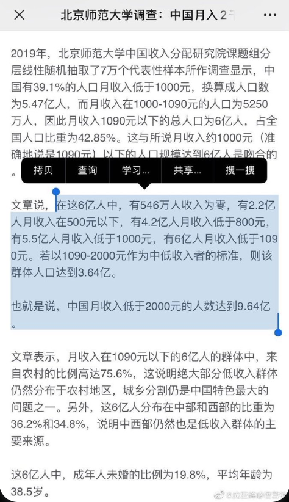  A李老师不是你老师 北京时间 2023-12-26T18:20:31Z 1739592017850593441 12月25日，长春冠群受害人前往长春南关区人民检察院维权 https://t.co/Hj6KAdznKY 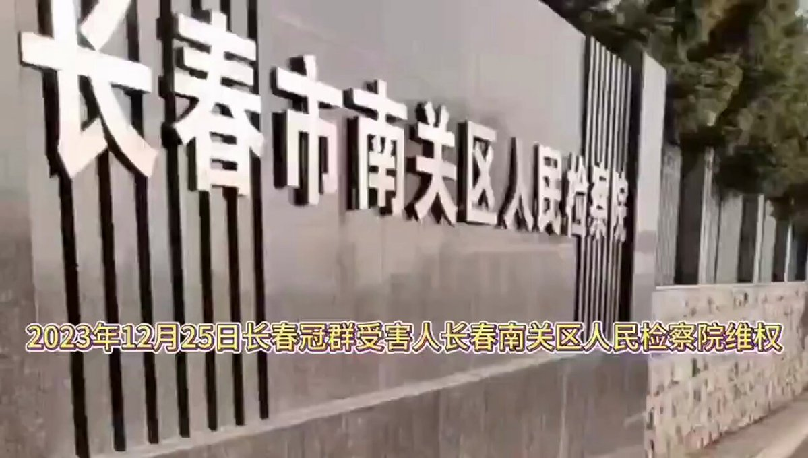  A李老师不是你老师 北京时间 2023-12-26T18:21:55Z 1739592370163703905 湖南怀化麻阳苗族自治县网友投稿 https://t.co/EW14NbECQM 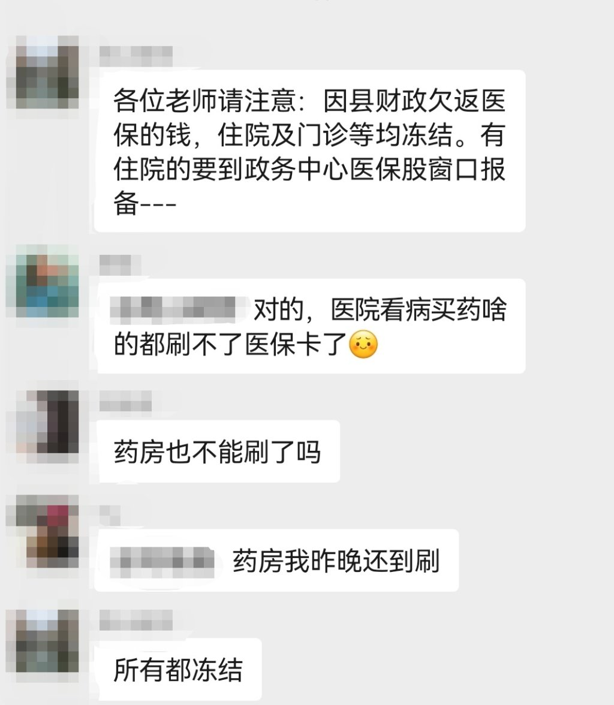  A李老师不是你老师 北京时间 2023-12-26T19:42:47Z 1739612721581088788 12月26日，西安沣东新城绿地兰亭公馆烂尾楼的业主到民生银行维权，在门口贴满印有辱骂言论的A4纸，指责民生银行违规放贷，有657笔5.58亿工程款未打倒监管账户 https://t.co/b0z59IPR7I 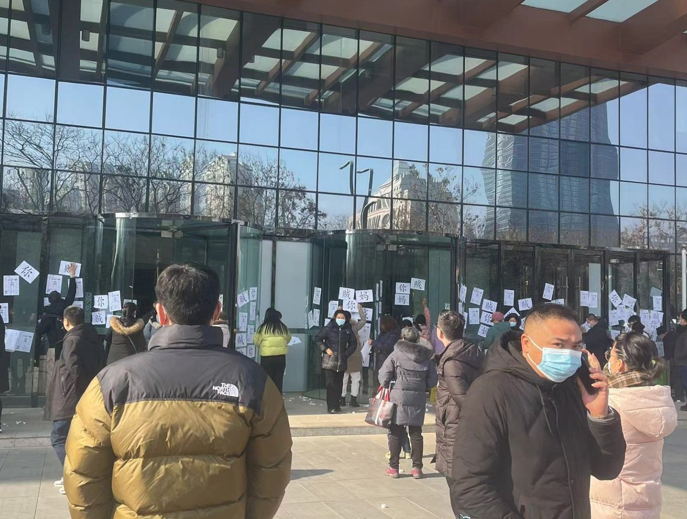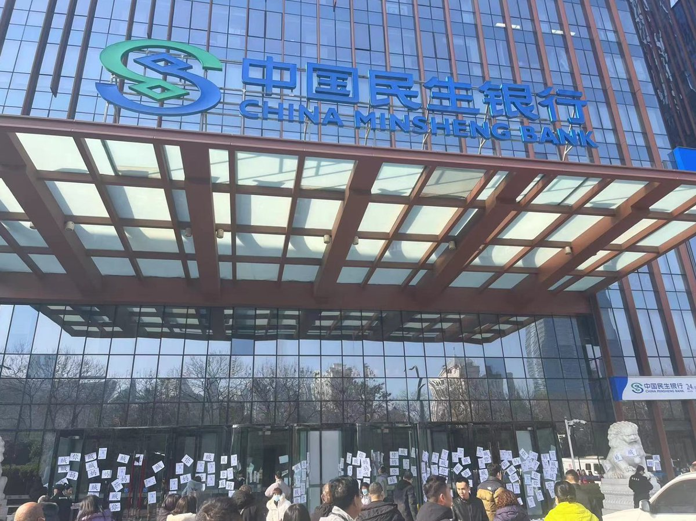  A李老师不是你老师 北京时间 2023-12-26T19:57:52Z 1739616517296140437 折叠屏手机鼻祖柔宇科技欠薪长达一年，累计金额4千多万，员工现场罢工讨薪
12月25日，深圳龙岗区的柔宇国际显示基地看到，约五十名柔宇科技员工聚集在该基地门口罢工维权，要求公司发放工资。
据现场一名柔宇员工透露，目前公司仅剩约200—300名在职员工，大部分为维护产线设备的工程师，业务上也仅剩基础的屏幕组装业务，“收入仅够用来交社保"。
柔宇科技为全柔性屏幕制造商，其宣称创新开发的超低温非硅制程集成技术是打破三星垄断的“国产之光”。 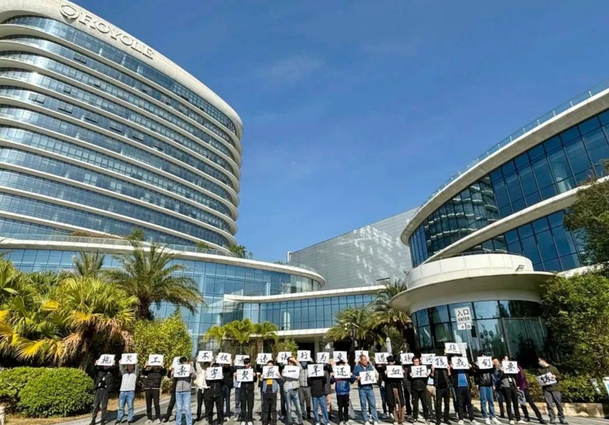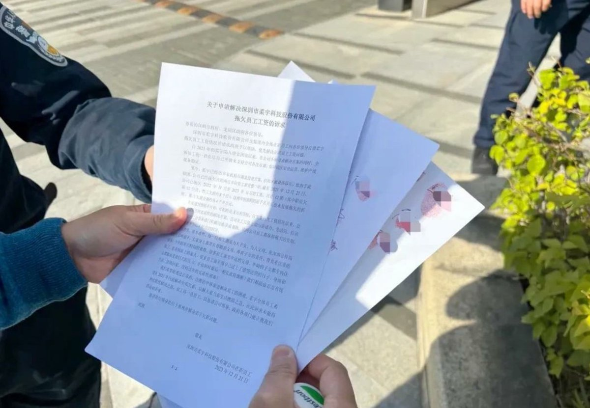  A李老师不是你老师 北京时间 2023-12-26T20:00:50Z 1739617262804271168 12月25日，“村民私搭浮桥一家十八口被判刑案”再审宣判。吉林省白城市中级人民法院对黄德义等18人寻衅滋事再审一案进行公开宣判依法维持对黄德义、何树春的定罪量刑。对黄嵩、黄强、黄德军、黄德友、刘彦辉免予刑事处罚宣告黄永、黄刚、黄伟、刘艳杰、何淑云、佐清芝、武风清、龙丽、刘海波、李丽、边光无罪。
 吉林省洮南市人民法院于2019年12月31日以犯寻衅滋事罪判处黄德义有期徒刑二年，缓刑二年判处何树春等17人有期徒刑一年、拘役六个月及三个月的刑期，同时宣告缓刑。
 法院经再审查明：黄德义等人未经行政机关审批任意占用河道非法建桥，为获取非法利益，将原本通往河道的便道路口及河道内老道封堵破坏致使部分车辆因陷入坑中造成财产损失，使其他车辆不能或不敢从老道通行被迫从案涉桥梁过河。
 黄德义等人在桥头设置铁链、绳索全天排班对过往车辆拦截强行收取过桥费，多次引发争执和纠纷，黄德义等人私自建桥经多次行政处罚拒不改正明知违法仍继续实施上述行为，无视国家法律法规与行政处罚，多次强拿硬要他人财物，破坏社会管理秩序情节严重，该行为已构成寻衅滋事罪黄德义在共同犯罪中起主要作用，系主犯原审判决对其量刑适当，应予维持何树春参与程度较深，作用较大原审判决对其量刑适当，应予维持。 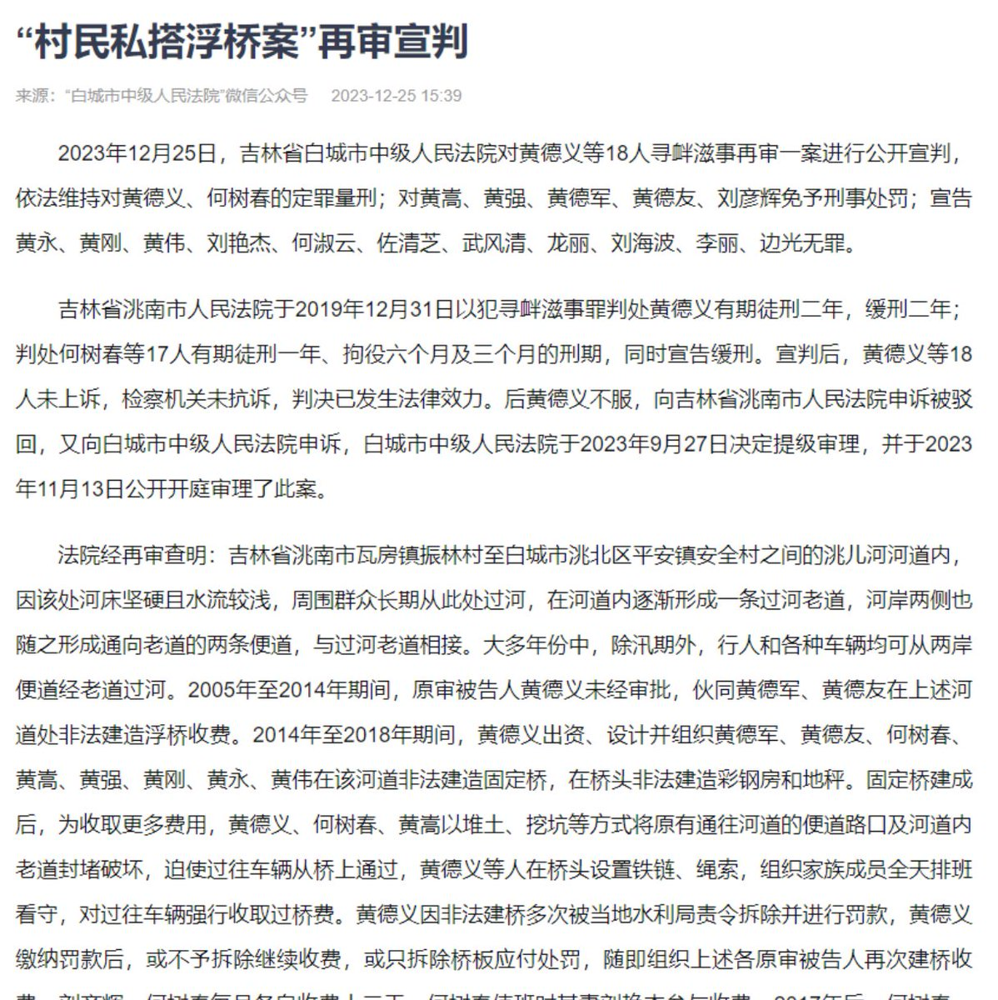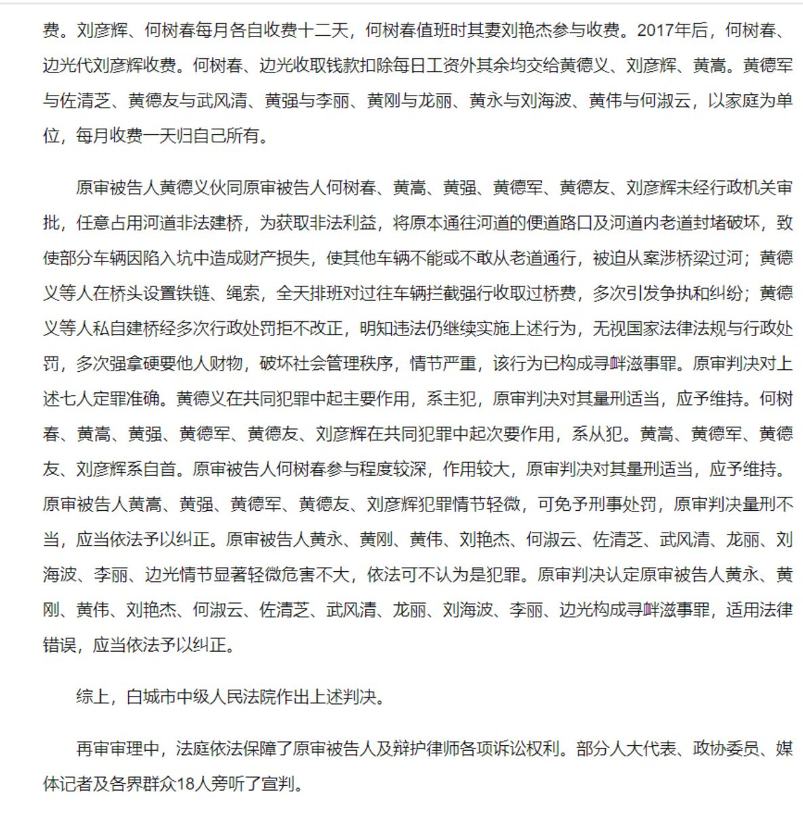  A李老师不是你老师 北京时间 2023-12-26T20:07:32Z 1739618946750263388 12月25日，有网友发现，近日爆火的“丁胖子金牌讲师”的B站和抖音账号均显示无法关注，疑似被软封杀。
这位博主的主要内容以分享在美国当流浪汉的日常，记录美国底层生活为主。因其言语幽默，节目效果出众，在近日爆火出圈，引发大众讨论 https://t.co/0MHyTBm0cd 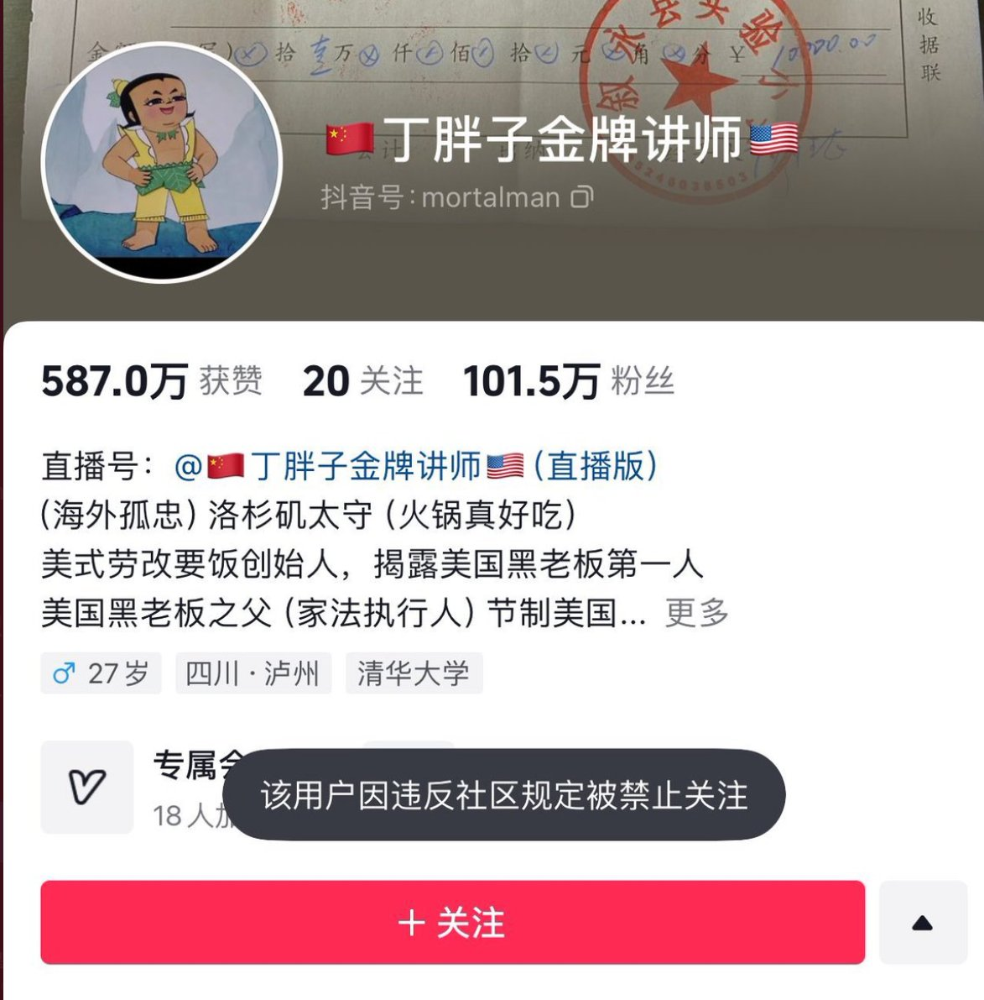  A李老师不是你老师 北京时间 2023-12-26T01:18:46Z 1739334885800595862 网传12月25日晚，湖南韶山毛泽东铜像广场
现场一些年轻人手举毛泽东相片和红旗高喊：“要社会主义，要真正的公有制，要毛泽东思想，不要资本主义，不要大官僚所有制，不要打着马列主义旗号的私有制” https://t.co/4NDg7OpHii   A李老师不是你老师 北京时间 2023-12-26T00:15:24Z 1739318936334713323 有自媒体报道称，青岛航空出现严重亏损，有内部员工称已经不能按时支付工资 https://t.co/TeYMuNeGvO 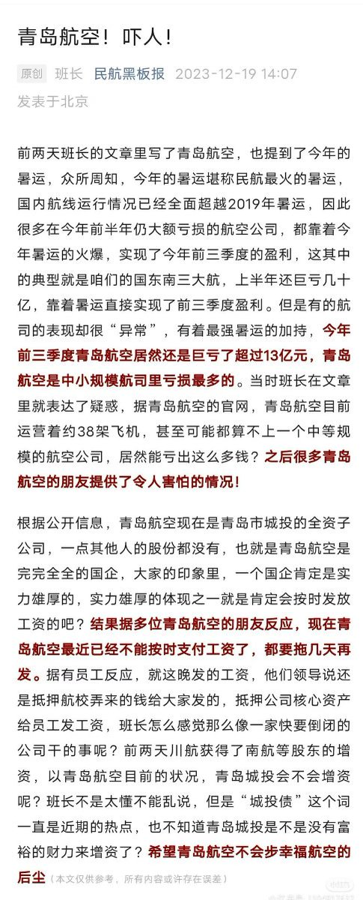  