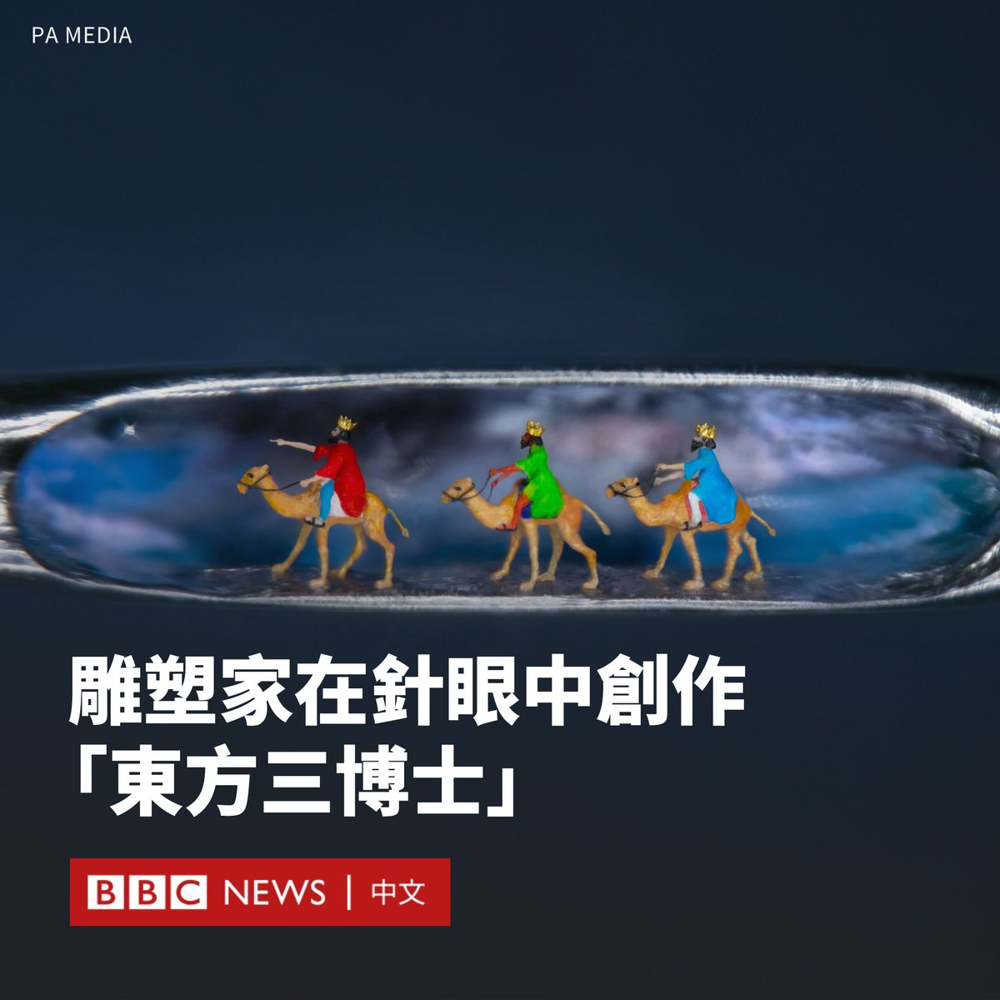
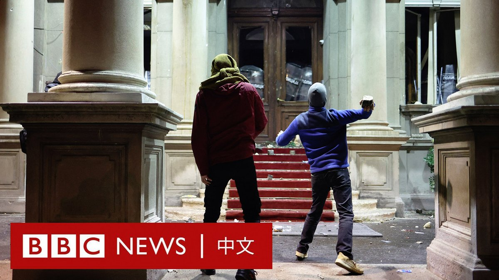
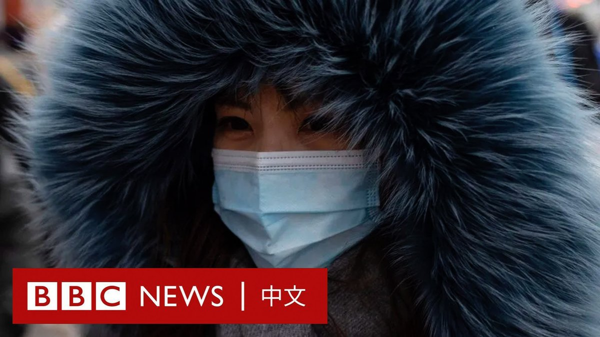

D英国广播公司BBC 北京时间 2023-12-26T14:55:40Z 1739540464209150463 你能想象把三个人塞进针眼吗？微型雕刻家威拉德·维根（Willard Wigan）证明了这是有可能的。

维根用睫毛作为画笔，手工制作了袖珍版的骑着骆驼的东方三博士（Three Wise Men）形象。他说，该创作比句点还小。

维根来自伯明翰，一直从事袖珍工艺品制作。他说：“我们生活在动荡的时代，有时我们需要看到一些能给我们带来快乐、愉悦和乐趣的东西。”

为创作该作品，维根每天工作16个小时，历时四周终于完成。他说，作品中的骆驼是用尼龙制成的，而王冠则是24K金。

他表示，在创作时他不得不屏住呼吸，以减少任何可能破坏其作品的干扰。

维根曾患有自闭症，在学校不受待见，但他从五岁起就开始创作微型雕塑。他最早的一个作品是为蚂蚁建造了房子。

“因为我患有自闭症，我不会读书，我找到了自己的旅程，并用我所做的事情激励人们，这样人们就可以看到我是谁以及我的意义。”他说道。   D英国广播公司BBC 北京时间 2023-12-26T13:25:44Z 1739517831140569497 缺乏信心，使中国民众在各种经济决策中展现出保守的一面，与过去30年狂飙突进截然不同。有经济学家开始担心“借款人的消失”，是否会重走当年日本经济停滞的老路。https://t.co/7edBVo09WC   D英国广播公司BBC 北京时间 2023-12-26T12:13:59Z 1739499773848383866 塞尔维亚首都贝尔格莱德周日（12月24日）有大批反对党支持者冲击市政厅大楼，指责执政党在大选中舞弊。抗议者向市政厅投掷石块，警方施放催泪气体驱散人群。 https://t.co/JFlCAMf1It   D英国广播公司BBC 北京时间 2023-12-26T09:13:33Z 1739454366829117929 近期，受强冷空气影响，中国多地经历异常寒冷天气，北方多省市打破十二月最低气温纪录，部分城市气温降至-30°C。

在中国东部沿海的烟台市，一艘船只在海滩上“冷冻”搁浅。而在不久前发生地震的中国西部甘肃省，骤降的气温让本就失去家园的村民生活雪上加霜。 https://t.co/SmScwCKahy   