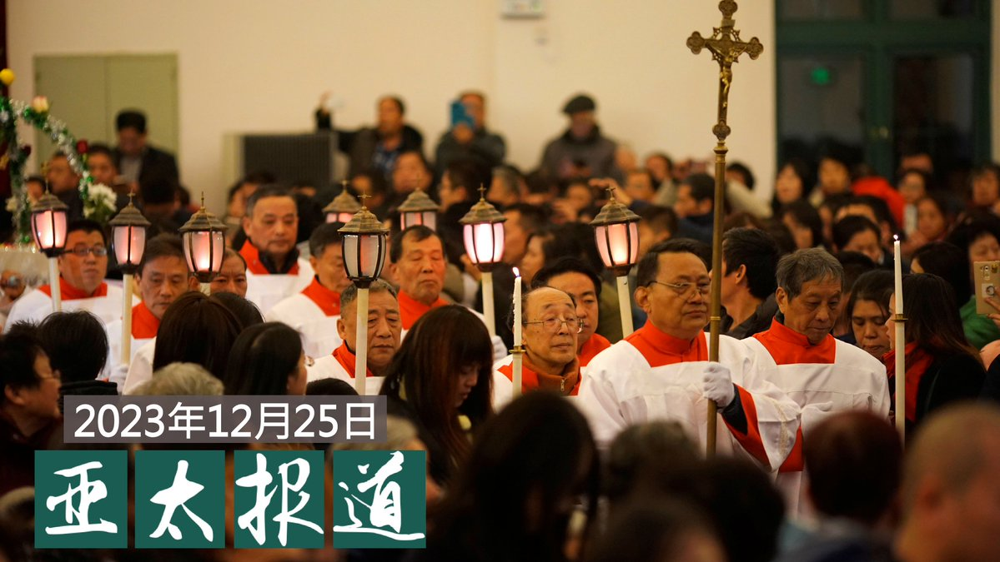
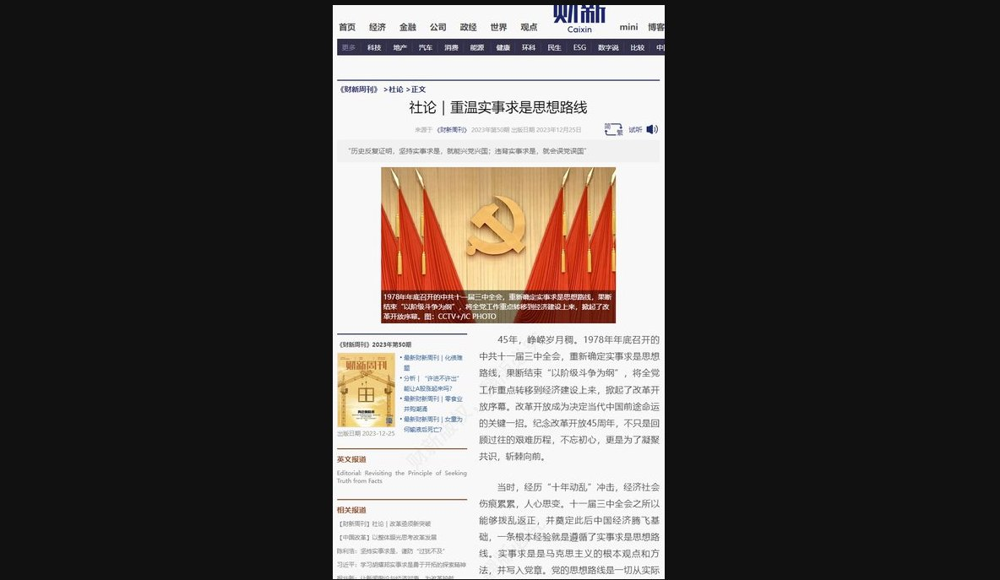
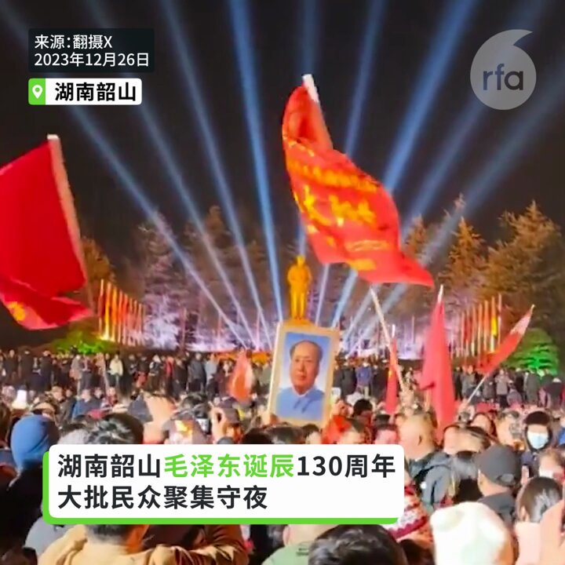
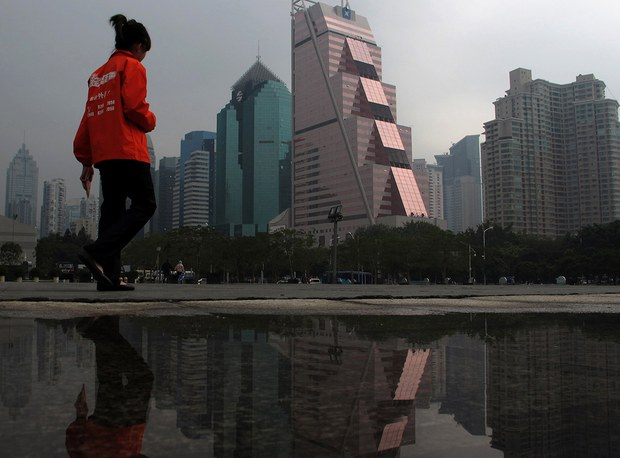
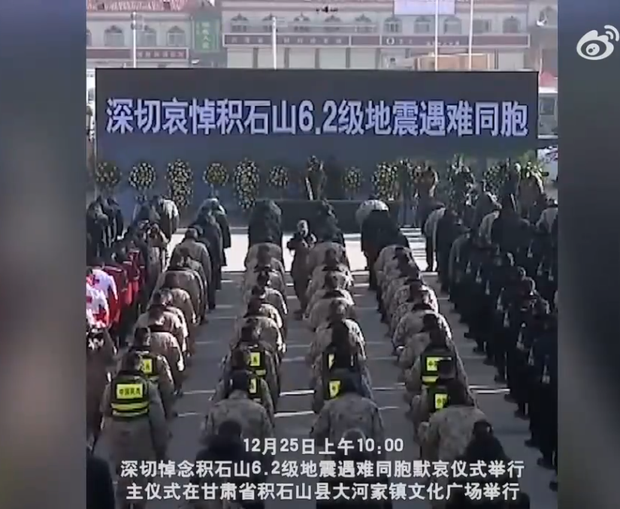
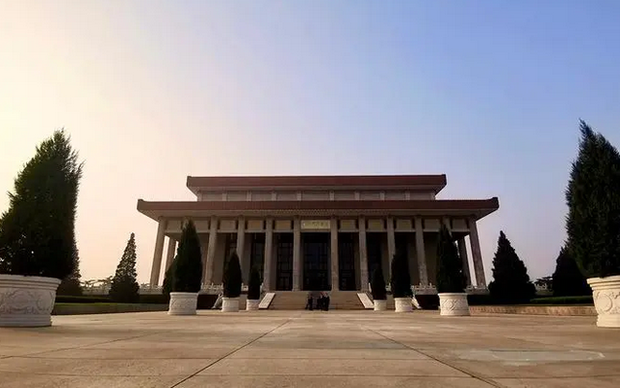
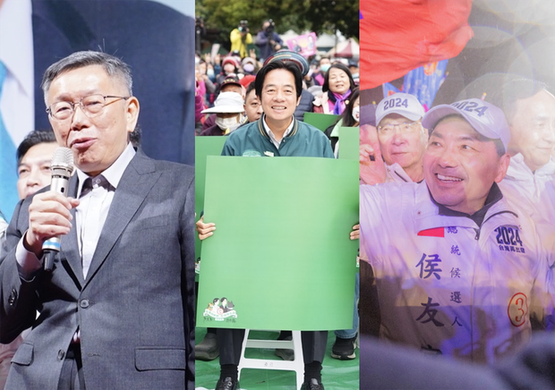
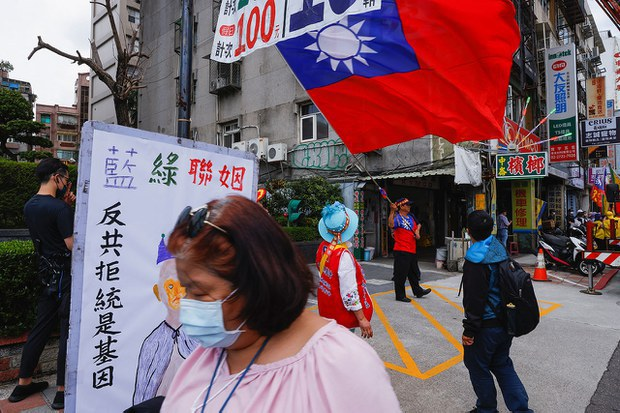

自由亚洲电台 北京时间 2023-12-26T12:30:02Z 1739503814905127139 欢迎收听和订阅播客【＃亚太报道】 https://t.co/MjLNSvVMqc
中国多地学校及幼儿园禁止过 #圣诞节；在美民运团体向 #中国政治犯 寄送圣诞卡；中国 #网游 整治导致股市受损；一 #哈萨克斯坦 公民遭新疆警方扣押护照；在台港人对居留政策能否持续表达担忧 https://t.co/FwiHM8eLcJ   自由亚洲电台 北京时间 2023-12-26T15:41:30Z 1739551997353955794 【财新社论八提邓小平“#实事求是” 被紧急下架】
《财新周刊》12月25日刊出社论“重温实事求是思想路线”，多次呼吁邓小平“实事求是”主张，并指出“经济不振金融风险显露”等，社论在发出数小时后被下架，引发热议。
https://t.co/4Jw7UdhYxX https://t.co/QwKmB9KqRp   自由亚洲电台 北京时间 2023-12-26T13:04:17Z 1739512436066234486 【毛泽东冥诞130周年】
【韶山民众聚集高喊极左口号】
在 #毛泽东 故乡湖南 #韶山，25日子夜开始，毛泽东广场人潮汹涌，聚集大批 #毛左 人士庆祝，高叫“极左”口号。要求驱逐资本主义，实施 #公有制 和社会主义制度，又高呼 #毛主席万岁。 https://t.co/dIkszfSU2N   自由亚洲电台 北京时间 2023-12-26T05:00:05Z 1739390580592173460 评论 | 易富贤：中国应该避免经济“机毁人亡” — 林毅夫等人不是“智囊”而是“肾囊”
https://t.co/7lDkpLoNZ0 https://t.co/LictqDGHKE   自由亚洲电台 北京时间 2023-12-26T04:34:42Z 1739384192054751569 评论 | 王丹 @wangdan1989：对中国政治的四个预测——2024年中国展望（二）
https://t.co/c0U03UDtuv https://t.co/VUoFDj9YNo   自由亚洲电台 北京时间 2023-12-26T05:30:02Z 1739398119216029782 评论 | #胡平：55年前的今天
https://t.co/uyEAKzBTeI https://t.co/2HKEzvW0Iu   自由亚洲电台 北京时间 2023-12-26T06:00:03Z 1739405673572798611 #甘肃 一边悼念 #地震 遇难者 一边处罚地震"造谣者"
https://t.co/gP1Ux4xurL https://t.co/0mNgpMBs6v   自由亚洲电台 北京时间 2023-12-26T02:54:45Z 1739359041909133692 评论 | #陈破空：#台湾 民众不可不知，中共死意吞并台湾的三重目的
https://t.co/lp1OHTXj4Q https://t.co/OGYTh660Cn   自由亚洲电台 北京时间 2023-12-26T03:30:42Z 1739368088876061031 专栏 | #夜话中南海："天下艰难际"，乞灵 #毛泽东
#毛诞 #毛泽东130周年冥诞
https://t.co/VXC9digVt1 https://t.co/cgv9z0f66E   自由亚洲电台 北京时间 2023-12-26T00:56:26Z 1739329264020042239 连日来，中国国家新闻出版署有关计划修正《#网络游戏管理办法》的消息引发股市下跌。而在本周一，当局批准多达105款游戏版号，能救回相关产业吗？
https://t.co/BoyCN6SooG https://t.co/HcLaNRuzbx   自由亚洲电台 北京时间 2023-12-26T01:30:02Z 1739337720105959918 距离 #台湾大选 投票只有三周，三组候选人在圣诞节的周末都举办了大型造势活动，而中国元素成为选战的话题之一。有候选人甚至批评竞争对手可能变成 #独裁者。
https://t.co/VfvmxtyaAt https://t.co/eoqPYPynNw   自由亚洲电台 北京时间 2023-12-26T02:15:20Z 1739349119297314938 近五年来，有接近五万两千名港澳人士获准在台湾居留。
这批港人虽然在本次 #台湾大选 中还不能投票，但却有可能成为受影响最深的族群。记者就此采访不同背景、正在等候定居的在台港人，了解他们对台湾大选的看法。
https://t.co/LmxJX6BYBJ https://t.co/tvKtaJoOS4   