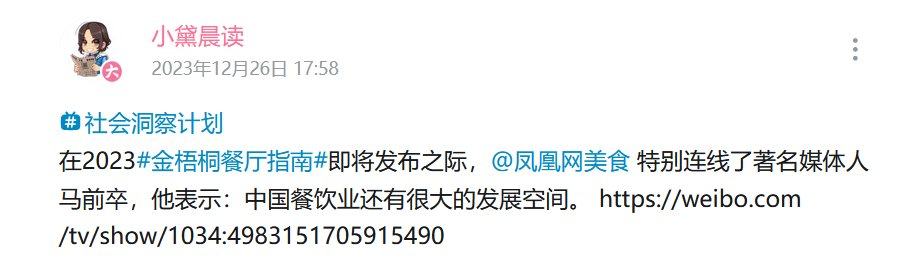
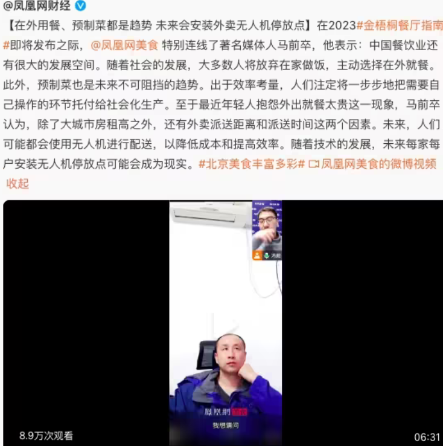

谁将十万横扫三江 北京时间 2023-12-26T22:48:45Z 1739659520396447871 转载：你会发现很多“天真”的人对书籍版号、游戏版号、音像制品版号和电影版号等所有文化市场的“正规发行”的这个东西缺乏最根本的概念认知。
很多人的认知是停留在“正规”上的，认为法律规定了发行这些必须有版号，那就要服从法律，违法是你坏。
但本质上这些所谓版号的发行逻辑都是违背宪法的。因为版号最根本的意义是意识形态管理，是权力控制。为什么小商品小摆件不需要商品版号，而所有涉及文艺内容创作类的制品需要呢？因为文人艺术家是统治者最讨厌最难管的一帮家伙，是最不屈服政治的存在，会衍生出各种或好或坏的思考，而创作的影响是深远的，民众的开化对统治者是麻烦的。只要看看我们在文化创作里尤其严格管理的部分你就知道了。意识形态约束和权力互相成就，形成巩固统治阶层的根系网络。而越是经济下行，越是要收紧，强化人的国家概念，激起人的情绪和向心力，稳固自己的地位。这个手段美国大选的时候大家也看得不少了。
所谓的正规发行名义上的一切借口（为了青少年、为了市场安定和平等等）都是骗人的。一如我们一直在说，全世界没几个国家限制公民出版自由，但他们都没塌，所以监管的意义不言自明。认同恶法，觉得规则就必须遵守的人活得形同家畜。   谁将十万横扫三江 北京时间 2023-12-26T18:37:47Z 1739596363388837955 凤凰网①美食特别连线了著名媒体人马前卒，他表示：中国餐饮业还有很大的发展空间。
 https://t.co/Al8xNYOpDV

①现任凤凰卫视董事会主席兼行政总裁徐威（据港交所相关规定，董事会主席与行政总裁不应由一人同时担任。），曾任上海市网信办、外宣办副主任。2011年7月至2020年8月任上海市人民政府新闻发言人   谁将十万横扫三江 北京时间 2023-12-26T10:44:05Z 1739477150447853796 https://t.co/xYpmhvo43U   谁将十万横扫三江 北京时间 2023-12-26T10:55:09Z 1739479938171056567 加拿大鹅捐的羽绒服分给了各位领导，部分流入市场 https://t.co/JpLbZkx4fw   谁将十万横扫三江 北京时间 2023-12-26T11:04:59Z 1739482410579116407 你们还年轻啊同学们呐，还年轻！来日方长，你们应该健康地活着，看到我们中国实现文革的那一天 https://t.co/mfcR2oBrSb   谁将十万横扫三江 北京时间 2023-12-26T10:23:59Z 1739472093539119596 RT @whyyoutouzhele: 12月25日，《财新》发表重磅社论《重温实事求是思想路线》，文中称：“违背实事求是，就会误党误国”
“文革期间，国民经济濒临崩溃，官方却仍坚称‘形式大好且越来越好’，实则民生凋敝，贫穷落后，不仅与发达国家差距越拉越大，而且正在被腾飞的周边…   谁将十万横扫三江 北京时间 2023-12-26T10:24:08Z 1739472131044647081 RT @whyyoutouzhele: “新软肋”
12月25日，媒体报道。江苏无锡一社区发布通知，禁止村民养家禽。如不整改就取消村级养老金。并影响家庭成员的入党，政审等。 https://t.co/FURoLiVlAg   