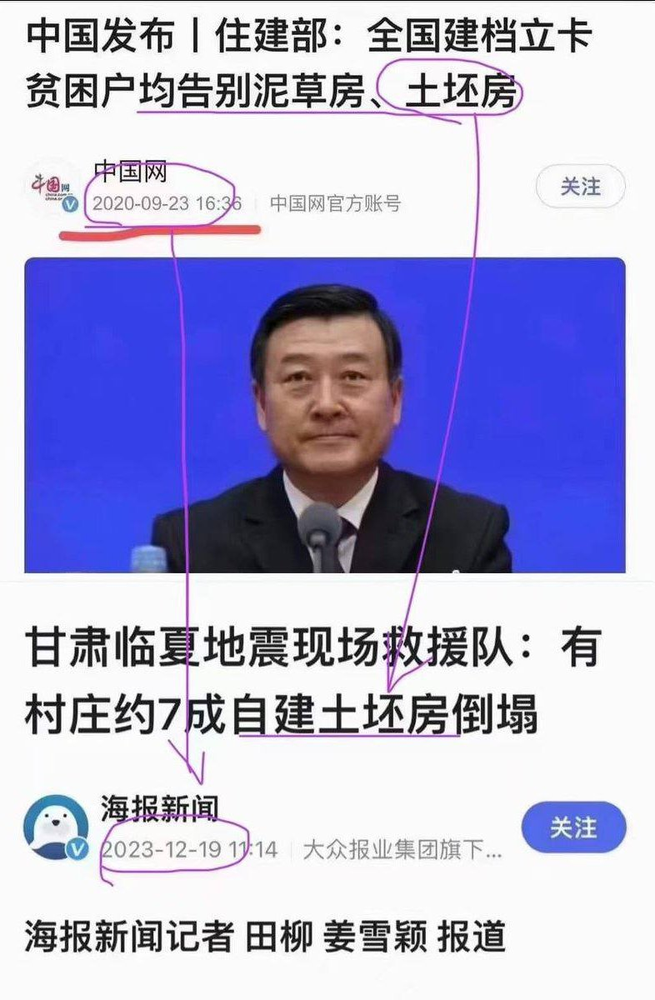
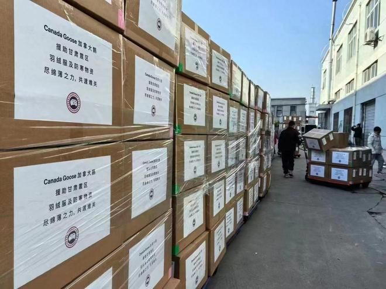
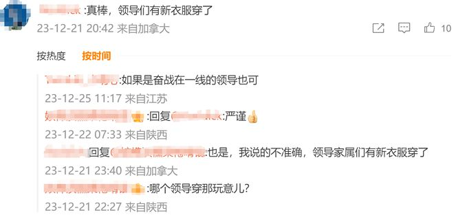
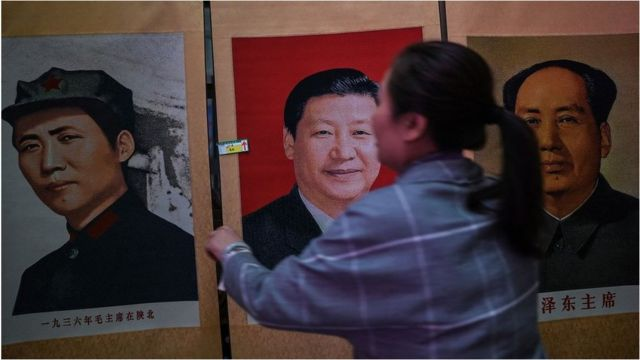
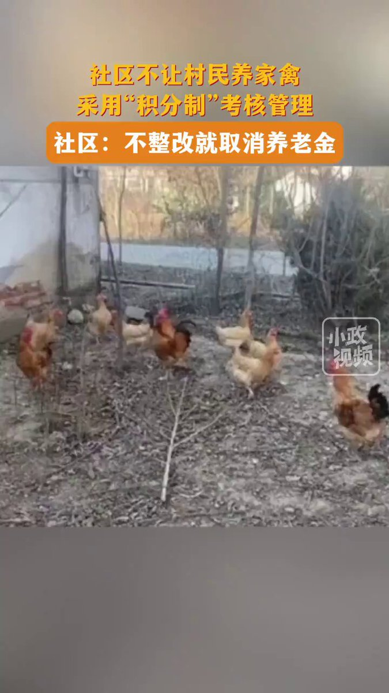

谁将十万横扫三江 北京时间 2023-12-26T10:44:05Z 1739477150447853796 https://t.co/xYpmhvo43U   谁将十万横扫三江 北京时间 2023-12-26T10:55:09Z 1739479938171056567 加拿大鹅捐的羽绒服分给了各位领导，部分流入市场 https://t.co/JpLbZkx4fw   谁将十万横扫三江 北京时间 2023-12-26T11:04:59Z 1739482410579116407 你们还年轻啊同学们呐，还年轻！来日方长，你们应该健康地活着，看到我们中国实现文革的那一天 https://t.co/mfcR2oBrSb   谁将十万横扫三江 北京时间 2023-12-26T10:23:59Z 1739472093539119596 RT @whyyoutouzhele: 12月25日，《财新》发表重磅社论《重温实事求是思想路线》，文中称：“违背实事求是，就会误党误国”
“文革期间，国民经济濒临崩溃，官方却仍坚称‘形式大好且越来越好’，实则民生凋敝，贫穷落后，不仅与发达国家差距越拉越大，而且正在被腾飞的周边…   谁将十万横扫三江 北京时间 2023-12-26T10:24:08Z 1739472131044647081 RT @whyyoutouzhele: “新软肋”
12月25日，媒体报道。江苏无锡一社区发布通知，禁止村民养家禽。如不整改就取消村级养老金。并影响家庭成员的入党，政审等。 https://t.co/FURoLiVlAg   