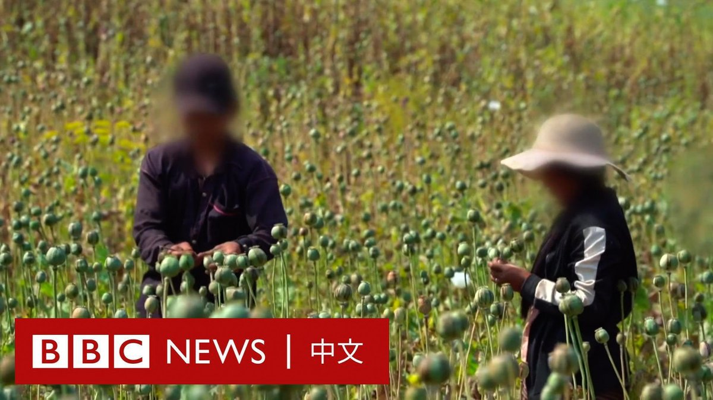
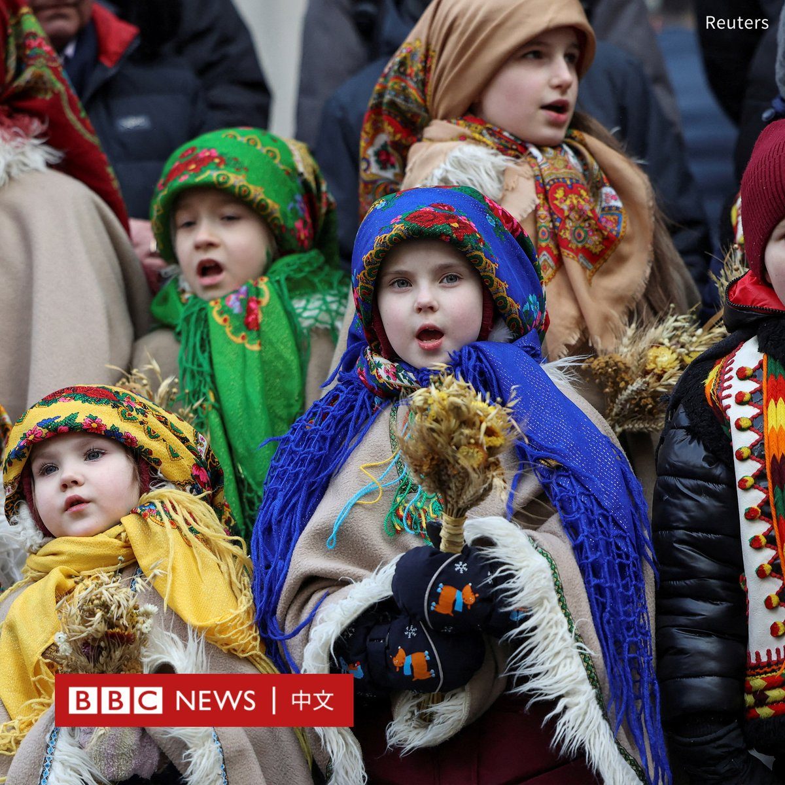
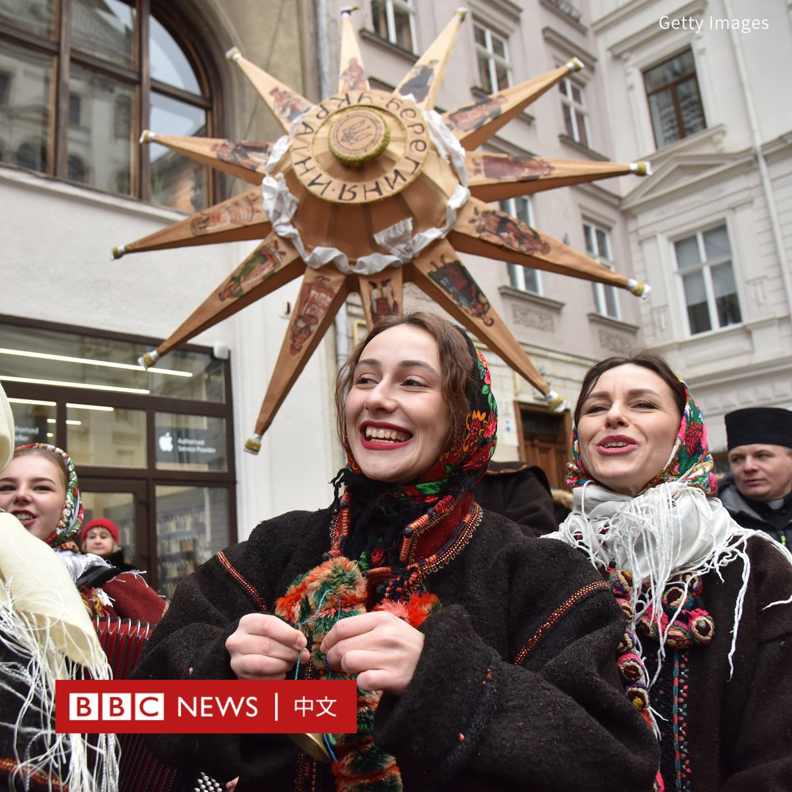
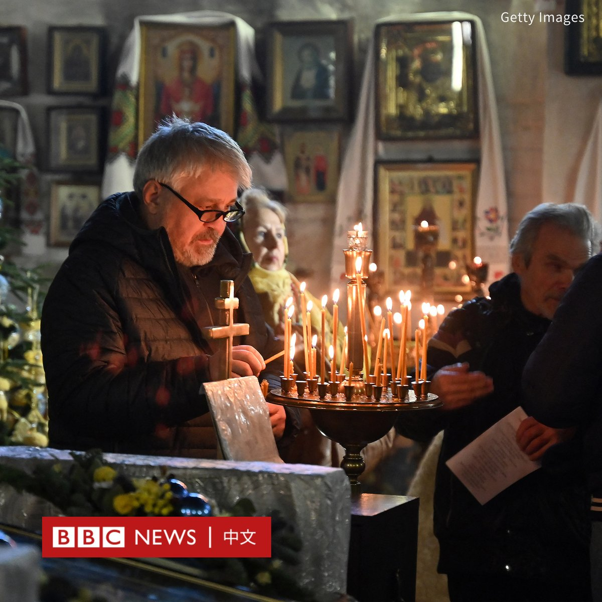
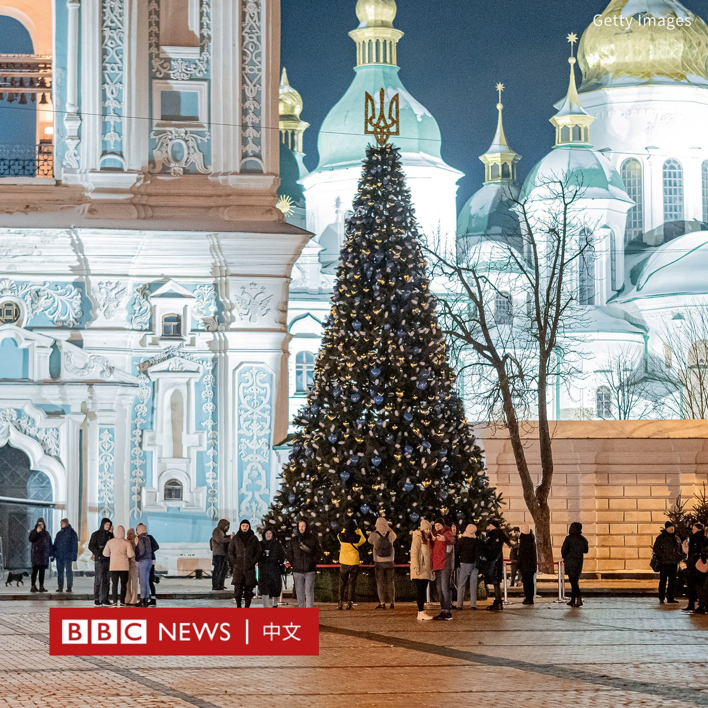
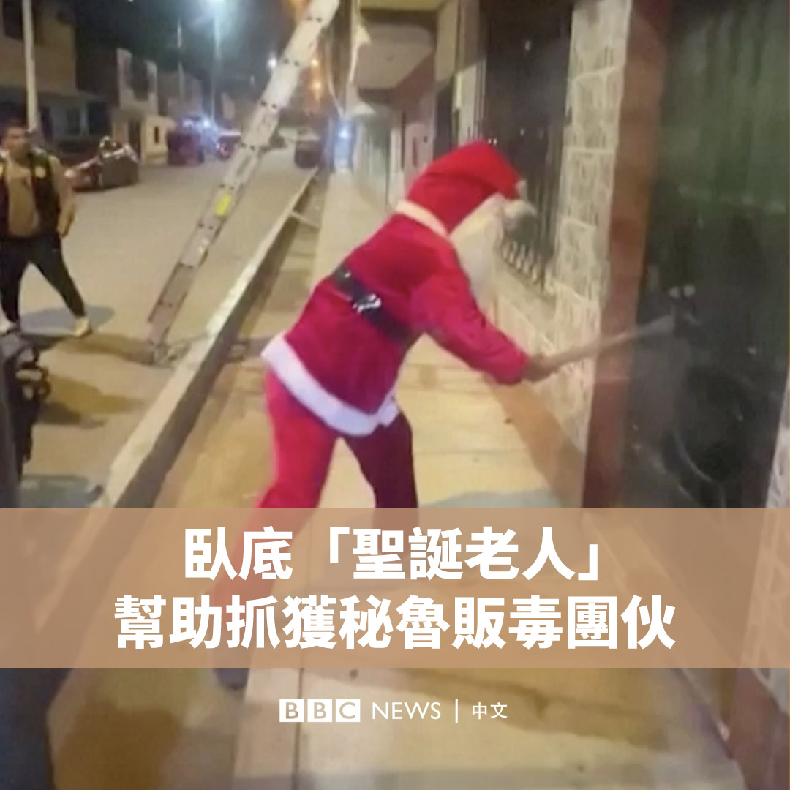

D英国广播公司BBC 北京时间 2023-12-25T16:49:01Z 1739206602480394347 根据联合国毒品和犯罪问题办公室（UNODC）的最新报告，缅甸今年首次成为世界上最大的鸦片生产国。

缅甸今年的鸦片产量预计将增至1080吨，是曾经排名世界第一的阿富汗的三倍。

虽然这个非法行业利润丰厚，但罂粟种植户却普遍贫穷。BBC来到掸邦北部，这是该国最重要的罂粟种植区之一。 https://t.co/F5wmACJjs1   D英国广播公司BBC 北京时间 2023-12-25T13:54:14Z 1739162618399432755 印尼苏拉威西岛青山工业园一家中资镍工厂发生爆炸，造成至少13名工人死亡，数十人受伤，其中一些严重受伤。死者是8名印尼人和5名中国籍工人。https://t.co/NVIIHWB0Cn   D英国广播公司BBC 北京时间 2023-12-25T11:48:06Z 1739130873893863912 乌克兰的东正教徒首次在12月25日庆祝圣诞节，而非传统上根据儒略历计算的1月7日。

随着俄罗斯入侵乌克兰促使反俄情绪升温，乌克兰根据西方或公历（格里历）来庆祝圣诞节，标志着基辅希望继续加强与欧盟的联系。

乌克兰总统泽连斯基（Volodymyr Zelensky）今年七月修改法律，将圣诞活动改至12月25日，并称其允许乌克兰人“抛弃”在一月份庆祝圣诞节的“俄罗斯传统”。

泽连斯基在周日（12月24日）晚发布的圣诞致辞中表示，所有乌克兰人现在都在一起。

“我们在同一天，作为一个大家庭、一个民族、一个统一的国家，一起庆祝圣诞节。”

2019年独立的乌克兰正教会（OCU）也将其圣诞节日期改为12月25日。

由于俄罗斯2014年吞并克里米亚并支持乌克兰东部的分离主义分子，该教会正式脱离俄罗斯正教会。

周日，乌克兰各地的人们祈祷并点燃蜡烛。在受战争破坏不大的西部城市利沃夫，身穿传统服装的孩子们在街上唱着颂歌，参加节日游行。

一些前线的乌克兰士兵也在周日享用圣诞晚餐。

随着俄乌战争将满两年，乌克兰当局还加大了重新命名地名的力度，并拆除了与沙皇和苏联历史有关的雕像和纪念碑。   D英国广播公司BBC 北京时间 2023-12-25T09:56:42Z 1739102838381584779 秘鲁警方在一名“圣诞老人”的特别帮助下，在首都利马附近的瓦卡尔（Huacal）开展了缉毒行动。

警方周六（12月23日）发布的影片显示，一名来自城市情报战术部门的警官装扮成圣诞老人，用大锤砸开一扇门，并帮助拘留了嫌犯。

该部门负责人沃尔特·帕洛米诺（Walter Palomino）表示，由于贩毒的场所很难进入，所以通过伪装圣诞老人靠近现场，以避免引起关注。

当地媒体称，两名年龄分别为25岁和32岁的男子因贩卖毒品被捕。   