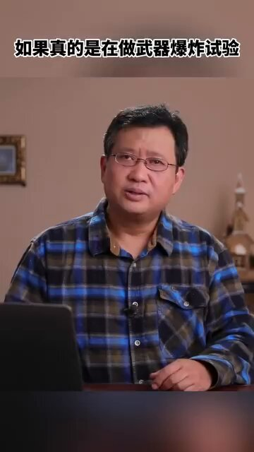
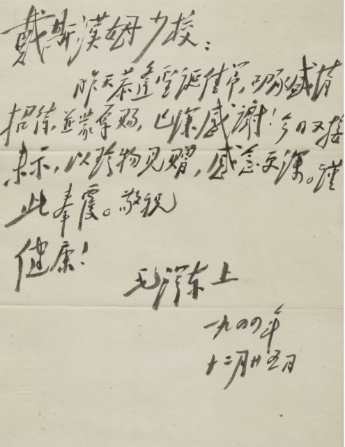
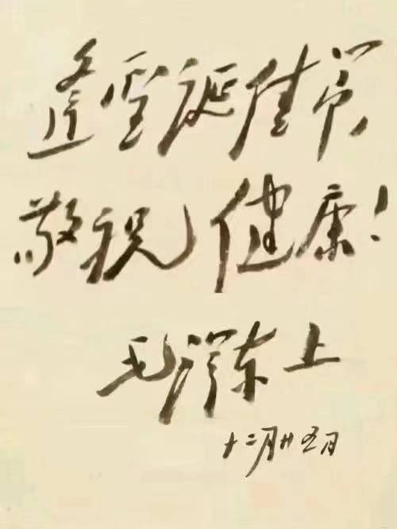
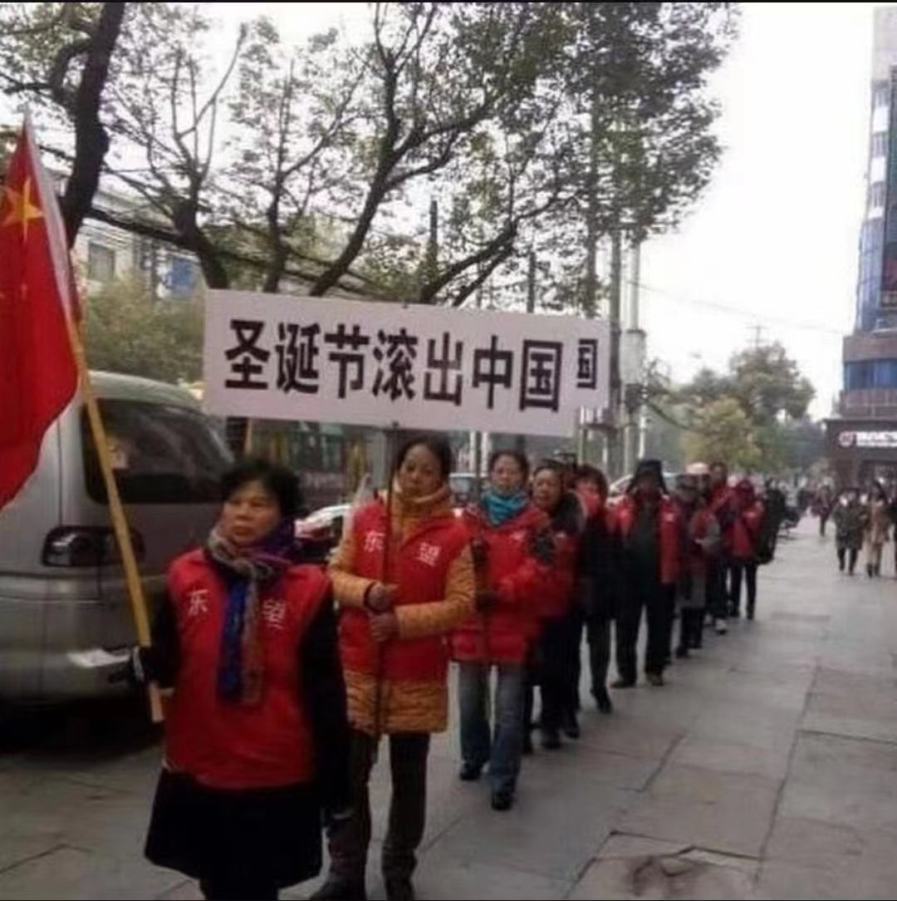
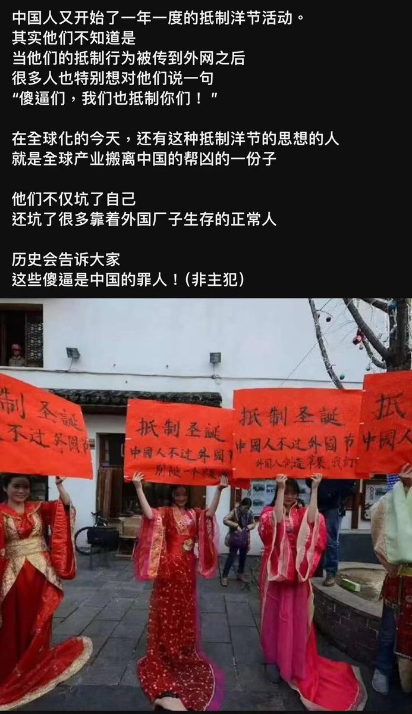
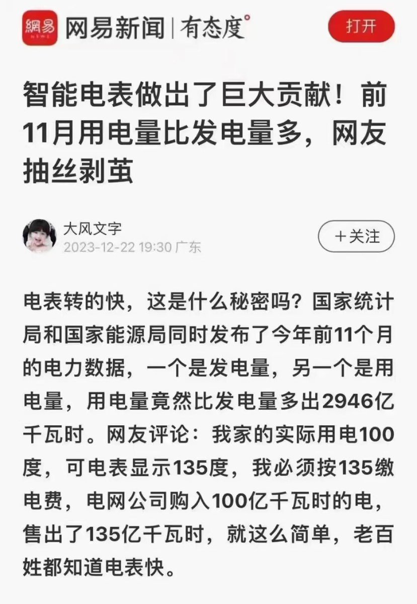
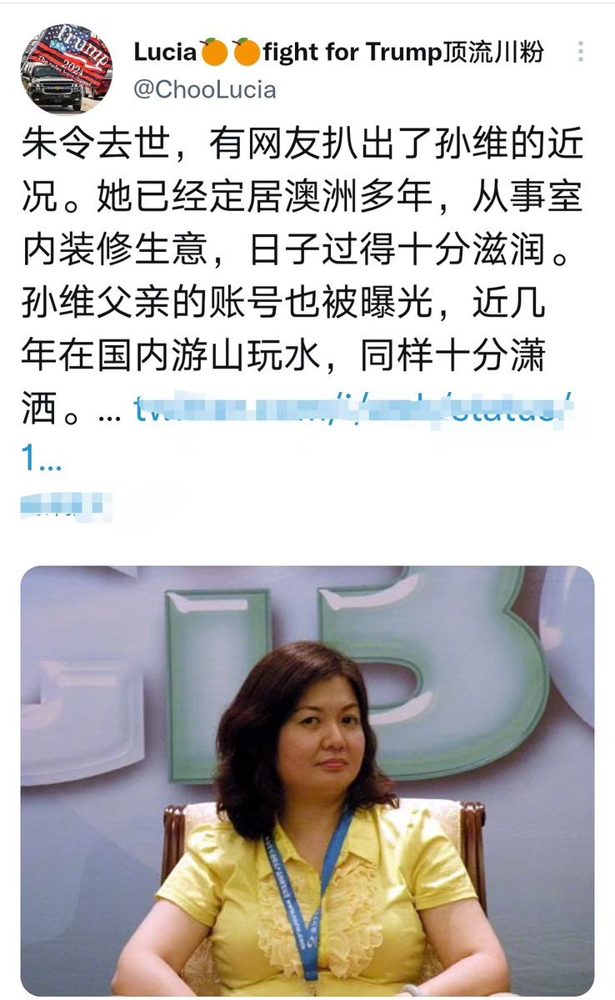

Petrichor 北京时间 2023-12-25T12:14:00Z 1739137391837778233 這次我不能同意江峰老師的觀點了。我的鄰居是中央研究院地球科學研究所的研究員，我問他最近甘肅地震是否是共軍核爆炸造成的，他說那是不可能的。兩者震源深度不同，核爆炸的深度近乎零。再說，兩者的波形不同，天然地震是斷層錯動（撕裂）造成的，會形成大量的剪切波，而核爆炸則產生大量的縱波。岩石撕裂是一個漸進過程，需要一段時間，例如，30-40秒，而爆炸就是點源一霎那。而且核爆炸產生不了高達6.2級的地震。江峰老師畢竟不是地震學家，我當然相信我鄰居專家的解釋。   Petrichor 北京时间 2023-12-25T12:16:37Z 1739138051266269587 不肖子孙，你们毛爷爷也过圣诞节的。 https://t.co/JItoBBXBYv   Petrichor 北京时间 2023-12-25T12:21:33Z 1739139290087432629 中国人用电量比发电量多，是智能电表被人暗中控制，出现短斤缺两的情况？还是美国背后使坏，悄悄往中国电网里打了电？小粉红们，你们怎么看？ https://t.co/Vjd6WT18gL   Petrichor 北京时间 2023-12-25T04:38:56Z 1739022872083935568 中国大陆也曾这样报道过美帝？
通货膨胀，一半人吃不起饭，只能到咖啡馆喝咖啡。 https://t.co/Q7Spqmw3x7   Petrichor 北京时间 2023-12-25T04:55:55Z 1739027143005278452 孙维爷爷是孙越崎。1947年3月，翁文灏任中华民国资源委员会委员长，孙越崎任副委员长。1948年5月，翁文灏内阁成立，孙越崎任行政院政务委员兼资源委员会委员长。此后，在孙科内阁中，孙越崎连任该职。1949年3月，何应钦内阁成立，孙越崎出任中华民国工商部（5月与其他部会合并成立经济部）部长兼资源委员会主任委员。

然后背叛国民党，孙越崎历任中共建政后的全国政协第二、三、四届委员，河北省政协副主席、河北省人大常委会副主任。1980年，孙越崎在全国政协五届三次会议上当选为全国政协第五届常委。1981年12月25日，民革中央五届二中全会增补孙越崎为第五届民革中央副主席。1983年，孙越崎当选为全国政协第六届常委，兼全国政协经济建设组组长。后来，孙越崎历任第六届民革中央副主席，第七届民革中央监察委员会主席。1981年，孙越崎任中华人民共和国煤炭工业部顾问。他还先后兼任中华人民共和国进出口管理委员会特邀顾问、中华人民共和国对外经济贸易部特邀顾问，其间结识了时任进出口管理委员会副主任的江泽民。此外，他还先后兼任中国统配煤矿总公司顾问、民生实业公司董事长、复旦大学北京校友会会长、欧美同学会名誉会长、辛亥革命研究会名誉理事长等职务。   Petrichor 北京时间 2023-12-25T00:47:31Z 1738964632130232831 中国农村究竟有没有土坯房和干打垒墙的房屋？
几年前住建部就宣布说没有了，习近平也宣布全面小康、消灭贫困了。
事实打脸了，一场中级地震震出大批大批土墙房屋，倒了，砸死人。
他们是有组织的撒谎，靠谎言创造政绩，从下到上，或者说上有所好，下必谎报。 https://t.co/V5epu2yHLP   Petrichor 北京时间 2023-12-25T00:57:38Z 1738967179968569838 “只要坚持两个维护（让习近平做大位），中国共产党什么也不在乎，什么代价都可以付，什么外资和科学技术都可以不要，中国人民什么苦日子都可以过”。一个人影响一个民族、危害一个国家、拉低全面智商、搞垮大国经济。

道理就是这么简单，这就是现在中国流行的所谓的讲政治。 https://t.co/3UXHDAAik2   Petrichor 北京时间 2023-12-25T01:25:48Z 1738974268866621729 就停止中国经济下行为习近平支招，他会采用吗？不会！因为他把皇位的重要性看出高于人民的生命。 https://t.co/bF4y9eX099   Petrichor 北京时间 2023-12-25T01:59:33Z 1738982758716772780 大爷，
长在红旗下，
哺育在毛泽东思想的雨露中，
生活在习近平的新时代，
发扬敢于斗争的精神，
做社会主义精神文明的模范。
不愧为习近平的好党员、好学生！ https://t.co/uDKnSmJlHF   