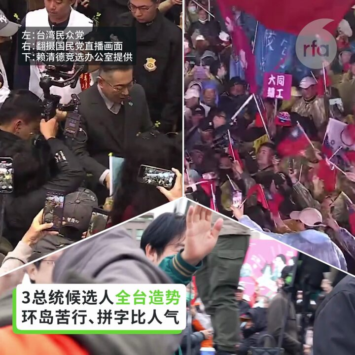
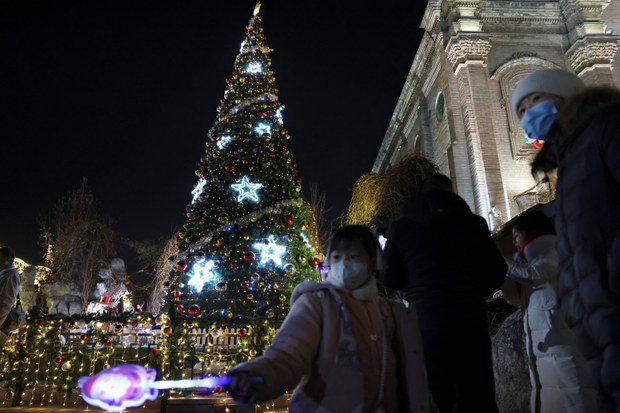

自由亚洲电台 北京时间 2023-12-25T22:00:12Z 1739284913684148231 日本政府内阁会议批准了2024财年预算案，其中防卫预算达到史上最高的约560亿美元，较前一年度增16%以上，旨在加速部署能够打击中国或朝鲜目标的远程巡航导弹，日本也将利用F-35战机和其它美国武器进一步增强军力。
详阅：
https://t.co/42yHqknh4b   自由亚洲电台 北京时间 2023-12-25T16:42:29Z 1739204956639596610 【台湾三组总统候选人全台造势】
【环岛苦行、拼字比人气】
#台湾2024总统大选 三组候选人圣诞节周末持续造势，民进党的赖清德和萧美琴完成4天环岛拼图行动，强调“台湾人世世代代当自己的主人，台湾绝对不走回头路。” 台湾民众党的柯文哲在一场造势大会上说: “不仅从台湾，甚至有一天，我们也会改变中国大陆。我不相信中国大陆永远不会有民主自由 !” 国民党总统候选人侯友宜则以他曾参与过的枪战举例说他是用生命保护台湾，不可能背叛台湾，促对手不要再说他“亲中卖台”。   自由亚洲电台 北京时间 2023-12-25T15:03:22Z 1739180014749593790 【多地流传禁过圣诞节倡议】
【王沪宁敦促从严治教】
今年圣诞节期间，广东、福建，黑龙江等地有学校及幼儿园拒绝过平安夜和圣诞节。在部分地区，当局禁止家庭教会聚会欢庆圣诞。与此同时，中共政治局常委王沪宁约见中国基督教领导层，要求“全面从严治教”。
详细报道：https://t.co/ZO15LpQ5Px https://t.co/WRtf6p5WLx   自由亚洲电台 北京时间 2023-12-25T13:07:22Z 1739150820745396695 RT @asiafactcheckcn: 22日傍晚，台中地检逮捕网络媒体《指传媒》老板及记者林献元，指控他制作假民调，为中共渗透台湾总统大选。

这份民调显示国民党候选人 #侯友宜 逆转领先民进党候选人 #赖清德，但它不仅来源不明，且做法毫无公信力，还是被主流媒体广泛引用，形…   自由亚洲电台 北京时间 2023-12-25T11:59:44Z 1739133802868560133 RT @asiafactcheckcn: 2024年台湾副总统大选政见发表会于22日（周五）举行，亚洲事实查核实验室针对三位候选人进行了一系列的事实快查。其中，#赵少康 和 #吴欣盈 分别发表了误导或错误资讯，#萧美琴 则有部分内容说得不完全。查核内容聚焦在国际、外交议题。…   自由亚洲电台 北京时间 2023-12-25T04:51:53Z 1739026128394744308 中国最新发布的网游监管草案引发市场和舆论的巨大震动。对此，新闻出版署回应说，“就各方对意见稿提出的关切和意见，#出版署 将认真研究，并将在继续听取意见的基础上进一步修改完善”。
详阅：
https://t.co/w1O58V5R4r   自由亚洲电台 北京时间 2023-12-25T05:17:20Z 1739032535873536084 位于印尼, 由中国 #青山控股集团 投资发展的不锈钢工厂在平安夜当日发生爆炸，造成至少13人死亡和38人受伤，死者包括八名印尼工人与五名中国工人。
详阅：
https://t.co/88bWExtXkB   自由亚洲电台 北京时间 2023-12-25T06:34:53Z 1739052049910681911 【全国政协主席: 中国基督教坚持中国化方向】王沪宁在 #基督教 第十一次代表会议上说，中国基督教界要学习贯彻习近平新时代中国特色社会主义思想和 #中共二十大 精神，高举爱国主义、社会主义旗帜。
详阅：
https://t.co/1Y0c5hKdaU   自由亚洲电台 北京时间 2023-12-25T07:14:08Z 1739061929967002093 “铊中毒”案受害者 #朱令 在北京去世，终年50岁。1994年，时为清华化学系学生的朱令在校期间遭投毒，致全身瘫痪，室友孙维曾被警方调查，但被免除嫌疑。有报道称，可能与 #孙维 家庭中共高层背景有关。
详阅：
https://t.co/ACLhknm4qo   自由亚洲电台 北京时间 2023-12-25T07:46:45Z 1739070136860946484 台湾国防部称，解放军行动并未因接近 #台湾 总统大选而减少，22日至23日24小时内侦获 #解放军 军机7架次、军舰2艘次。
详阅：
https://t.co/XpI0yAgyWC   自由亚洲电台 北京时间 2023-12-25T06:11:22Z 1739046133861584937 12月初公开呼吁中国股民不要入市并因此遭到全网禁言的金融学者 #刘纪鹏 近日证实他已不再担任中国政法大学资本金融研究院院长。
详阅：
https://t.co/6ZPTKi0fk5   自由亚洲电台 北京时间 2023-12-25T03:33:46Z 1739006471369552298 工行、建行、农行、中行、交行和邮政储蓄银行宣布下调存款利率以刺激经济增长，是为年内第三次。虽然利好市场情绪回暖，但挤压了商业银行的盈利能力。
详阅：
https://t.co/Ew9XJtbn5E   自由亚洲电台 北京时间 2023-12-25T04:01:43Z 1739013503191531914 【民运人士向政治犯寄圣诞贺卡】圣诞之际，中国民主党 #洛杉矶 党部举行了向中国政治犯写贺卡活动。上百张圣诞贺卡正准备被寄到 #良心犯 被关押或被软禁的地方。
详阅：
https://t.co/StD7A0ifg7   自由亚洲电台 北京时间 2023-12-25T00:32:46Z 1738960922138333299 广东近期有多名高管被查，最新一人为广东 #卫健委 副主任及中医药局局长 #徐庆锋，其因涉嫌严重违纪接受广东纪委监委纪律审查和监察。
详阅：
https://t.co/nSR4YQVybw   自由亚洲电台 北京时间 2023-12-25T01:26:01Z 1738974322889236796 【1951年以来最寒的十二月】北京 #气象观测站 自12月11日以来记录的低于冰点的小时数已经超过300小时，并且 #北京 还经历了这一时期连续九天的低于摄氏零下10度的气温。
详阅：
https://t.co/hr7RmzNBz8   自由亚洲电台 北京时间 2023-12-25T02:00:04Z 1738982891710017771 【美中两国正竞相开发盒式导弹】 装箱化导弹发射器几乎可以在任何商用或军用船舶上安装预制导弹（#prepackagedmissiles）, 有可能彻底改变海战面貌。
详阅：
https://t.co/1sczjfWosX   