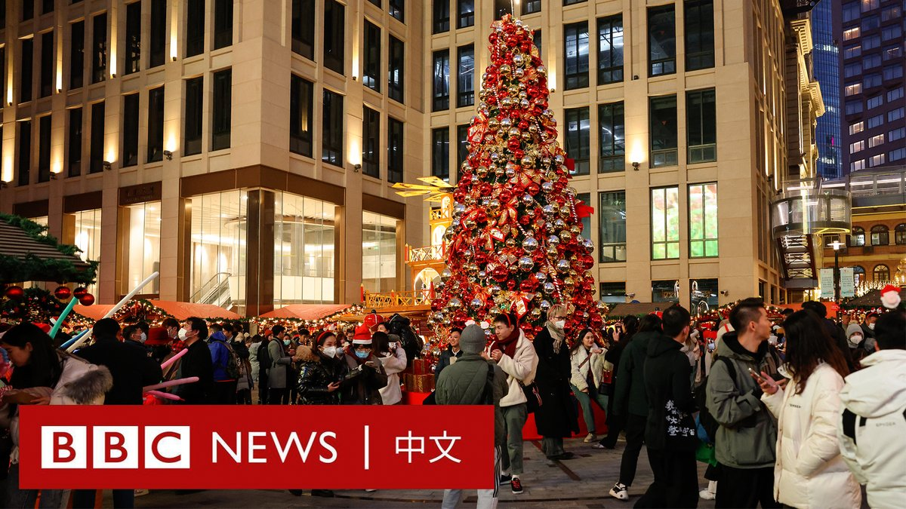

D英国广播公司BBC 北京时间 2023-12-24T19:43:19Z 1738888079409398236 随着平安夜到来，中国一些城市街头的圣诞市集彩灯闪耀，年轻人摩肩接踵。

近年每逢圣诞节等西方节日，中国网络上都会掀起过洋节是否是“崇洋媚外”的争论。一些庆祝者认为，这些节日在中国已没有太多宗教含义，而是一个与朋友相聚的机会。 https://t.co/c249se9LY6   D英国广播公司BBC 北京时间 2023-12-24T17:06:55Z 1738848717493400042 1990年代震惊中国的北京清华大学“铊中毒”案受害者朱令在北京辞世，终年50岁。https://t.co/ZGPqWU1W47   