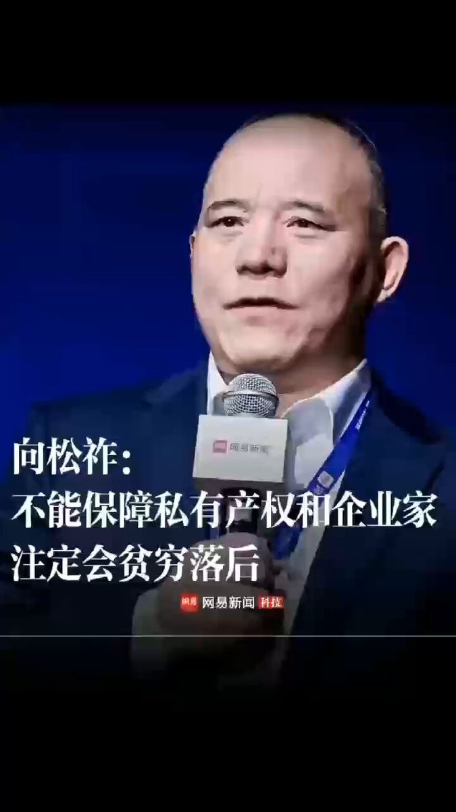
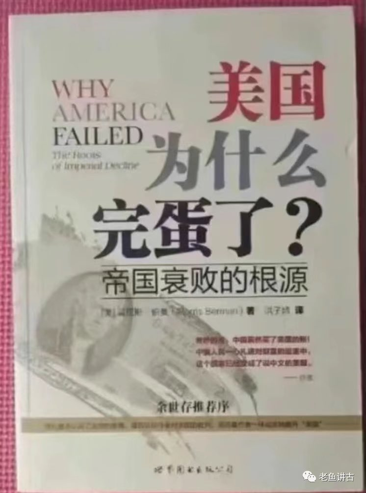

Petrichor 北京时间 2023-12-24T22:50:38Z 1738935218545795544 In a word, they deserved all the suffering they suffered.
Leeks love sickles, slaves praise slave owners, women in chains sing human traffickers, continue on….
Suffering is ahead, a great famine is on the way, and people are being harassed on the road, while the Cultural Revolution is taking place.

Keep tossing   Petrichor 北京时间 2023-12-24T22:43:05Z 1738933317754310747 消灭私有制，是共产党的初心和目标。既然不能保护私有制的国家不可能发达和富裕，那么哪里有了共产党，哪里人民就贫穷。人民的贫穷，丝毫不影响共党官员的奢侈生活，因为全民所有制就是官员所有制，他们随意动用公款支付他们奢侈的消费，看看习近平如何请客的宴会排场就知道了。

邓小平意识到百姓贫穷会引起造反而让共产党失去政权，为了延续共党政权而不得以允许个体和民营经济发展，于是经济发展迅速。习近平上台后，怕民营资本家要和共产党争话语权，赶紧搞国进民退，立竿见影，经济下行，外资撤离，富人移民海外。   Petrichor 北京时间 2023-12-24T12:35:20Z 1738780370974191761 前苏联政府总理雷日科夫在评价苏联冷战失败的时候，也曾经说过，“我们最大的错误，另一方面来说，则在于关键时刻低估了美国的实力，这严重损害了我们后来的内部政策回旋空间。”

历史上，还有德国，他们和日本、苏联一样，一个最大的共同错误就是低估了美国。

美国被低估并不是一种偶然，主要因为美国的“唱衰文化”。

不让唱衰的国家必然不能强大！   Petrichor 北京时间 2023-12-24T11:09:01Z 1738758650229899685 原文地址：一切新词，国家必须给全国人民作出明确的诠释
原文作者：太仓钱伟品

新一届党政执政以来，不少“新词”迭出。 但是，网上网下不少人民群众对一些“新词”至今还“云里雾里、不甚了了”。
因此，国家、特别是国家社科院、中央宣传部和中央党校，必须对一切“新词”作出正确明确的诠释。以及时回应全国人民的呼声。譬如：
1、中国梦。究竟是什么梦？个人梦是否是中国梦的一部分？央视天天广告的“中国梦，梦之蓝”。中国梦真正的内涵是什么？
2、中华民族复兴。究竟复兴什么？因为中华民族泱泱5千年，究竟要复兴哪一段社会形态？实现民族复兴的社会，究竟是什么样的社会？
3、新常态。所谓常态就是经常态。提出新常态，必须有老常态、正常态、经常态的存在。所谓新常态，必须要有别于“正、老、经”3种常态，应该分别说说清楚。
4、新业态。一般《经济学》都将经济产业分成3种即：一产农业、二产工业、三产服务业。所谓“新业态”究竟指哪个产业？必须把这个业态与原来3大产业，区别诠释清楚。
5、互联网+。地球人都知道：互联网就是一个电讯“平台”。互联网自诞生第一天起，就是一把“双刃剑”。什么正能量负能量都可以+。我国现代提出的互联网+，究竟要+些什么东西？怎样+？都必须阐述清楚。
6、现代服务业。什么是“现代”服务业？它包括哪些方面？究竟能否一切都由“市场”决定？如当今市场上泛滥的东西，是否就是“现代服务业”？如：孩子买卖、两性买卖、人体器官买卖、五毒俱全买卖、等等。好像不能作为现代服务业，更不能完全由市场决定吧？！
7、混合型改革。究竟什么是混合型所有制经济改革？混合型究竟要混什么？混合型的目的是什么？怎样检验混合型改革的成败？等等。都必须诠释明确。
8、供给侧。供给本身就是一个经济学名词。加上了一个“侧”字，便“八股”起来了。侧是什么东东？“侧”是相对“正”而存在的。侧和正又将作如何解释？
9、《合同》制。《合同》本身，是人类在经济社会关系中的一种契约。现在用到“人类”身上，一、究竟合理性咋样？二、人民是主人、官员是仆人，怎么能“仆人”与“主人”主次颠倒签订《合同》呢？三、人，怎么能当作“物”体确立《合同》的？
10、人才市场。社会主义市场经济，绝对不是“一切皆市场，一切皆商品”。更不是“彻底私有化、彻底市场化、彻底商品化”。人类是国家社会的主 人。怎么能当作“商品”进入“市场”交换呢？中国历来有“牲口市场”。却绝对没有“人才市场”。当“人”都成为了“商品”，并且进入市场自由买卖了。——这个社会究竟是什么社会啊？！怪不得“两性、孩子、器官、文凭、发票、户口、学历、学位、官职、等等”都连同五毒俱全一并成为商品，在“中国特色”市场上买卖一派兴旺，并且愈演愈烈。
笔者强烈建议：国家社科院、中宣部、中央党校，必须将上述“新词”，尽快向全国人民诠释明确、解释清楚！
凡是无法诠释或者解释不清的，应该立即停止使用，以免“蛊惑”民众、混乱社会、殃祸民族。   Petrichor 北京时间 2023-12-24T09:24:17Z 1738732293668184327 有一拨人
通宵达旦只为了看升旗
有一拨人
夜以继日只为想签证逃离
起早看升旗的
瞧不起办签证逃离的
办签证逃离的
瞧不起看升旗的
他们是互相瞧不起

看升国旗的大多都是穷人
他们第一次去北京和天安门广场
不注重周围的环境乱丢垃圾
办签证逃离的大多是富人
比较爱干净不会丢垃圾满地
富人以为钱是自己的
穷人以为国是自己的
究竟孰是孰非
只有等潮水褪去
才会发现谁在裸泳
才会懂得海水的意义   Petrichor 北京时间 2023-12-24T01:43:05Z 1738616228472573967 折腾吧，与欧美文化、商贸、科技交流一刀两断吧！ https://t.co/K1RzSzNTo1   Petrichor 北京时间 2023-12-24T01:52:03Z 1738618484202799510 “我爱国，我爱党！请可怜可怜我吧，救济我这个老人几个吃饭的钱。” https://t.co/GKfL8QzMM4   Petrichor 北京时间 2023-12-24T01:55:57Z 1738619464730435957 年轻人躺平，不再愿意生孩子，习近平对此应该负主要责任。他过去10年干的很失败，经济全面倒退，失业率高升，年轻人找不工作，社会和个人自由度下降。 https://t.co/hFD2EVPJ2X   