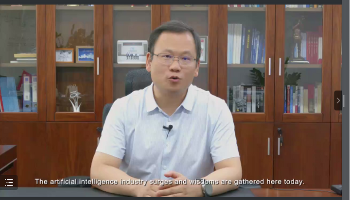
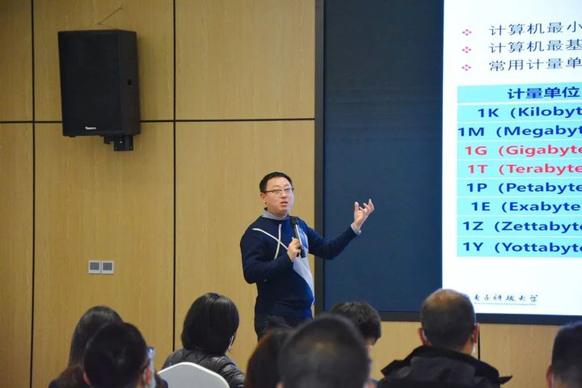

拆墙运动公号 北京时间 2023-12-24T16:29:19Z 1738839256477388878 【#2259专案组 互联网防火墙第063号嫌犯 #饶云波】（更新）
 性别：男
出生年月：1978年07月
证件: 510521197807066790
 籍贯：四川省泸州市泸县 
手机/微信/支付宝/QQ: 15908177003
手机微信/支付宝: 13808230590，用户：曾婧
职称：副教授
电子邮件：uestc2008@126.com
IP: 69.91.162.250 美国
学历：工学博士
职务：电子科技大学三角研究所（湖州）智能媒体研究团队教授
电子科大软件学院副教授，博士生导师。
导师代码：11811
专业方向：图像/视频处理 虚拟现实 人工智能
个人经历：四川省学术与技术带头人后备人选，
科技部/国家基金委项目网评专家，
四川省科技厅项目网评专家，
CCF YOCSEF 成都副主席（2019.6-2020.6）。
地址1：江苏省镇江市丹徒区长晖路666号
地址2：沙河校区：建设北路二段4号，610054|清水河校区：611731西高新区西园大道2006号|中国四川省成都市

所在单位：信息与软件工程学院（示范性软件学院）
职务：Associate Professor,Supervisor of Ph.D
Phone: +(86)-83202896

饶云波
电子科大信息与软件工程学院副教授，
电子科技大学信息与软件工程学院创新创业中心主任。

个人简介：2006年在电子科技大学获硕士学位。2009.10—2011.10年在美国华盛顿大学IEEE fellow MingTing Sun 教授实验室做联合博士生培养。
2012年电子科技大学计算机应用技术专业，获工学博士学位。
与美国、加拿大、德国、台湾等著名大学实验室建立了紧密合作关系。
目前担任电子科技大学信息与软件工程学院创新创业中心主任。

擅长网络加密和监控控制
#拆墙运动 #BanGFW #反人类罪

详细资料见: #BanGFW拆墙运动（建墙罪犯录）（#ban_great.wall）:https://t.co/KxsUwLQVuK

合作伙伴：#zhinawiki   拆墙运动公号 北京时间 2023-12-24T06:26:05Z 1738687445959364627 RT @LinShengliang: 勿忘孤勇者今何在？   