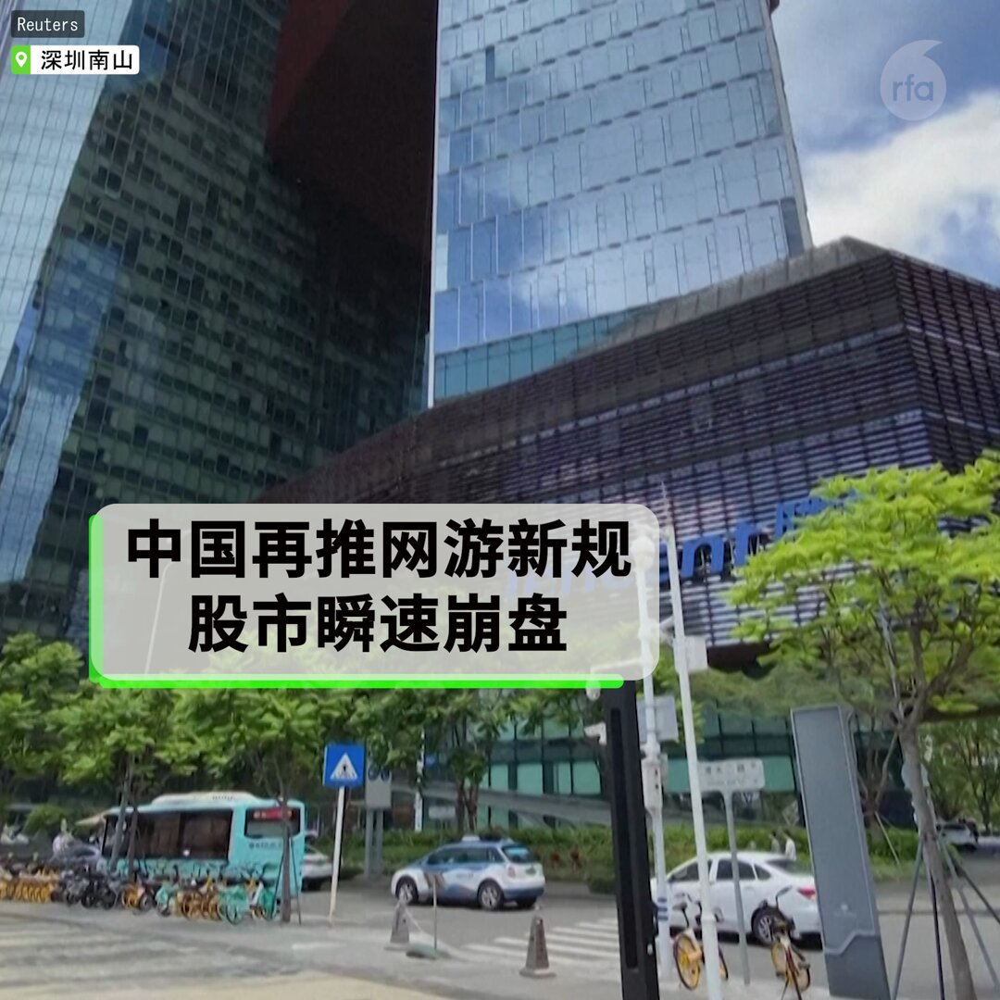

自由亚洲电台 北京时间 2023-12-24T04:43:33Z 1738661646430609813 中国国有石油巨头 #中石油 和 #中海油 均已请求美国政府，豁免对俄罗斯新建的北极液化天然气2号项目（#ArcticLNG2）的制裁。中石油和中海油分别拥有该项目10%的股份，而俄罗斯最大的液化天然气生产商诺瓦泰克（#Novatek）则持有该项目60%的股份。
详阅：
https://t.co/GDjZbL7RuA   自由亚洲电台 北京时间 2023-12-24T05:14:11Z 1738669352990208443 【台湾大选临近，中国恢复石斑鱼进口】
中国去年六月因发现违禁化学物质，对台湾 #石斑鱼 实施禁令，昨日解禁。发言人 #朱凤莲 称，只要坚持“九二共识”，愿意与继续为恢复 #台湾 农渔产品输入提供帮助。
详阅：
https://t.co/6ocj1N0m1n   自由亚洲电台 北京时间 2023-12-24T06:24:12Z 1738686972938404158 【评论 | 自由贸易还能忽悠人吗】“自由贸易在一个国家范围内是必须的，主要有的是积极的意义。这是完善市场经济的必须政策。但在政治体制不同，经济水平千差万别的国际之间，其所导致的结果就太复杂了。不可以用理想化的政策来概括，否则后果难料”。— #魏京生 
详阅：
https://t.co/RZAVEcoym5   自由亚洲电台 北京时间 2023-12-24T06:52:29Z 1738694092958077069 【评论 | 55年前的今天】"同样是号召知识青年下农村，50年代和文革还是很不一样的... 在50年代，毛泽东主要是着眼于知识分子可以发挥有知识的长处，促进农业生产和农村建设; 文革期间号召知青到农村，是接受再教育，改造思想"。— #胡平
详阅：https://t.co/8Jlr4nt6gR   自由亚洲电台 北京时间 2023-12-24T07:47:51Z 1738708023248351302 【假装存钱法: 转化消费幻想为存款动力】#假装存钱 就是剧情式存钱法，以独特方式模拟各种生活场景，剧情涵盖爱情、穿越、历史、科幻、冒险，由虚构的主角筹资，最终存入自己银行帐户。有人假装自己怀孕，74天省人民币3000元并存入银行。
详阅：
https://t.co/fx5EJD20RZ   自由亚洲电台 北京时间 2023-12-24T05:40:23Z 1738675948604592517 "#习近平 总书记一直十分牵挂"的编修清史计划顿时死翘翘。这似乎成为一个规律：只要是习近平插手的事情，必定是失败的结局......《人民日报》曾发表《牢牢把握清史研究话语权》，声称 #清史 研究与维护国家领土主权完整有着密切关系，事关意识形态安全。— #余杰 
详阅：
https://t.co/Q1MwkHR39m   自由亚洲电台 北京时间 2023-12-24T00:40:21Z 1738600442211291264 【不能唱衰经济，中国大力打击网络“谣言”】
中国自4月份发起的“#网络 谣言专项整治”行动以来，警方关闭了34000个网络账号，惩罚了6300人， 2024年将会是打击网络 #谣言 专项行动年。
详阅：
https://t.co/gXOsdOUxI4   自由亚洲电台 北京时间 2023-12-24T02:31:33Z 1738628427261845820 狂犬疫苗受害者谭华及其母亲 #华秀珍 失踪近百日后，23日回到家中。#谭华 9月11日借亚运会之机赴杭州为其母亲维权，要求 #宁波大学 恢复其母退休金, 遭当局抓捕。
详阅：
https://t.co/9UjknAYYKS   自由亚洲电台 北京时间 2023-12-24T03:06:44Z 1738637277960585263 【中国男性使用约会App是殖民新疆?】网上出现为汉族男性提供维吾尔族女性的婚介应用程序 - “#我的未婚妻文化传播有限公司”。专家表示，该App受中国政府支持，旨在为单身 #新疆 维族女生与汉族男人牵线搭桥，是北京同化战略的一部分。
详阅：
https://t.co/tCodViBz1a   自由亚洲电台 北京时间 2023-12-24T03:48:26Z 1738647772176269498 【西藏斗士贡却洛多去世，曾被判 13 年徒刑】
1992 年6月30日，贡却洛多（#KunchokLodoe）与另四名藏人街头抗议，在中国领导人举行会议的大楼外展开藏旗，高喊“西藏自由”，其后被捕判刑。三年后出现严重肝脏问题，于 1995 年被释放接受治疗。#贡却洛多 享年 54 岁。
详阅：
https://t.co/yb0ZIKtNdH   自由亚洲电台 北京时间 2023-12-24T01:00:31Z 1738605515897245772 【时隔两年再推网游限制，股市瞬时崩盘】
中国发布 #网络游戏 管理办法草案，禁止运营商以奖励诱惑玩家每日登陆和连续登陆，又提出游戏要“坚守中华文化立场”。消息传出后，游戏股全数崩跌，其中，腾讯市值蒸发540亿，网易跌超30%，打破跌幅记录，至少十只游戏股跌停，带动 #港股 大幅跳水4%。新闻出版署随后发布40新游戏版号，尝试以 #利好消息 重振股市，无力回天。市场情绪消极，担心科技打压卷土重来。   自由亚洲电台 北京时间 2023-12-24T01:37:40Z 1738614866758242640 【拜登签署行政令，或波及中国四大银行】从周五起，凡是帮助俄罗斯在 #乌克兰战争 获取军备物资的金融机构，一经发现，可被美国政府制裁。中国工商银行、建行、农行和中国银行近年大幅加强在俄业务，华盛顿的警告可能对北京产生重大外交影响。
详阅：
https://t.co/TtDKGWX887   自由亚洲电台 北京时间 2023-12-24T02:01:44Z 1738620923815637351 【告别中国“法学泰斗”，自由派人士被监控】包括朱镕基、温家宝，张德江、栗战书的数千名生前故旧参加 #江平 的八宝山告别仪式。但一些有意参加的自由派人士，日前被公安警告不得出门。
详阅：
https://t.co/y1abGYCFNW   