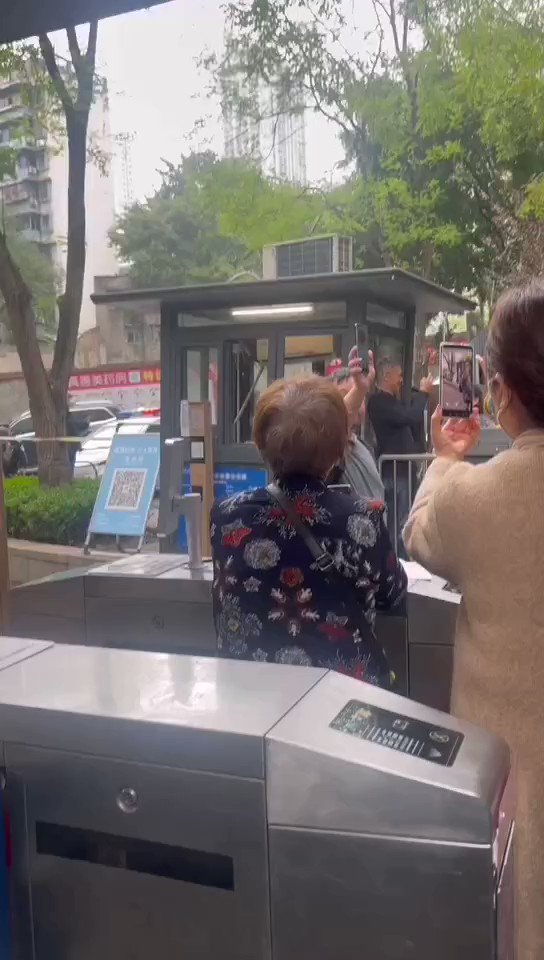
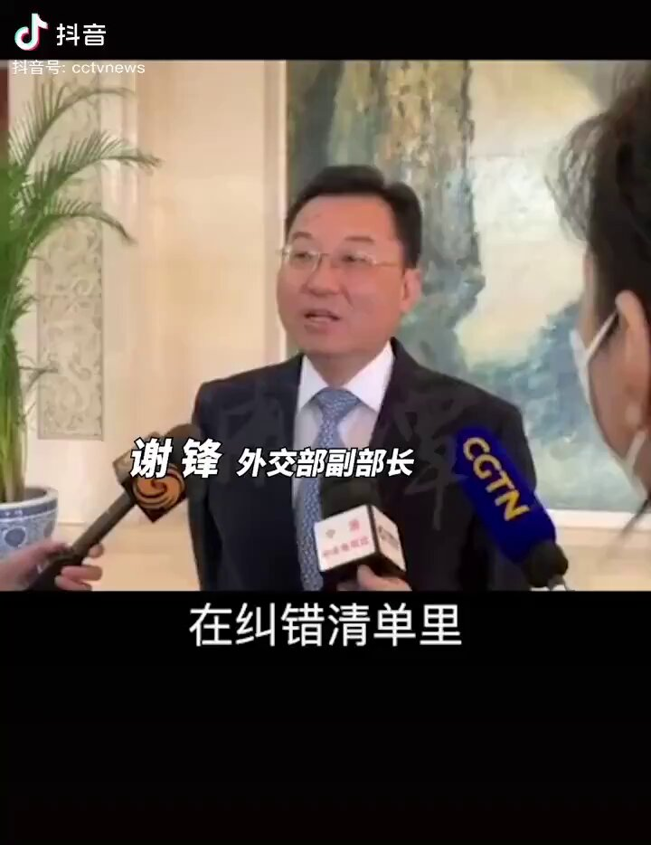

拆墙运动公号 北京时间 2023-12-23T04:38:43Z 1738298041554157707 RT @jielijian: 『聖誕節寄明信片關注牛騰宇、中共停止迫害立即釋放牛騰宇』… https://t.co/7Zdro3HoZN   拆墙运动公号 北京时间 2023-12-23T04:56:11Z 1738302436249387364 RT @LinShengliang: 越來越多的人克服了恐懼，站出來站起來做一個 #孤勇者 ：「為什麼不能學習諸葛亮承認自己打了敗仗？貧窮和不自由才是病毒。為什麼不承認錯誤？承認了錯誤就有人要擔責，只能一錯再錯。」 https://t.co/ct0Xg7yp2R   拆墙运动公号 北京时间 2023-12-23T03:36:29Z 1738282377359524227 RT @Ldl076ya: 中共外交部长 #谢峰  高喊要求美国撤销对中共党员及家属的签证限制🚫，要求美国撤销对中共党员的制裁。
中共政府很早高喊不担心美国制裁，中共一直说美国的制裁只是口号。口号难道影响的中共官员、影响中共党员了？ https://t.co/FBRAUdn6JM   