自由亚洲电台 北京时间 2023-12-23T08:00:08Z 1738348727138705620 欢迎收听和订阅播客【＃亚太报道】 https://t.co/MjLNSvVMqc

 #李昱函 获“#林昭自由奖”； 美中重启军方沟通；浙江发布“#过紧日子”新规；中国再对 #网游 行业提出限制措施；台湾举办 #副总统候选人政见会 https://t.co/ohdzdiOYbR   自由亚洲电台 北京时间 2023-12-23T09:00:07Z 1738363825114812810 专栏 | #周末茶馆：后人应向“亚洲英雄”#高耀洁 医生学习什么？
https://t.co/hLwkdjfAQp https://t.co/chAJAg8U8v 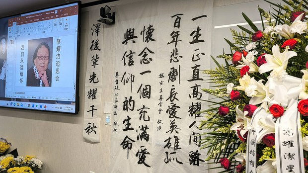  自由亚洲电台 北京时间 2023-12-23T05:13:46Z 1738306860736991416 中国国家新闻出版署12月22日推出了名为《#网络游戏管理办法（草案征求意见稿）》的文件，其中对中国的网络游戏做出了多项规定。这一意见征求稿推出后，腾讯、网易等公司的股价随之暴跌。
https://t.co/oSLsrdKTs0 https://t.co/exG0nSflTz   自由亚洲电台 北京时间 2023-12-23T05:58:00Z 1738317993099313364 《#指传媒》案调查报道｜"谜之 #总统大选民调"与他们的产地（上）
https://t.co/frSZVBGtKd
@asiafactcheckcn https://t.co/NDXrHbIZvc   自由亚洲电台 北京时间 2023-12-23T08:30:02Z 1738356252277928109 专栏 | #夜话中南海：“民族互嵌”不仅是以汉制“夷”，还有“以夷制夷”
https://t.co/46cYozc4f5 https://t.co/xTspdG8q0I 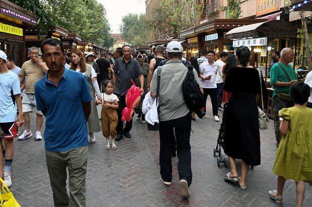  自由亚洲电台 北京时间 2023-12-23T09:00:16Z 1738363860506329489 明年初，#加拿大 将举行有关 #外国干预 问题的听证会。但三位与会华裔议员因与中国关系密切，他们的证人身份受到舆论质疑。
https://t.co/AMO9wHOWjT https://t.co/hPmyxpp70s 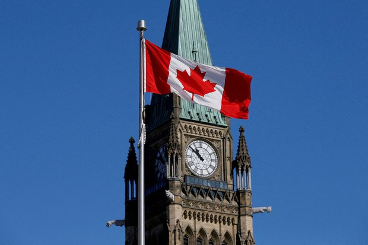  自由亚洲电台 北京时间 2023-12-23T05:19:52Z 1738308394212073518 【独家：异议人士杨海抵达美国旧金山　与妻女团聚】
中国异议人士  #杨海 乘机于美国时间12月22日下午抵达加州旧金山机场，他此行是从马来西亚吉隆坡出发。据杨海的妻子王菁向本台证实，他们的女儿杨倩怡已在机场接到了杨海。到截稿时为止，父女正在赶回他们在旧金山的家中。
杨海自1989年参加天安门民主运动以来，一直为中国民主奔走发声，也因此常年受到中国政府的打压，为此两次入狱。他的妻子和女儿12年前被迫离开中国，流亡美国。王菁几年前患上肝癌，近期即将接受换肝手术，一家人迫切希望团聚。
杨海于12月8日飞抵吉隆坡，等待获得赴美签证。据对华援助协会创始人傅希秋介绍，在美国国务院的紧急处置下，杨海迅速获批移民申请，并第一时间赶往旧金山。 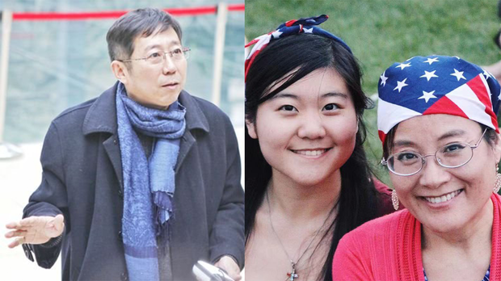  自由亚洲电台 北京时间 2023-12-23T06:01:16Z 1738318813769453699 【《#指传媒》案调查报道｜"谜之 #总统大选民调"与他们的产地（下）】
https://t.co/4XSI83rClw
从当年的红媒案，到如今的假民调案， 这4年间与《指传媒》相关的调查与报导付之阙如，拥有的十数家网媒指动传播科技有限公司到底在布一个什么局？
@asiafactcheckcn https://t.co/MroYVY9uj6 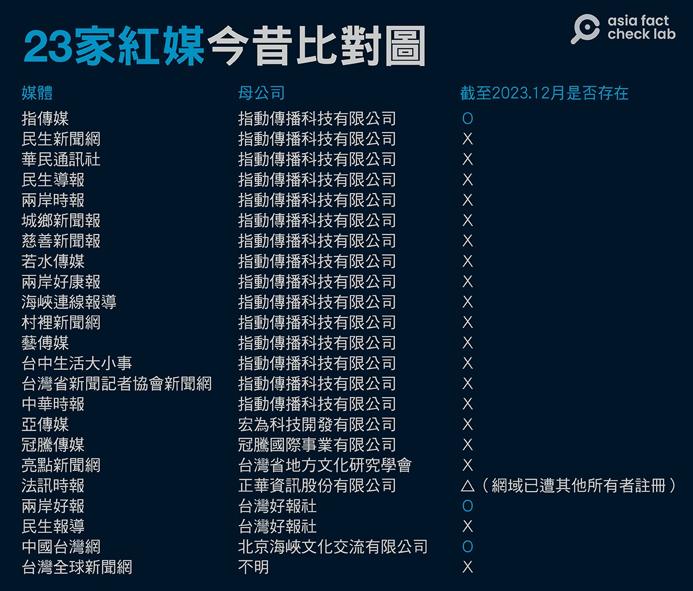  自由亚洲电台 北京时间 2023-12-23T06:12:51Z 1738321730652053682 今年12月26日恰逢 #毛泽东130周年诞辰，按照逢整年大庆的风俗，预计毛泽东的拥趸们会组织各类纪念活动。特别是习近平恢复一人体制以来，一度被边缘化的毛泽东的地位再度被推高，#毛粉 们愈加活跃。
今天我们就来讲述一名毛粉的故事，透视时下中国这股思潮的走向。
https://t.co/jfFaTqfaBL https://t.co/DNJMtDCNUP   自由亚洲电台 北京时间 2023-12-23T03:20:06Z 1738278254845571566 中国公安部22日宣布，决定将2024年作为 #打击整治网络谣言专项行动年，对于编造传播虚假信息进行“造热点”“蹭热点”“带节奏”的网红大V，以及借机进行造谣引流牟利的“网络水军”团伙，公安机关将采取针对性警示、禁言、封号等管理措施，推动建立违法账号“黑名单”制度。
https://t.co/IIJaBX1qpG https://t.co/kVHhPaCZZt 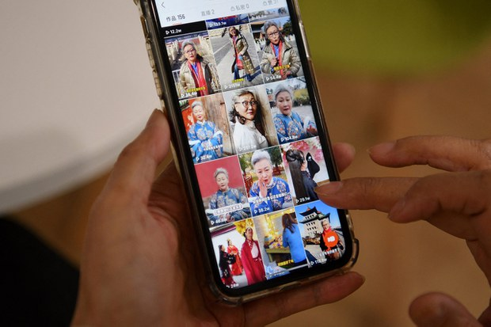  自由亚洲电台 北京时间 2023-12-23T00:52:57Z 1738241226196070647 因为寻衅滋事和诈骗罪被判监六年半，目前仍被关押的中国维权律师 #李昱函，获得2023年 #林昭自由奖。
由于家属至今无法与李昱函会面，无法与她分享喜讯。有法律界人士认为，曾代理“#709案”的李昱函为自由和公义付出了沉重代价，获奖实至名归。

https://t.co/eUn89nL17v https://t.co/14LBEy6H2K 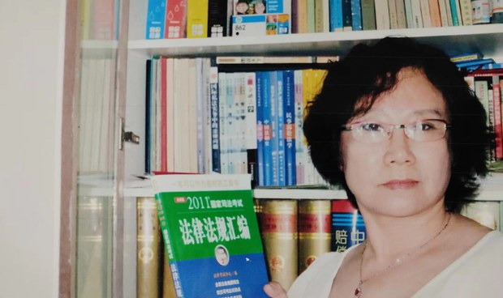  自由亚洲电台 北京时间 2023-12-23T01:17:14Z 1738247334977548342 随着黎智英案开审，成长于香港的澳大利亚人权律师塔兰特为表声援，再次将"铁链中的黎智英"霓虹灯箱装置推出悉尼街头展出。除谴责中国及香港政府打压香港争取民主人士之外，塔兰特更强调，目前仍在香港终审法院留任的3名澳大利亚籍法官，全部应辞职，避免替香港司法体系背书。

https://t.co/dVf3MtOik1 https://t.co/e0tRLt6KKY 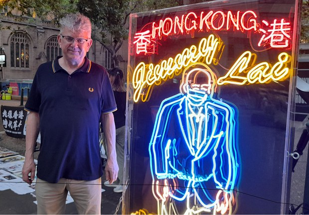  自由亚洲电台 北京时间 2023-12-23T01:45:27Z 1738254437981040685 本周五，#2024年台湾大选 的副总统候选人电视政见会登场。
民众党籍候选人 #吴欣盈: 台湾的和平要靠繁荣，民众党没有蓝绿包袱，呼吁选民把国家赢回来。
国民党籍候选人 #赵少康 :国民党不是亲中政党而是永远反共。
民进党籍候选人 #萧美琴 :真正想消灭中华民国的是共产党。
https://t.co/2ZaJABGEzJ https://t.co/0BCT4GYX0U 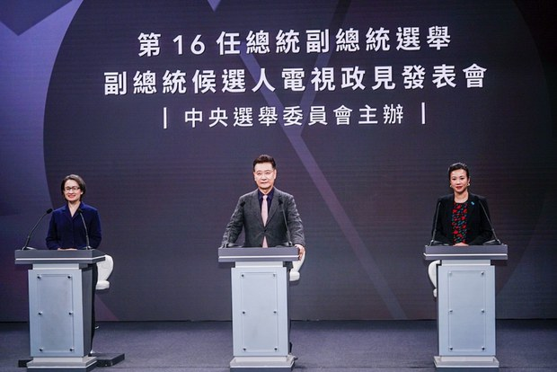  自由亚洲电台 北京时间 2023-12-23T01:52:20Z 1738256168118858154 【美中争夺世界秩序之权 台湾是关键】
【陶杰：美国如果丢掉台湾 在全世界就不用混了】
为何观察台湾这场总统选举如此重要？香港知名专栏作家 #陶杰 有详细分析。
#亚洲很想聊 https://t.co/NAV9dLDhKZ https://t.co/2p7SIgZqJy 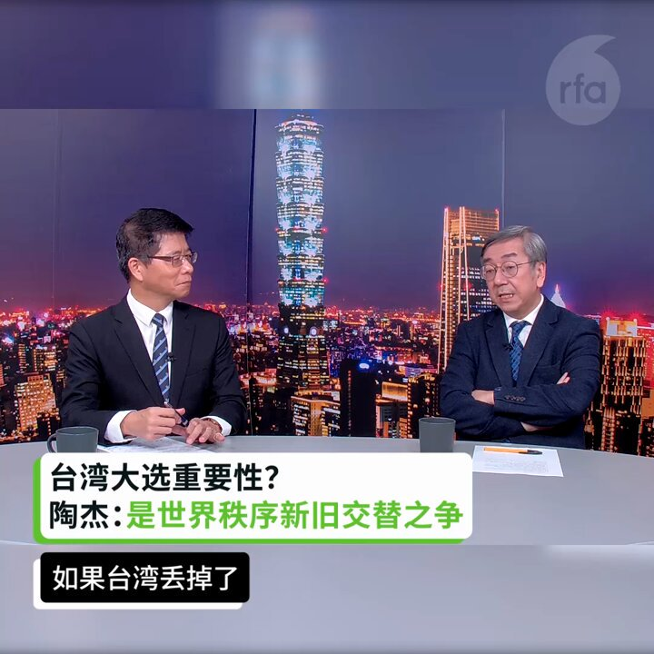  自由亚洲电台 北京时间 2023-12-23T02:22:39Z 1738263798295970161 【#台湾选情观察】上届 #台湾总统大选 ，香港议题成为决定胜败因素之一。香港因素对这次台湾选举还有没有影响力？过去几年，因逃避《国安法》和追求民主等种种原因，移居台湾的港人会如何运用手中的一票？记者访问了几名移居台湾的 #香港首投族，了解他们对本届选举的看法。

https://t.co/brUy00S9CU https://t.co/h4SkkRJvqf 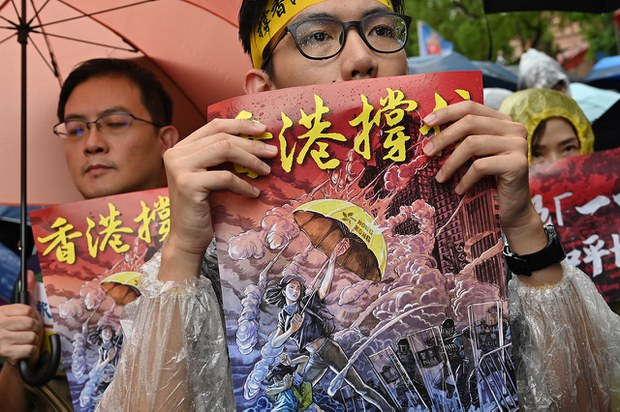  自由亚洲电台 北京时间 2023-12-23T00:19:31Z 1738232811428188349 综合中国媒体“澎湃新闻”和“每日经济新闻”的报道，当地时间12月20日，在港上市的中国知名房企“#中国奥园”根据美国《破产法》第15章，向纽约法院申请破产保护。
https://t.co/bVrOWb9gkM https://t.co/MODJPlDs82 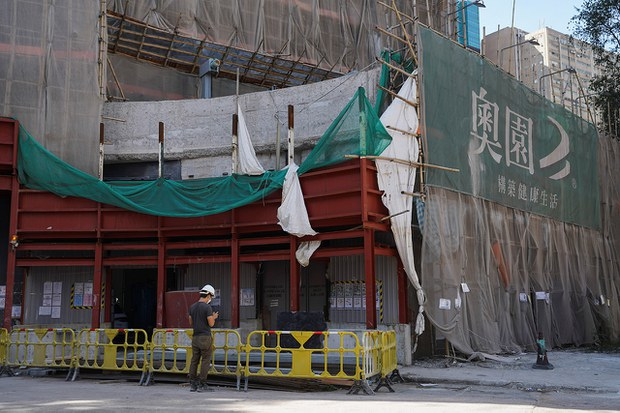  