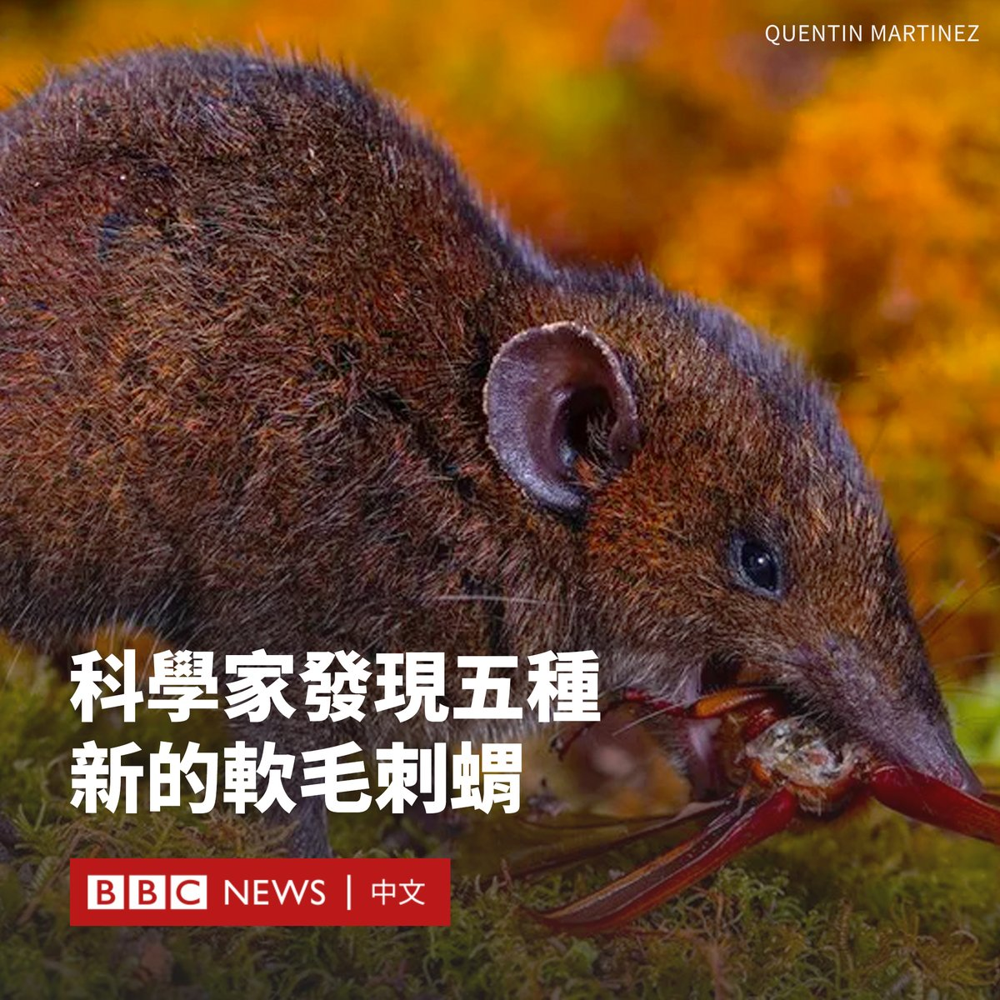

D英国广播公司BBC 北京时间 2023-12-22T16:30:58Z 1738114895378567646 科学家在东南亚发现了五个新的刺猬物种。与人们熟知的长满刺的刺猬不同，它们看上去毛茸茸的。

研究人员前往刺猬在热带森林中的家园进行数次科学考察，还重新评估数在博物馆收藏了几十年的刺猬标本。

这项生物学差异研究发现，博物馆中的两种动物是科学界的新物种。

另外三种刺猬曾被归类为同一物种的亚型，但经证实它们之间有足够的区别，可以被正式认定为单独的物种。

美国自然历史博物馆的首席研究员梅丽莎·霍金斯博士（Dr Melissa Hawkins）告诉BBC，这一发现展示了地球上仍有待揭示的“惊人”生物多样性。

她说：“我们以为对自然界有所了解，但对于哺乳动物这样的物种，特别是那些生活在难以到达的栖息地的小物种，我们实际上知之甚少。”

她表示：“发现这些动物可以引起对（热带雨林）生态系统的关注，它们正受到严重威胁。”

这些动物属于刺猬中的一类，称作毛猬属（Hylomys），它们都生活在东南亚。以前只有两个已知物种，而这次发现使其达到了七个。

它们是小型长鼻哺乳动物，虽然与人们更熟悉的刺猬同属一个家族，但是毛茸茸的，而不是多刺的。   D英国广播公司BBC 北京时间 2023-12-22T14:42:26Z 1738087583429849239 在印尼东南苏拉威西省布顿岛上，小学生们正在写着独特的韩文字母，但他们学习的语言并不是韩语，而是他们自己的语言。

长期以来，吉阿吉阿族原住民只有语言，没有文字，而这种以音节为基础的语言不容易用拉丁字母转写其发音，因此当地引入韩文字母作为正式文字。 https://t.co/fr0j1PdeDp   D英国广播公司BBC 北京时间 2023-12-22T13:08:31Z 1738063948249964900 捷克布拉格查理大学文学院周四（12月21日）发生枪击案，目前已造成15人死亡。社交媒体上分享的画面显示，案发时有多人从建筑物的窗台跳下逃生。

据报道，枪手是来自布拉格郊外村庄的一名24岁学生，已经死亡。其父亲周四早些时候也被发现死亡。 https://t.co/3pKGcxUj4P   D英国广播公司BBC 北京时间 2023-12-22T11:04:50Z 1738032820327678460 台湾“低薪族”情况一直备受关注，尽管历届政府都承诺解决，但过去二十年一直改善甚微。有调查显示低薪困境是本届年轻选民最重视的议题之一，将对候选人构成选举压力，长远更可能会损害台湾青年对民主政治的信心。

BBC中文访问了几名年青人。他们如何看待低薪问题，这又是如何影响投票意向的？

阅读全文：https://t.co/BvZNjm88km   D英国广播公司BBC 北京时间 2023-12-22T09:29:13Z 1738008758750789957 捷克首都布拉格的一所大学发生枪击案，一名枪手开枪打死14人，伤25人，成为捷克现代史上最致命的袭击。

枪击案于当地时间15:00左右在杨·帕拉赫广场（Jan Palach Square）的查理大学（Charles University）文学院大楼开始。

社交媒体上的画面显示，一些人从建筑外檐上跳下逃生，同时还听到了枪声。在另一段影片中，可以看到惊恐的人群逃离游客云集的地区。

事发时，一些学生表示他们躲在大学教室中，并锁上了门。

警方表示，24岁的枪手已被“消灭”。在新闻发布会上，该国警察局长和内政部长表示，枪手是该学院的一名学生。

官员称，他来自布拉格郊外21公里的一个村庄。周四早些时候，嫌疑人的父亲被发现死亡。目前尚不清楚枪手的动机。

警方表示，他们还在研究枪手是否涉及上周在布拉格附近的森林中有两人死亡的案件。

欧盟委员会主席冯德莱恩（Ursula von der Leyen）表示，她“对这种无谓的暴力行为感到震惊”。

查理大学成立于1347年，是捷克共和国最古老和规模最大的大学，也是欧洲最古老的大学之一。   