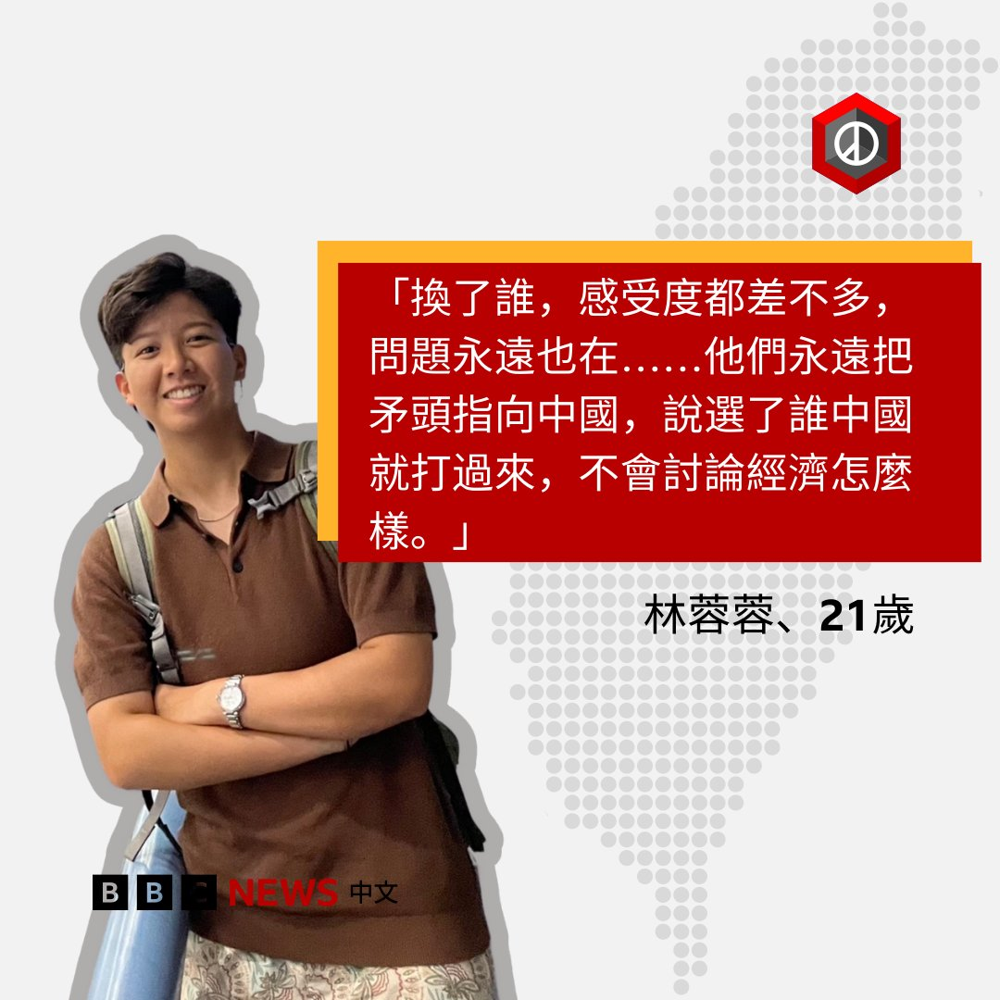
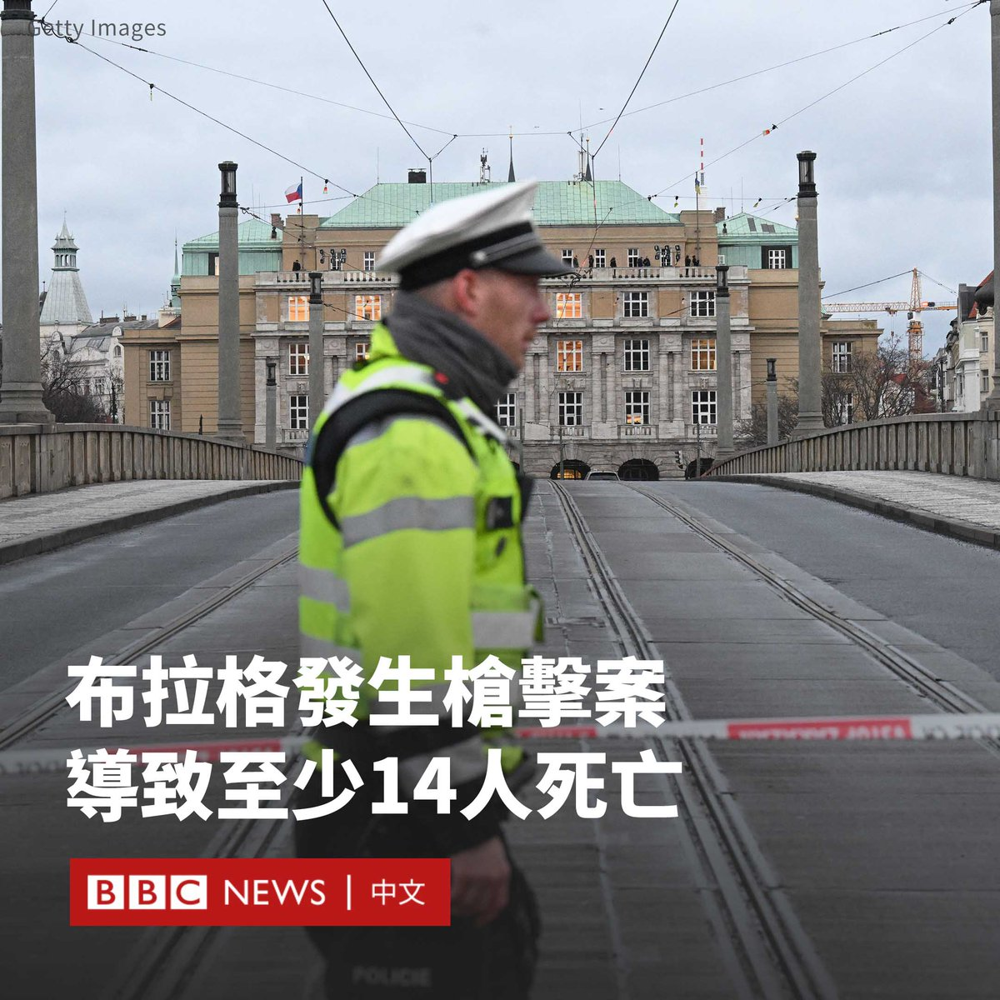

D英国广播公司BBC 北京时间 2023-12-22T11:04:50Z 1738032820327678460 台湾“低薪族”情况一直备受关注，尽管历届政府都承诺解决，但过去二十年一直改善甚微。有调查显示低薪困境是本届年轻选民最重视的议题之一，将对候选人构成选举压力，长远更可能会损害台湾青年对民主政治的信心。

BBC中文访问了几名年青人。他们如何看待低薪问题，这又是如何影响投票意向的？

阅读全文：https://t.co/BvZNjm88km   D英国广播公司BBC 北京时间 2023-12-22T09:29:13Z 1738008758750789957 捷克首都布拉格的一所大学发生枪击案，一名枪手开枪打死14人，伤25人，成为捷克现代史上最致命的袭击。

枪击案于当地时间15:00左右在杨·帕拉赫广场（Jan Palach Square）的查理大学（Charles University）文学院大楼开始。

社交媒体上的画面显示，一些人从建筑外檐上跳下逃生，同时还听到了枪声。在另一段影片中，可以看到惊恐的人群逃离游客云集的地区。

事发时，一些学生表示他们躲在大学教室中，并锁上了门。

警方表示，24岁的枪手已被“消灭”。在新闻发布会上，该国警察局长和内政部长表示，枪手是该学院的一名学生。

官员称，他来自布拉格郊外21公里的一个村庄。周四早些时候，嫌疑人的父亲被发现死亡。目前尚不清楚枪手的动机。

警方表示，他们还在研究枪手是否涉及上周在布拉格附近的森林中有两人死亡的案件。

欧盟委员会主席冯德莱恩（Ursula von der Leyen）表示，她“对这种无谓的暴力行为感到震惊”。

查理大学成立于1347年，是捷克共和国最古老和规模最大的大学，也是欧洲最古老的大学之一。   