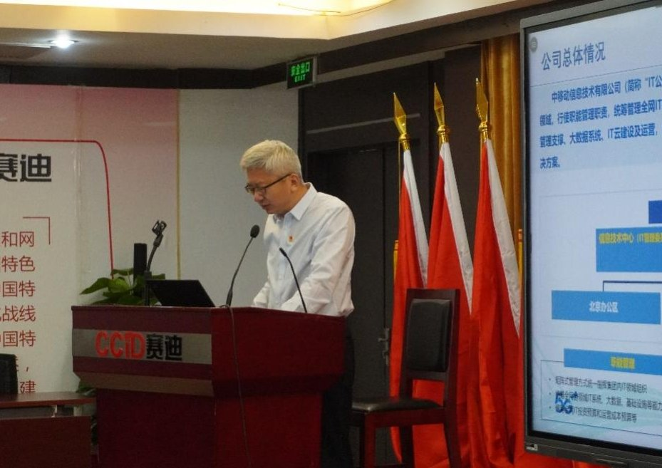

拆墙运动公号 北京时间 2023-12-22T05:05:26Z 1737942377669755096 RT @__Inty__: 美国罗格斯大学一家独立研究机构的研究报告称，TikTok会根据中国政府的喜好来推广和贬低某些话题 ，不仅操纵针对中国的特定话题（例如 1989 年天安门广场抗议和大屠杀）的公众辩论，还操纵关于乌克兰和加沙地带战争等具有重要战略意义的话题的公众辩论。…   拆墙运动公号 北京时间 2023-12-22T00:31:34Z 1737873453343011318 使用 teleguard ，session ！免手机号免邮箱免注册即用，无IP地址泄露，在teleguard添好友 WCMS3EU9Q session 添好友0574c0e3db87e0ddce32b112c16b626543f20991694b66718160e54d3daa71762f  可進群。进群后可申请网址。 https://t.co/xseoixgI4v   拆墙运动公号 北京时间 2023-12-22T02:31:29Z 1737903633101128112 关注中国在押政治犯 #孙志华   拆墙运动公号 北京时间 2023-12-22T02:33:42Z 1737904189693423670 关注中国在押良心犯 #孙萌   拆墙运动公号 北京时间 2023-12-22T02:46:24Z 1737907388274082279 RT @Ldl076ya: 关注中国在押良心犯 #王炳章   拆墙运动公号 北京时间 2023-12-22T03:53:27Z 1737924262722244737 【#2259专案组 互联网防火墙第038号嫌犯 #田峰】(更新）
   性别：男，
身份证: 130302197803161415
籍贯:河北省秦皇岛市海港区
手机号/支付宝/QQ: 18603366862
职务:中国移动信息技术中心安全管理中心副总经理
住所：北京市昌平区未来科学城英才北三街16 号院16号楼1006室 

擅长互联网络加密和监控控制
#拆墙运动 #BanGFW #反人类罪

详细资料见: #BanGFW拆墙运动（建墙罪犯录）（#ban_great.wall）:https://t.co/gtRGISDxoN

合作伙伴：#zhinawiki   拆墙运动公号 北京时间 2023-12-22T00:16:20Z 1737869621246533759 #拆墙运动 关注被中关押的政治犯 #秦永敏   