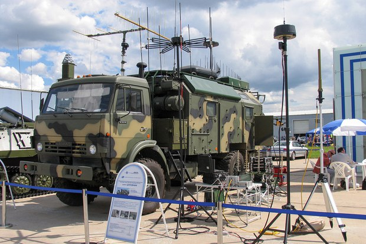
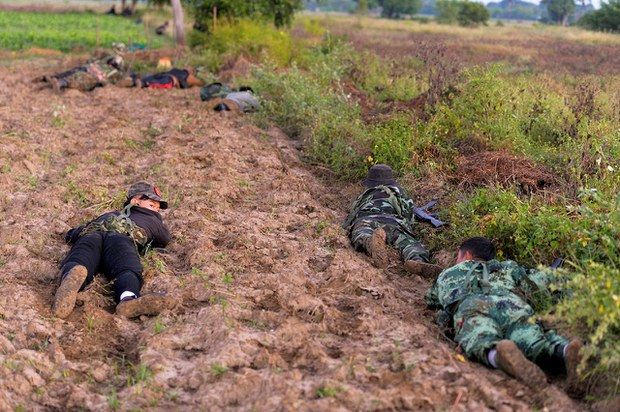
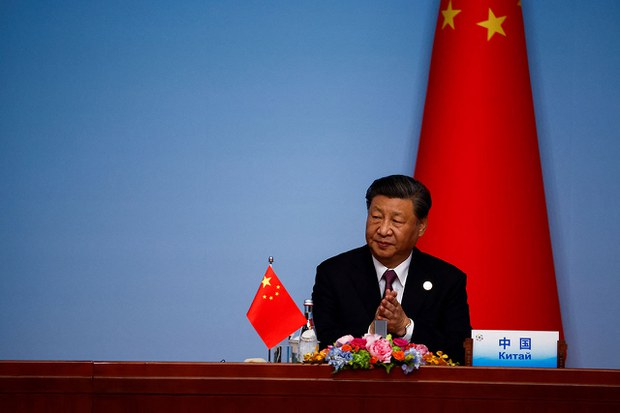
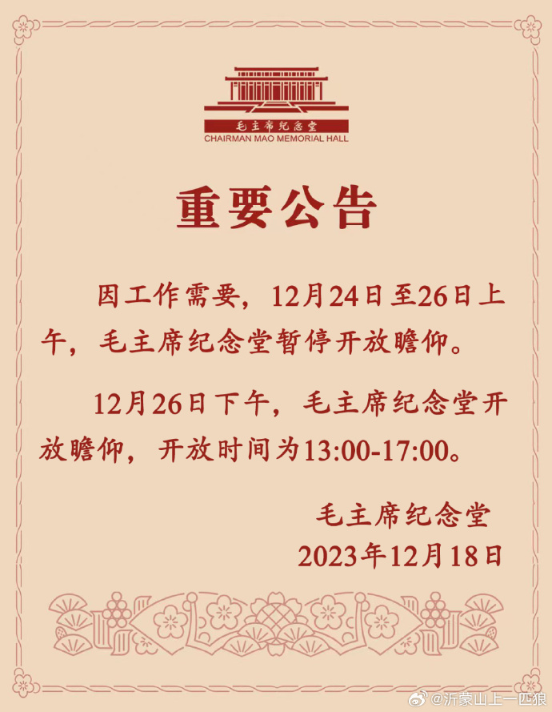
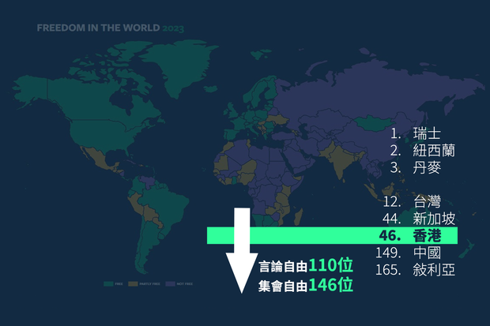
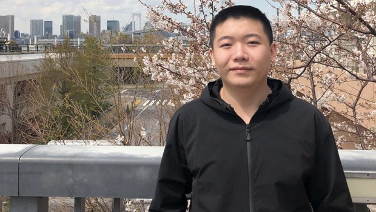

自由亚洲电台 北京时间 2023-12-22T04:42:19Z 1737936559612301391 香港政府上周悬红百万港元 #通缉 五名海外港人，当中包括美国公民及居民。多名跨党派美国国会议员就此致信国务卿布林肯，要求他在限期前决定是否制裁七名涉事中、港官员。这也是一周内第二次有美国议员针对 #香港 作出 #制裁 呼吁。
https://t.co/sbgFfRApXq https://t.co/i2Lnlx8JpE   自由亚洲电台 北京时间 2023-12-22T04:54:55Z 1737939729788899695 专栏 | #军事无禁区: 新的战争时代－#俄军电子战 抵销乌克兰攻势
https://t.co/YIKyMwWB6o https://t.co/FlCapseC4M   自由亚洲电台 北京时间 2023-12-22T02:42:28Z 1737906396862251019 针对 #缅甸 持续冲突、尤其规划中的 #中缅经济走廊 附近的冲突，中国外交部21日表示，将继续做缅北止战促谈工作，共同推动 #缅北 局势软着陆。中方也希望缅甸相关各方维护中缅边境的安全稳定，维护中方在缅项目和人员安全。
https://t.co/h1DY1TcGwg https://t.co/MpoKf9jUQp   自由亚洲电台 北京时间 2023-12-22T03:32:03Z 1737918875738734769 专栏 | #中国透视：#年终回顾：2023年中国的 #外交 博弈
https://t.co/4edlRAziwC https://t.co/02YZM2nb5X   自由亚洲电台 北京时间 2023-12-22T00:50:17Z 1737878163584377045 12月20日，中国国家语言资源监测与研究中心和官方新华网公布今年的"#年度汉字"，
结果选出“#振”和“#高质量发展” 作为代表2023年的用字和用词。
同时还选出“危”和“ChatGPT”，作为最能代表国际情况的国际字词。
网民热议，许多人选择"跌"和"惨"字作为代表。
#您怎么看?
https://t.co/WgCzOEAumE https://t.co/oXy4dkEIsJ   自由亚洲电台 北京时间 2023-12-22T01:28:42Z 1737887834772766837 美军参谋长联席会议主席布朗（Charles Quinton Brown Jr.）周四（21日）与中国中央军委联合参谋部参谋长 #刘振立 进行了视频通话。这是拜登政府在努力与北京关系解冻之际，两国高级军事领导人之间首次重启对话。

https://t.co/DHG5QFVrna https://t.co/88m7ZG9bN7   自由亚洲电台 北京时间 2023-12-22T01:50:07Z 1737893221450285506 天安门附近一餐饮店的服务员周四告诉本台，当地居委会口头传达，最近几天尽量不要去 #天安门广场：“26日，#毛主席纪念堂 有重要活动，叫居民不要去天安门广场凑热闹，避免人多发生意外。”
https://t.co/WlYmKm9CZF https://t.co/gsw4n72fS1   自由亚洲电台 北京时间 2023-12-22T02:19:05Z 1737900513742717163 美国智库加图研究所（Cato Institute）与加拿大智库菲莎研究所（Fraser Institute）19日共同发布 #2023年度人类自由指数（Human Freedom Index, HFI）排名，亚洲以台湾排名12位最高，中国则排第149位；香港则进一步跌至第46位，法治、言论自由以及结社和集会自由均大幅下降。
https://t.co/rvCa5eI2kx https://t.co/jhfiMQ9bVX   自由亚洲电台 北京时间 2023-12-22T00:19:03Z 1737870307095130589 截至目前，广东肇庆四会监狱仍未就“#恶俗维基案”主犯 #牛腾宇 出现精神异常的问题作出公开说明。狱方继拒绝家属会面要求后，又以牛腾宇违规为由，叫停了远程视频会见。而专程抵达广东的家属也被强行遣送回河南。
https://t.co/GbmTXky9wa https://t.co/Pt9VFNPXHu   