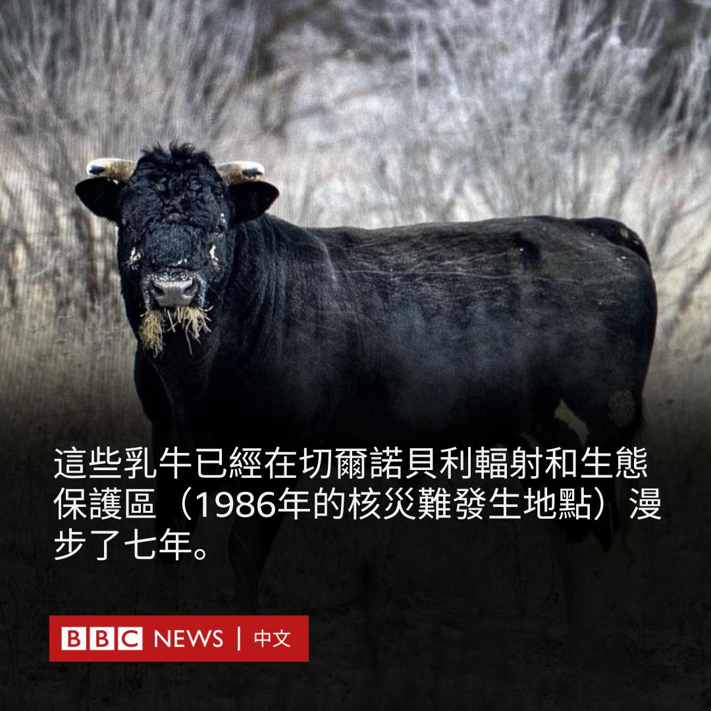
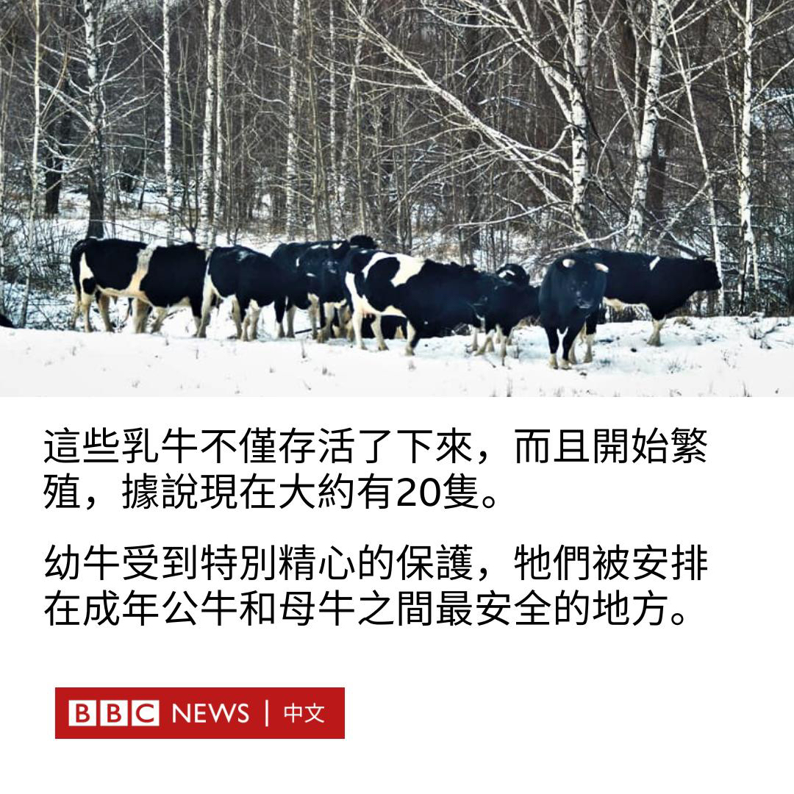

D英国广播公司BBC 北京时间 2023-12-21T16:40:29Z 1737754904658403329 这群乳牛生活在切尔诺贝利核灾难现场附近的野外。它们在主人去世后，独自生活了七年。它们从哪里来，又是如何存活下来的？ https://t.co/cFSaeQ87YV   D英国广播公司BBC 北京时间 2023-12-21T18:18:20Z 1737779528603193825 每场战争在打法上都是独特的，但BBC访谈的专家一致认为，在加沙地带的杀戮速度明显超过了最近的一些其它战争。https://t.co/9cW847alSm   D英国广播公司BBC 北京时间 2023-12-21T13:48:19Z 1737711575858086119 一名因1974年谋杀案入狱近半个世纪的男子被俄克拉荷马州法官裁决无罪，成为美国导致入狱时间最长的错判案例。

70岁的格林·西蒙斯（Glynn Simmons）于7月获释，当时法官下令重审该案。

一位县地方检察官周一（12月18日）表示，没有足够的证据证明这一点。周二，俄克拉荷马县地方法官艾米·帕伦博（Amy Palumbo）宣布西蒙斯无罪。

她在一份裁决中表示：“本院通过明确而令人信服的证据认定，西蒙斯先生被定罪、判刑和监禁的罪行……不是西蒙斯先生所为。”

据美联社报道，西蒙斯告诉记者：“这是一堂关于韧性和坚毅的课……不要听任何人说它不可能发生，因为它真的可以。”

因被指在俄克拉荷马市郊区一家酒店抢劫案中谋杀卡罗琳·苏·罗杰斯（Carolyn Sue Rogers），西蒙斯已服刑48年零1个月零18天。根据美国国家免罪登记处（National Registry of Exonerations）数据，西蒙斯在被平反的囚犯中，是服刑时间最长的。

1975年，时年仅22岁的西蒙斯和共同被告唐·罗伯茨（Don Roberts）被判有罪并被判处死刑。量刑后来被减为终身监禁。

西蒙斯先生曾表示，谋杀发生时他正在家乡路易斯安那州。

地方法院在发现检察官没有向辩护律师移交所有证据（包括一名证人指认了其他嫌疑人）后，于7月撤销了对他的判决。

西蒙斯和罗伯茨被定罪的部分原因是一名后脑中枪的青少年的证词。在指认嫌犯时，这名少年指认了其他几名男子。罗伯茨于2008年获得假释。

西蒙斯的律师表示，周二的裁决为西蒙斯获得17.5万美元的赔偿铺平道路，并使他有机会提起联邦诉讼。

据西蒙斯的筹款页面称，他目前正在与癌症作斗争，该页面已筹集了数千美元来帮助支付他的生活费和化疗费用。   D英国广播公司BBC 北京时间 2023-12-21T11:35:53Z 1737678247293595763 世界卫生组织（WHO）已将新冠病毒奥密克戎（Omicron）变异株的一个亚变种列为“需关注变异株”，因为“其传播迅速增加”。

JN.1已经在世界上许多国家被发现，包括美国、英国、印度和中国。

世卫组织表示，目前公众面临的风险很低，当前的疫苗仍有保护效力。但该组织警告说，今年冬天新冠病毒和其他感染可能会上升。

流感、呼吸道合胞病毒以及儿童肺炎等也在北半球呈上升趋势。

JN.1正在世界的许多角落迅速传播。根据美国疾病控制和预防中心的数据，它是目前美国增长最快的变种，占目前感染的15-29%。

英国卫生安全局（UK Health Security Agency）表示，JN.1目前约占实验室分析的新冠病毒阳性结果的7%。该机构表示将继续监测该变种和其他变种相关数据。

在丹麦、西班牙、比利时、法国和荷兰在内的欧洲多国，JN.1也迅猛增长，住院人数也随之增加。

JN.1也在亚洲的新加坡成为主流变异株，该国卫生部已宣布恢复每天通报确诊数字，并呼吁民众在人群拥挤的场所佩戴口罩。

JN.1能快速传播可能是因为与它的祖先BA.2.86变异株相比，其在刺突蛋白中有一个额外的突变。

世卫组织表示，虽然JN.1已表现出更高的感染率、增长优势和免疫逃逸特性，但根据现有证据，JN.1对全球公共卫生造成的额外风险较低。   D英国广播公司BBC 北京时间 2023-12-21T09:31:25Z 1737646926953078824 台湾薪资停滞20年，有调查显示低薪困境是此次选举中年轻选民最重视的议题之一，将对各候选人构成选举压力，长远更可能会损害台湾青年对民主政治的信心。https://t.co/yu24PSBSbk   