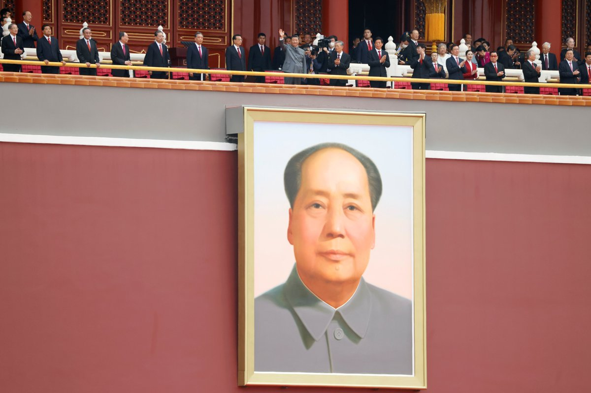
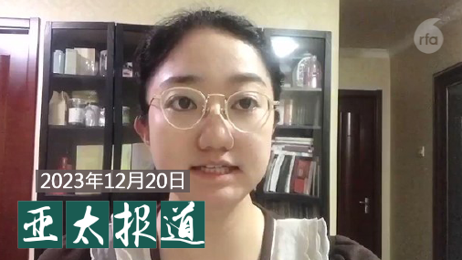
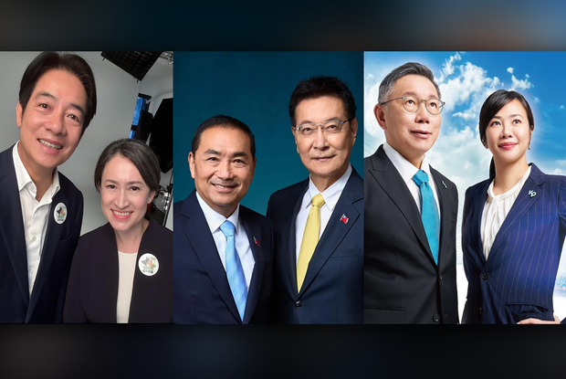
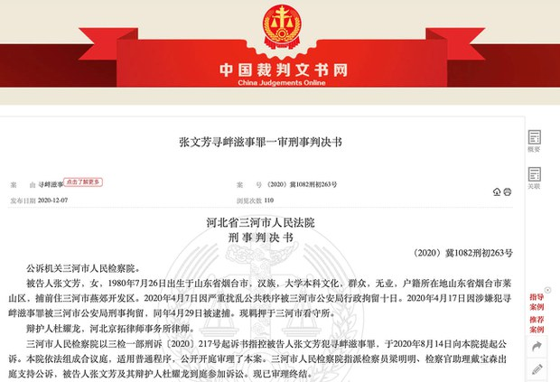
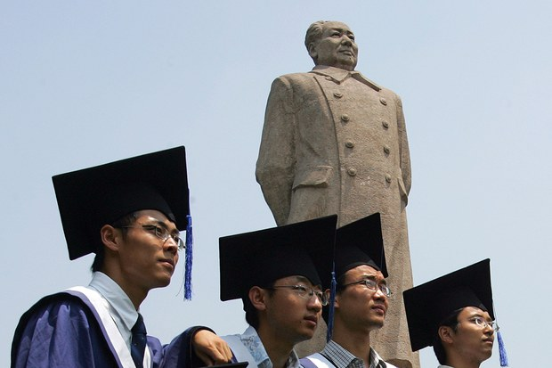
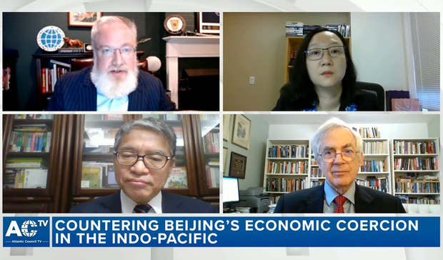
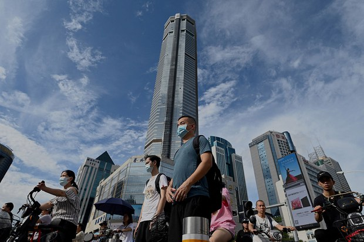
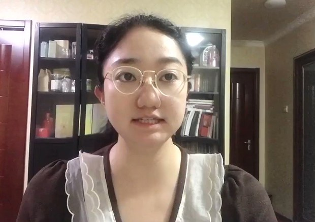
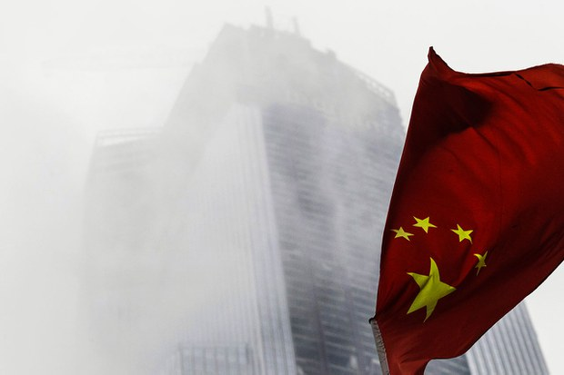

自由亚洲电台 北京时间 2023-12-21T15:46:19Z 1737741272990015735 RT @asiafactcheckcn: 【事实快查】

2024台湾首场 #总统大选 政见发表会在20日（周三）登场，亚洲事实查核实验室针对三位候选人做了一系列的事实快查。其中，#赖清德 和 #侯友宜 都分别发表了误导或片面资讯，议题聚焦在两岸、民生和经济:

https:/…   自由亚洲电台 北京时间 2023-12-21T16:13:32Z 1737748122691158486 【毛泽东130周年冥诞日前夕】
【《求是》文章赞扬毛泽东及习近平】
今年12月26日是中共已故领导人 #毛泽东 诞辰130周年，北京“#毛主席纪念堂”发出暂停开发两天半的公告。据报，#习近平 等人将会前往瞻仰毛泽东遗容。中共党刊《求是》发文高调评价毛泽东，赞扬习近平。https://t.co/ehLNDNYuvt https://t.co/qinrE9MUkv   自由亚洲电台 北京时间 2023-12-21T08:00:08Z 1737623951810166815 欢迎收听和订阅播客【＃亚太报道】 https://t.co/MjLNSvVMqc
“#千万工程”经验能否解决 #三农问题？深圳调高 #养老保险 缴费基数；#李翘楚 案开庭 律师被拒上庭；新疆学者 #杜曼 失联；台湾民调显示蓝绿逼近黄金交叉。 https://t.co/9V1NvfPXIH   自由亚洲电台 北京时间 2023-12-21T09:52:02Z 1737652114334290100 #国民党 紧咬 #民进党　民调显示蓝绿逼近黄金交叉
https://t.co/2kDEAtqO2Q https://t.co/trKoljchjL   自由亚洲电台 北京时间 2023-12-21T06:26:43Z 1737600444606919119 专栏 | #网络博弈：全国法院 #裁判文书库 不对公众开放成敏感话题
https://t.co/o34CASNDOd https://t.co/DHYYeTMbQk   自由亚洲电台 北京时间 2023-12-21T08:03:06Z 1737624697452519757 RT @RFA_Chinese: 【#2023年度人物】
多年以后，提起2023年， 您会想起谁？
小编起个头：#李克强。
欢迎大家跟帖提名，小编将选出呼声最高的十位人物，制图”2023年十大年度人物“，以飨网友。 https://t.co/TDzh4cRwFj   自由亚洲电台 北京时间 2023-12-21T03:24:14Z 1737554520883044398 本周一，甘肃 #积石山 县发生6.2级浅层 #地震， 据中国官媒央视新闻发布的信息指出，截至当地时间20日16时，这场地震已经造成海东市21人遇难、186人受伤，13人失联；甘肃113人遇难、782人受伤，目前搜救仍在继续。总共遇难人数达134人。
https://t.co/s8P7JRd3mD https://t.co/KKckfWcfXe   自由亚洲电台 北京时间 2023-12-21T04:25:21Z 1737569901232197651 在中国年轻人中，#考研 热度正在退却，而 #考公 热潮显著攀升。减少教育投资转向尽快"上岸"，对中国年轻人来说是否是更优选择？ 
https://t.co/ITakcrAIiV https://t.co/hgvD47YIgK   自由亚洲电台 北京时间 2023-12-21T05:34:03Z 1737587191738712306 中国商务部上周五表示，#台湾 禁止进口部分大陆产品的行为构成贸易壁垒，将研究应对措施。此举正值 #台湾总统大选 之际，北京当局是否沿袭过往的操作模式，以经济手段进行政治胁迫？而台湾政府又该如何面对？ 
https://t.co/a6WWB6VXuC https://t.co/HnBj3ioM2O   自由亚洲电台 北京时间 2023-12-21T06:00:16Z 1737593787776655365 中共 #中央农村工作会议 日前在北京召开，中共总书记习近平针对"#三农" 工作作出指示，其中提到要求学习运用“#千万工程”经验，推进乡村全面振兴。到底什么是"千万工程"经验？它对于解决当前中国的"三农"问题能有任何帮助吗？
https://t.co/GlzgJJKXny https://t.co/t2OOKbUXuQ   自由亚洲电台 北京时间 2023-12-21T01:29:13Z 1737525576515428506 【#2023年度人物】
多年以后，提起2023年， 您会想起谁？
小编起个头：#李克强。
欢迎大家跟帖提名，小编将选出呼声最高的十位人物，制图”2023年十大年度人物“，以飨网友。 https://t.co/TDzh4cRwFj   自由亚洲电台 北京时间 2023-12-21T03:31:02Z 1737556232464929170 香港传媒大亨 #黎智英 涉嫌违反《港区国安法》的案件在本周一开庭审理。据《华盛顿邮报》17日报道，黎智英案中的其中一名证人 #李宇轩，先前在参与“反送中”民主运动后，试图偷渡逃亡台湾时被中国海警抓获，而他在被关押期间遭遇酷刑，令外界质疑他在黎智英案中作证是否公正、可靠。

报道指出，李宇轩是天才程序员，在“反送中”抗议期间是国际游说及筹款活动的重要参与者，而随著香港当局在“反送中”后对民主人士大规模逮捕、清算，李宇轩在2020年偷渡前往台湾，却在国际海域被中国海警捕捉。经《华盛顿邮报》调查，李宇轩在被抓捕后，他遭受有关当局的非人道虐待，外界就此怀疑，香港当局会透过酷刑胁迫取得证词来确保给黎智英定罪。   自由亚洲电台 北京时间 2023-12-21T00:05:19Z 1737504462229668049 深圳市财政局、税务局等四个部门宣布，自2024年1月1日起，该市企业员工 #社保 缴费基数由2360元调涨至3523元，上涨幅度超过三成。有企业主接受采访时对此表示不满。
#连深圳都扛不住了
https://t.co/b3CYIQ38z6 https://t.co/QxENjnrfd9   自由亚洲电台 北京时间 2023-12-21T01:02:34Z 1737518867042509101 中国女权行动者 #李翘楚 被控"煽动颠覆国家政权"案12月19日完成庭审，没有当庭宣判。代表李翘楚的人权律师谴责法院阻挠他为当事人辩护并瞒骗李翘楚，说是律师拒绝为她辩护。
https://t.co/ZBpSGQ4qtF https://t.co/Mh0KWGDbHP   自由亚洲电台 北京时间 2023-12-21T02:17:33Z 1737537740001223016 可怕！日本经济研究中心假设 #中国金融危机 在2027年爆发，中国政府会优先还债，减少基础设施，美元兑人民币贬值至1：9，中国经济长期陷于低增长的情况.
更可怕的是，舆论认为日本研究结果太乐观和保守！
https://t.co/GnnQBUYAkD https://t.co/pay5DzDICl   